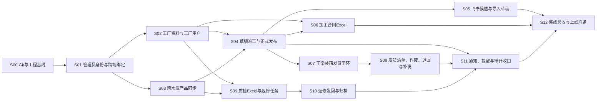

# 跟单管理系统一期开发计划

> 状态：已确认
>
> 版本：V1.0
>
> 日期：2026-08-20
>
> 需求基线：`docs/requirements/一期需求文档.md` V1.46
>
> 原型基线：已确认的管理员网页端、管理员小程序端和工厂小程序端低保真原型
>
> 技术基线：`docs/project/一期技术设计方案.md` V1.0

## 1. 文档职责

本文只确定一期正式开发的切片、顺序、依赖、并行边界和验收门，不替代需求、原型、技术设计或具体开发工单。

- 需求文档决定做什么和怎样验收；
- 已确认原型决定页面层级与交互；
- 技术设计决定系统怎样实现；
- 本开发计划决定按什么顺序实现；
- 当前工单决定本次具体修改哪些文件、迁移、接口和测试。

本计划只创建一份总文档。实施时逐个创建当前要执行的具体工单，不预先编写全部工单。

本计划已经用户整体确认。S00 工单确认前，不建立正式工程脚手架，不开始功能编码。

## 2. 开发方法

### 2.1 垂直切片

除工程基线外，每个切片必须打通一个可以独立演示和验收的业务结果，并同时包含该结果所需的：

- MySQL 表、索引和 Alembic 迁移；
- 后端业务模块、事务和 HTTPS API；
- 管理员网页端或微信小程序页面；
- 权限、审计、幂等和文件访问控制；
- 自动化测试、真实工具或环境验证和人工验收步骤。

不采用“先做完全部数据库，再做完全部后端，最后集中做页面”的横向开发方式。数据库整体模型已经在技术设计中确定，正式迁移按切片逐步落地。

### 2.2 逐工单执行

每个切片开始前只创建该切片当前需要的工单。一个切片如果仍然过大，可以拆成多个有明确前后顺序的工单，但不能把同一个业务闭环长期拆成互不可验收的数据库、后端和前端孤立任务。

每个工单至少写明：

1. 工单编号、目标和前置依赖；
2. 需求、原型和技术设计依据；
3. 包含范围与明确不包含内容；
4. 修改目录、模块和公共接口；
5. 数据库迁移、API 和页面入口；
6. TDD 场景、集成测试和人工验收；
7. 外部账号、样例文件或环境前置条件；
8. 回滚方式、未完成事项和交接结果。

工单没有确认范围时不开始实现；工单没有通过约定测试和验收时不标记完成。

### 2.3 贯穿所有切片的要求

以下内容不是最后补做的独立包装，而是从涉及它们的第一个切片开始持续落实：

- 后端权限和工厂数据隔离；
- 请求编号、操作日志和敏感信息脱敏；
- 高风险写操作的幂等、事务、行锁和唯一约束；
- OpenAPI 契约及网页端、小程序 TypeScript 类型同步；
- 本地开发库、自动化测试库、共享测试库和生产库隔离；
- 真实密钥不进入代码、Git、文档、日志或业务数据库；
- 核心业务先写失败测试，再完成最小实现；
- 每个切片合并前执行对应检查，不把失败测试留给后续切片。

## 3. 总体顺序与依赖

S00 至 S04 是主业务基础，默认串行完成。S04 合并后，飞书导入、合同、发货和返修链路才允许根据依赖情况有限并行。

## 4. 一期开发切片

### S00 Git 与工程基线

**可验收结果：** 已有原型仓库形成已确认的 V1.40 资料基线提交，并建立可安全提交和回退的正式实现工程基线；三端空工程、开发与测试环境、真实 MySQL 8 测试入口和基础持续集成可运行。

**包含范围：**

- 确认并整理当前文档、原型和参考资源的未提交差异，提交已确认资料与原型基线；
- 创建 `server/`、`admin-web/`、`miniprogram/` 和约定的测试目录；
- 初始化 uv、FastAPI、SQLAlchemy、Alembic、Vue 3、TypeScript、Vite、Element Plus、微信原生小程序和 pnpm；
- 建立本地开发与自动化测试 MySQL、临时文件存储、假外部适配器和示例配置；
- 建立 API/worker 启动入口、健康检查、统一错误、请求编号、日志、审计和幂等基础设施；
- 建立 Ruff、类型检查、pytest、ESLint、TypeScript、Vitest、构建、迁移和 `git diff --check` 检查。

**关键验证：** 三端基础构建通过；API 与 worker 可启动；MySQL 迁移可在空库执行；测试库与开发库隔离；仓库不含真实密钥。

**前置条件：** 开始前必须确认当前工作区已有修改的归属，并处理两张参考 PNG 的待删除状态；未建立 Git 基线前不创建并行 Worktree。

### S01 管理员身份、申请与跨端绑定

**可验收结果：** 内部人员通过飞书登录管理员网页端，使用飞书企业通讯录已验证手机号提交申请后由最高管理员审核；管理员再从小程序授权手机号，号码一致且唯一时绑定到同一内部 `userId`。

**包含范围：** 内部用户、外部身份、网页会话、小程序凭证、飞书手机号读取、管理员申请、最高管理员初始化、审核与启停；网页登录/申请/审核入口；网页和小程序自动续期；管理员小程序首次绑定、“我的”、头像和退出登录基础流程。V1.36 已实现的短信挑战表仅作为历史兼容数据保留，不再提供管理员申请接口。

**关键测试：** OAuth `state`、验证码过期与次数、手机号唯一匹配、未审核拒绝访问、最高管理员权限、账号停用立即失效、测试与正式 AppID 身份隔离、跨终端同一用户。

**人工验收：** 用受控飞书和微信测试身份走完申请、审核、绑定、退出和重新登录。

**依赖与外部条件：** 依赖 S00；真实联调需要飞书 OAuth 及当前用户手机号读取权限、微信 AppID 和生产最高管理员名单，缺失时只能完成假适配器测试，不能算真实集成验收。

### S02 工厂资料、合同资料与工厂用户

**可验收结果：** 管理员可以维护工厂、联系人和合同资料；飞书统一工厂名称直接严格匹配系统工厂；工厂用户可以在小程序申请，经管理员审核后只进入所属工厂身份。

**包含范围：** 工厂、联系人、供应商编号、工厂代码、合同资料、版本冲突；工厂申请、职位、手机号、审核、拒绝原因、用户启停；管理员网页端工厂和人员页面；工厂小程序登录与申请入口。不保存委托代理人、银行资料或来源别名。

**关键测试：** 供应商编号、名称和工厂代码唯一；编号自动大写且编辑只读；合同资料完整性；职位固定值；工厂申请审核记录；停用和工厂归属失效；工厂之间不能互相读取。

**人工验收：** 管理员新增工厂并补齐合同资料，两个不同工厂账号分别申请和登录，交叉访问被拒绝。

**依赖：** 依赖 S01。

### S03 聚水潭产品同步与只读产品资料

**可验收结果：** worker 可以分页扫描并按修改时间增量读取聚水潭产品和规格，只把六个指定商品分类中来源状态为启用的资料作为可用于新订单的 MySQL 快照；管理员网页端可以只读查询，后续订单只严格匹配已成功落库且当前可用的产品快照。

**包含范围：** 六分类精确白名单、来源启用状态、产品、规格、同步批次、成功游标、来源停用或移出分类、产品图片缓存；JstProductSource 适配器；worker 首次扫描与增量任务；管理员网页端按已确认原型提供产品列表、搜索、排序和分页只读展示。

**关键测试：** 六分类精确匹配、非白名单与非启用资料不落为可用、`sku_id` 唯一、产品和规格严格匹配、分页、批次失败不推进游标、增量重复获取幂等、资料进入或退出范围、来源停用不删除历史、图片失败可重试。

**人工验收：** 使用受控接口执行一次全量和一次增量，核对指定商品及规格；只读插件查询结果不能替代生产接口验收。

**依赖与外部条件：** 依赖 S00 和 S01；真实验收需要聚水潭正式 OpenAPI 授权、字段、分页、限频和增量语义。

### S04 草稿、派工、发布与三端订单查询

**可验收结果：** 管理员可以手工创建或编辑草稿、完整派工并发布；相关工厂看到本厂任务，管理员网页端和管理员小程序看到一致的订单与进度。

**包含范围：** 草稿保存、手工创建、版本冲突、多产品多规格派工、合同出货时间、发布、撤回、未发货订单删除、完成与撤销完成；管理员网页端订单看板/列表/详情；管理员小程序只读订单；工厂小程序任务列表和详情基础展示。

**关键测试：** 订单编号唯一、单一跟单人员、派工合计等于订单数量、所有工厂有启用用户、发布事务、通知写入发件箱、无发货时撤回、有发货时拒绝、删除留痕、完成和撤销历史、未完成/已逾期/已完成展示、工厂只见本厂数据。

**人工验收：** 一张多产品、多规格、多工厂草稿发布后，用管理员网页、管理员小程序和两个工厂账号核对可见内容和隔离结果。

**依赖：** 依赖 S02 和 S03。先用手工创建订单打通核心业务，不因飞书接口尚未就绪阻塞订单主链路。

### S05 飞书手动获取、待处理候选与导入草稿

**可验收结果：** 管理员点击“获取飞书新订单”，查看后台任务结果和待处理候选；可以排除候选或确认完整导入为工厂不可见的草稿订单，并继续复用 S04 的派工和发布流程。

**包含范围：** 飞书获取任务、来源快照、候选、候选明细和校验问题；后台任务领取；待处理/已导入列表和详情；整单删除候选；调用订单模块公开操作完成候选确认导入事务。

**关键测试：** 分页、同时点击只保留一个活动任务、来源记录和订单编号幂等、部分行失败、已排除不再出现、产品/工厂/用户/跟单人员/完整订单校验、严格小于50%边界、订单日期可空、整单初始已发数量与导入日志、重复确认不重复建单、失败整体回滚、已导入不跟踪飞书后续修改。

**人工验收：** 手动获取一组含成功、已存在和失败记录的样例，核对反馈数量；确认一张候选后只生成一张草稿，并可以按 S04 继续发布。

**依赖与外部条件：** 依赖 S04；真实验收需要飞书企业自建应用和指定多维表格、视图权限。

### S06 加工合同 Excel

**可验收结果：** 管理员对统一已发数量为0的“一个订单＋一个工厂”导出加工合同 `.xlsx`，带初始已发数量的订单不可导出；重复导出保持合同编号、签订日期和历史快照稳定。

**包含范围：** 合同和导出快照、私有文件引用、合同编号事务、同日同厂顺序、工厂资料校验、模板生成、公式与图片、下载授权和管理员网页入口。

**关键测试：** 已发数量限制、资料必填与可空图片、第一份无后缀/第二份 `-1`/第三份 `-2`、并发唯一、既有编号不重排、空白加工单价、金额公式、文件名、历史快照、WPS/Excel 打开和 OOXML 结构。

**人工验收：** 使用真实模板分别验证首次、重复、同日同厂多份和缺失资料场景；人工填写加工单价后公式结果正确。

**依赖与外部条件：** 依赖 S02 和 S04；需要确认正式合同模板和 MinIO 测试桶。

### S07 正常装箱发货闭环

**可验收结果：** 工厂从本厂任务创建多订单发货单，完成装箱、凭证和提交；发货立即计入订单进度，管理员网页端和管理员小程序可以查看，工厂发货记录同步出现。

**包含范围：** 发货草稿、明细、箱号、装箱组、混装、凭证、备注、提交、数量台账和进度汇总；工厂创建/记录/详情；管理员网页和小程序只读列表/详情；管理员确认订单完成。

**关键测试：** 本厂权限、多订单混装、装箱组、尾箱、箱内汇总等于发货明细、超出待交数量显式归属、幂等和并发提交、正式发货不可直接编辑删除、提交立即生效、按时发货判断、多发少发、三端响应裁剪和文件权限。

**人工验收：** 用两个工厂账号分别提交正常发货，核对订单进度、逐箱内容、凭证、管理员移动端裁剪字段和完成操作。

**依赖与外部条件：** 依赖 S04；文件联调需要 MinIO 测试桶。

### S08 发货清单、发货单作废、按发货单退回与补发

**可验收结果：** 管理员可以下载正确的发货清单；工厂可以申请撤回发货，管理员审核后数量正确回退；管理员可以从有效发货单执行按规格退回，原任务未发数量增加，工厂通过普通发货补回。

**包含范围：** 基于有效发货事实生成“发货明细”和跨订单“汇总”两个 Sheet 的发货清单；作废申请、审核通过/拒绝、负向数量台账；发货单详情只读订单编号退回弹窗、退回事件与明细、累计可退数量、订单完成状态恢复、原任务补发；下载权限、操作日志和通知。

**关键测试：** 发货清单文件名、只保留两个指定 Sheet、颜色/规格、跨订单汇总、模板样式、扩展行和 OOXML 结构；同一发货单最多一个待处理申请、待处理期间禁止退回、已有退回仍可申请但只能拒绝、重复审核、累计退回不超可退数量、原发货事实不被覆盖、已完成订单恢复、逾期重新判断、补发重新计入、无独立退回单号/列表/状态。

**人工验收：** 使用真实模板打开并核对发货清单；分别演示作废通过、作废拒绝、部分退回、重复退回拦截和补发恢复进度。

**依赖：** 依赖 S07。

### S09 质检 Excel 与返修任务创建

**可验收结果：** 管理员上传真实质检 `.xlsx`，预览解析结果并确认创建独立返修任务；所属工厂可以查看任务和原始附件，其他工厂不可访问。

**包含范围：** 临时预览、原始文件、质检明细、箱号、原因、照片、严格匹配、补传图片、返修单号和任务；管理员网页创建/列表/详情；管理员小程序只读返修进度基础页面；工厂返修任务列表/详情和附件下载。

**关键测试：** 仅 `.xlsx`、异常压缩包限制、原因和照片可空、原始行与箱号保留、字段错误不创建部分任务、确认事务、文件摘要和权限、相同箱号展示规则、返修不关联或改变正常订单。

**人工验收：** 使用真实但非生产质检文件验证成功、字段错误、缺图和补图；用不同工厂账号验证附件权限。

**依赖与外部条件：** 依赖 S02 和 S03；需要真实样例质检 Excel 和 MinIO 测试桶。

### S10 返修分批发回、自动完成与归档

**可验收结果：** 工厂可以分批填写每个规格的返修数量和报废数量，提交后立即计入返回进度；全部返回后自动完成，管理员归档后从三端隐藏但数据仍保留。

**包含范围：** 发回批次、发回明细、数量锁定、幂等、自动完成和归档；工厂填写/预览/提交及历史记录；管理员网页和管理员小程序返修进度、详情与归档。

**关键测试：** 非负整数、至少一项大于0、单规格不超待返回、返修与报废混合、分批、并发发回、重复提交、自动完成、仅已完成可归档、三端隐藏和历史审计保留。

**人工验收：** 演示首次发回、分批发回、混合填写、超量、最后剩余数量、自动完成和归档后的三端结果。

**依赖：** 依赖 S09。

### S11 通知、提醒与审计收口

**可验收结果：** 已完成业务切片产生正确站内通知和外部待发送消息，用户小程序通知设置生效，worker 可以去重、重试并对失败告警；关键操作日志可查询。

**包含范围：** 通知偏好、站内通知、未读红点、微信订阅消息、临期/到期/逾期提醒、发件箱领取与退避重试、重试耗尽、运维告警和统一审计查询；管理员网页只读通知记录，小程序通知设置。

**关键测试：** 用户关闭通知、稳定去重键、业务事务成功但外部发送失败、worker 重启续跑、重试上限、提醒日期、不同终端来源、日志脱敏和工厂日志隔离。

**人工验收：** 使用测试模板验证授权、开关、发送、失败重试和未读状态；业务通知与运维告警使用不同渠道。

**依赖与外部条件：** 依赖 S04、S08 和 S10；真实验收需要微信订阅消息模板和专用运维告警渠道。

### S12 集成验收、部署与上线准备

**可验收结果：** 共享测试环境可以用多角色和真实样例走通一期全流程，生产发布、备份恢复、监控、回滚、试运行和正式切换条件均有证据。

**包含范围：** ECS 测试与生产 Compose、Traefik HTTPS、独立数据库账号和桶、迁移发布、日志轮转、监控告警、MySQL 和附件备份恢复、全流程集成、试运行与切换检查表。

**关键验证：** 网页端、微信开发者工具和真机；飞书、聚水潭、微信和 MinIO 真实受控账号；真实 Excel；权限攻击场景；数据库与附件实际恢复；应用回滚；V1.46 每条验收标准的证据映射。

**人工验收：** 先在共享测试环境完成全流程，再由用户批准2至3家工厂试运行；试运行通过后另行批准正式切换。

**依赖与外部条件：** 依赖 S05、S06、S08、S10 和 S11；需要正式域名、DNS、Traefik 路由、生产账号、备份位置和付费资源批准。本切片完成不等于用户已经批准生产上线。

## 5. 并行开发与多对话规则

### 5.1 开始并行的前提

- S00 已完成并存在可回退的 Git 基线；
- 当前工单的依赖切片已经合并并通过验收；
- 并行工单没有同时修改同一业务模块、同一页面入口或同一数据库迁移链；
- 主对话已经确定各工单的起始提交、分支、Worktree 和合并顺序。

未满足这些条件时，即使可以打开多个 Codex 对话，也必须串行开发。

### 5.2 对话与 Worktree

- 一个开发工单对应一个 Codex 对话和一个独立 Git Worktree；
- 多个开发对话不能同时使用同一个 Local 工作目录；
- 每个工单使用独立 `codex/` 分支，完成测试和提交后再交给主对话合并；
- 主对话负责正式资料、依赖顺序、差异审查、迁移顺序、合并和集成测试；
- 只读代码审查可以与开发并行，但审查对话不得修改主工作区；
- 一个小程序项目同时承载管理员和工厂页面，修改公共登录、导航、API 封装或组件时不得并行写同一文件；
- Alembic 迁移必须保持单一可执行顺序；出现两个迁移头时，在合并前由主对话明确处理，不能把冲突留到部署时。

### 5.3 建议并行节奏

一期前半段 S00 至 S04 默认串行。S04 合并后，在依赖满足时可以从以下链路中最多同时选择两条：

- 飞书导入链路：S05；
- 合同链路：S06；
- 正常发货链路：S07 → S08；
- 质检返修链路：S09 → S10。

S11 需要汇总各业务事件，S12 需要完整系统，均在相关前置切片合并后执行。并行只减少等待时间，不改变任何验收门。

## 6. 每个切片的完成门

一个切片只有同时满足以下条件才可以标记完成：

1. 当前工单约定的范围全部实现，没有静默加入二期功能；
2. 数据库迁移可以从空测试库顺序执行，且没有未说明的数据破坏；
3. 后端权限、事务、数量、状态、并发和幂等测试通过；
4. 涉及的网页端或小程序自动化检查和构建通过；
5. 外部系统使用假适配器时明确标注，不能冒充真实联调完成；
6. 约定的浏览器、微信开发者工具、真机或 Excel 人工验收完成；
7. `git diff --check`、锁文件、OpenAPI 类型和文档同步检查通过；
8. 用户要求确认的可见页面或业务结果已经确认；
9. 工单记录修改文件、测试结果、未解决问题、回滚方式和下一步依赖；
10. 变更已在独立提交中保存，主对话审查后才能合并。

## 7. 需求覆盖关系

| V1.46 范围 | 主要切片 |
|---|---|
| 统一 API、MySQL、三端目录和环境隔离 | S00、S12 |
| 管理员申请、飞书登录、微信绑定和跨端身份 | S01 |
| 工厂、合同资料、工厂申请和人员管理 | S02 |
| 聚水潭六类启用产品首次扫描与增量同步 | S03 |
| 草稿、派工、发布、撤回、删除、完成和三端订单查询 | S04 |
| 飞书手动获取、候选、排除和导入草稿 | S05 |
| 加工合同编号、快照和 Excel | S06 |
| 正常发货、装箱、进度和发货记录 | S07 |
| 发货清单、发货单作废、按发货单退回和补发 | S08 |
| 质检 Excel、返修任务和附件权限 | S09 |
| 返修分批发回、自动完成和归档 | S10 |
| 通知设置、提醒、发件箱、运维告警和审计收口 | S00、各业务切片、S11 |
| 集成验收、备份恢复、试运行和正式切换 | S12 |

## 8. 明确不进入本计划的内容

- 不维护旧 CloudBase 正式实现，不建立第二套正式业务数据库；
- 不创建两个小程序项目，不引入 Taro、uni-app 或强制 Skyline；
- 不增加正常收货确认、实际收到数量、到货日期或异常收货；
- 不增加生产进度、飞书已导入订单后续修改检测或自动回写；
- 不增加加工单价保存、PDF合同、合同审批、在线签署、对账、付款或结算；
- 不增加返修复检、再次返修、赔偿扣款或退回物流；
- 不增加箱标打印、二维码或物流轨迹；
- 不把自动化测试、假适配器或文件生成成功直接当作业务验收完成；
- 不在 S00 工单批准前创建正式脚手架，也不在后续工单范围确认前实施对应切片。

## 9. 批准门

本计划已于 2026 年 8 月 20 日获得用户整体确认，阶段4完成，项目进入阶段5“Git与工程基线”。下一步执行门为：

1. 只创建并确认 S00 的第一份开发工单；
2. S00 工单确认前不创建正式脚手架、不开始功能编码；
3. S00 完成并建立 Git 基线后，才允许为后续独立工单创建 Worktree；
4. 后续按依赖逐片实施，不一次性创建或执行全部工单。
