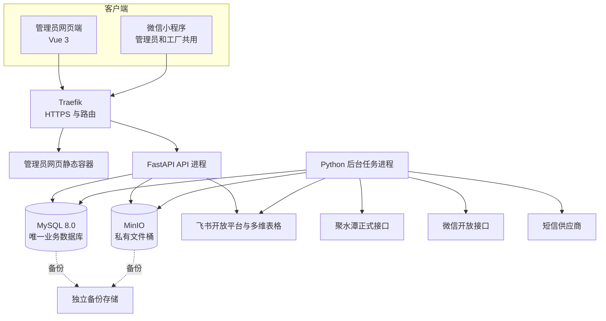
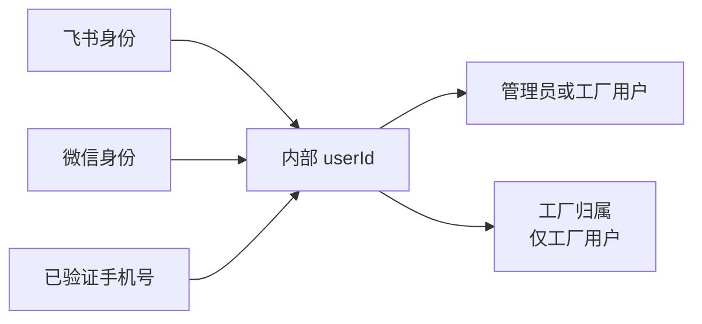

# 跟单管理系统一期技术设计方案

> 状态：已确认
>
> 版本：V1.0
>
> 日期：2026-08-20
>
> 需求基线：`docs/requirements/一期需求文档.md` V1.40
>
> 原型基线：已确认的管理员网页端、管理员小程序端和工厂小程序端低保真原型
>
> 适用范围：一期正式实现，不包含旧 CloudBase 实现

## 1. 文档职责

本文确定一期的实现方式，包括：

- 总体架构和代码目录；
- 前端、小程序、后端和数据库技术栈；
- 业务模块、数据模型、状态与数量实现；
- HTTPS API、身份、权限和防重复提交；
- 飞书、聚水潭、微信、短信和文件存储接入；
- 部署、环境隔离、备份、监控和回滚；
- 自动化测试、集成验收和试运行策略。

本文不重新定义业务范围和页面视觉：

- 业务字段、状态、数量、权限和验收以 V1.40 需求为准；
- 页面层级和交互以已确认原型及页面地图为准；
- 开发顺序、单次修改文件和验收步骤由后续开发计划与工单确定。

本技术设计已经用户整体确认。项目进入“开发计划与工单”阶段；开发计划再次获得用户确认前，不创建正式工程脚手架，不开始功能编码。

## 2. 已确认的技术结论

| 主题 | 一期结论 |
|---|---|
| 管理员网页端 | Vue 3、TypeScript、Vite、Element Plus |
| 微信小程序 | 微信原生小程序、TypeScript、默认 WebView 渲染 |
| 跨端框架 | 一期不使用 Taro、uni-app，不把 Skyline 作为基础要求 |
| 后端 | Python、FastAPI、SQLAlchemy 2、Alembic、Pydantic 2 |
| Python 工具链 | uv 管理依赖、虚拟环境和锁文件 |
| JavaScript 工具链 | pnpm 管理前端和小程序依赖 |
| 正式数据库 | 公司 ECS 上的 MySQL 8.0 独立数据库和最小权限账号 |
| 文件存储 | 现有 MinIO 中建立项目独立私有桶和独立凭证 |
| 公网入口 | 复用服务器现有 Traefik 提供域名路由和 HTTPS |
| 后台任务 | 一个独立 Python worker，使用 MySQL 记录任务和发件箱，不引入 Celery |
| 飞书订单来源 | 管理员手动“获取飞书新订单”，不设置五分钟或其他定时发现 |
| 产品来源 | 聚水潭首次全量、后续按修改时间自动增量同步 |
| 正式数据源 | MySQL 是唯一正式业务数据源，飞书不接收自动回写 |
| 测试原则 | 核心 API、事务、权限、状态、数量和 Excel 优先 TDD |

## 3. 总体架构

一期采用模块化单体，不拆分微服务。管理员网页端和微信小程序独立构建，但调用同一个 FastAPI 后端；后端按业务模块组织，所有模块使用同一个 MySQL 正式数据库。



### 3.1 进程职责

- 管理员网页静态容器只返回编译后的 HTML、CSS 和 JavaScript，不处理业务规则。
- API 进程处理登录、查询、写入、文件上传下载授权和同步任务创建。
- worker 处理飞书手动获取任务、聚水潭产品同步、定时提醒、微信和短信发送及失败重试。
- MySQL 保存业务事实、当前状态、任务、通知、幂等记录和操作日志。
- MinIO 保存原始质检 Excel、照片、发货凭证、头像缓存和需要留档的导出文件。

API 与 worker 使用同一套后端代码和业务模块，仅启动入口不同。worker 不绕过业务模块直接修改业务表。

## 4. 代码项目结构

```text
order_tracking/
├── server/
│   ├── app/
│   │   ├── api/                 # HTTP 路由、请求与响应模型
│   │   ├── modules/             # 业务模块
│   │   ├── adapters/            # 飞书、聚水潭、微信、短信、MinIO 适配器
│   │   ├── db/                  # SQLAlchemy、迁移入口和事务支持
│   │   ├── worker/              # 后台任务领取、调度和重试
│   │   └── settings/            # 环境配置，不含真实密钥
│   ├── migrations/              # Alembic 迁移
│   ├── tests/
│   ├── pyproject.toml
│   └── uv.lock
├── admin-web/
│   ├── src/
│   │   ├── api/                 # OpenAPI 类型和统一请求封装
│   │   ├── modules/             # 按业务模块组织页面逻辑
│   │   ├── pages/
│   │   ├── components/
│   │   └── stores/
│   ├── tests/
│   ├── package.json
│   └── pnpm-lock.yaml
├── miniprogram/
│   ├── miniprogram/
│   │   ├── api/
│   │   ├── pages/
│   │   ├── modules/
│   │   ├── components/
│   │   └── utils/
│   ├── tests/
│   ├── project.config.json.example
│   ├── package.json
│   └── pnpm-lock.yaml
├── docs/
├── compose.yaml
└── .github/workflows/
```

管理员和工厂共用一个小程序 AppID 和一套小程序代码。登录后由后端返回角色及终端能力，小程序跳转到管理员或工厂页面，不创建两个小程序项目。

真实 AppID、域名、密钥和服务器地址不写入仓库；仓库只提供示例配置和环境变量名称。

## 5. 后端业务模块

每个模块通过少量公开操作承载完整业务规则，HTTP 路由、worker 和测试均调用这些公开操作，不复制规则。

| 模块 | 主要职责 | 关键公开操作 |
|---|---|---|
| identity_access | 内部用户、外部身份、申请、会话和权限 | 登录解析、手机号验证、身份绑定、申请审核、会话撤销、权限判断 |
| order_import | 飞书手动获取、候选校验和候选转草稿 | 创建获取任务、读取结果、排除候选、确认导入为草稿 |
| orders | 草稿、派工、发布、撤回、完成和删除 | 保存草稿、发布、撤回、确认完成、撤销完成、删除 |
| shipments | 工厂任务、装箱、发货、作废和按发货单退回 | 保存草稿、提交、申请作废、审核作废、确认退回 |
| repairs | 质检 Excel 预览、返修单、发回和归档 | 解析预览、创建返修单、提交发回记录、归档 |
| master_data | 产品同步、工厂资料和来源名称映射 | 同步产品、维护工厂、绑定来源名称 |
| files_exports | 私有文件、发货清单和加工合同 | 上传、授权下载、生成发货清单、生成加工合同 |
| notifications_audit | 系统通知、外部发送、去重和操作证据 | 记录通知、投递、重试、查询日志 |

模块间通过内部公开操作协作。例如发货单提交由 shipments 模块完成数量事务，再调用 notifications_audit 记录待发送通知；不能由路由先改数量、再自行拼通知。

## 6. 身份、会话与权限

### 6.1 内部身份模型

系统以内部 `userId` 作为唯一人员身份。飞书和微信只是登录身份，不直接作为业务表外键。



外部身份唯一键至少包含平台、应用或租户标识和平台用户标识，避免测试 AppID 与公司正式 AppID 的 `openid` 混用。测试号身份和测试数据不迁入生产；切换公司正式 AppID 后，用户通过正式微信身份和已验证手机号重新绑定同一内部账号。

手机号用于唯一匹配，需要同时保存：

- 加密后的完整号码，用于授权后的业务显示；
- 不可逆查询摘要，用于唯一匹配；
- 脱敏显示值，用于日志和普通页面。

验证码只保存摘要、用途、过期时间、尝试次数和发送记录，不保存明文验证码。

### 6.2 管理员网页端登录

1. 网页端跳转飞书 OAuth，并使用随机 `state` 防止请求伪造。
2. 后端使用授权结果解析飞书身份并映射内部 `userId`。
3. 无角色用户只能进入管理员申请流程。
4. 申请人填写手机号并通过短信验证码验证。
5. 最高管理员审核通过后授予普通管理员角色。
6. 网页端使用 Secure、HttpOnly、SameSite Cookie 保存不透明会话编号；写请求增加 CSRF 校验。

### 6.3 小程序登录与绑定

1. 小程序把 `wx.login` 临时 code 发送后端，后端向微信换取平台身份。
2. 已绑定身份直接恢复内部账号；未绑定身份请求用户授权手机号。
3. 后端使用手机号授权 code 从微信服务端取得号码，不信任客户端自行提交的号码。
4. 管理员手机号必须与网页端已验证申请唯一匹配；未匹配时提示前往网页申请。
5. 工厂用户填写真实姓名、职位和申请工厂后等待管理员审核。
6. 小程序使用短期访问凭证和可续期凭证；服务端只保存凭证摘要并支持统一撤销。

退出登录只撤销当前会话，不删除外部身份绑定。账号被停用、角色被撤销或工厂归属失效时，已有会话立即失效。

### 6.4 权限矩阵

| 操作 | 最高管理员网页端 | 普通管理员网页端 | 管理员小程序 | 工厂小程序 |
|---|---:|---:|---:|---:|
| 查看全部业务数据 | 是 | 是 | 是，按原型只读展示 | 否 |
| 获取和确认导入飞书订单 | 是 | 是 | 否 | 否 |
| 编辑、发布、撤回和完成订单 | 是 | 是 | 否 | 否 |
| 创建返修单、处理发货单退回 | 是 | 是 | 否 | 否 |
| 维护工厂和合同资料 | 是 | 是 | 否 | 否 |
| 审核工厂用户 | 是 | 是 | 否 | 否 |
| 审核和停用普通管理员 | 是 | 否 | 否 | 否 |
| 查看本厂任务 | 不适用 | 不适用 | 不适用 | 是 |
| 创建正常发货单和返修发回 | 否 | 否 | 否 | 是，仅本厂 |
| 申请撤回本厂发货 | 否 | 否 | 否 | 是，仅本厂 |
| 修改头像和通知设置 | 小程序内 | 小程序内 | 是 | 是 |

后端同时校验角色、会话终端、工厂归属、记录归属和业务状态。工厂查询必须在数据库查询条件中加入 `factory_id`，不能先读取全部数据再由前端过滤。

## 7. 数据模型

### 7.1 通用约定

- 数据库使用 MySQL 8.0、`utf8mb4` 和 InnoDB。
- 业务数量统一使用非负整数，数据库和业务层双重校验。
- 数据库时间戳统一保存 UTC；合同出货时间、签订日期、发货业务日期等使用东八区业务日期。
- 正式业务事实只追加或通过反向事件纠正，不直接覆盖历史记录。
- 列表所需进度可以使用同事务更新的汇总字段或汇总表，但发货、退回、作废和返修发回明细是可重算的权威事实。
- 关键唯一规则同时使用数据库唯一索引和业务校验，不能只依赖页面校验。
- 所有可编辑资料带 `version` 字段，用于检测并发覆盖。

### 7.2 身份与人员

| 表 | 关键内容与约束 |
|---|---|
| users | 内部用户、角色、最高管理员标记、启停状态、工厂归属、脱敏手机号、头像引用；最高管理员不能由普通申请产生 |
| external_identities | `user_id`、平台、应用或租户、平台用户标识；组合唯一 |
| user_sessions | 会话摘要、终端类型、过期时间、撤销时间和最后活动时间 |
| sms_challenges | 手机号摘要、用途、验证码摘要、过期时间、尝试次数和发送状态 |
| admin_applications | 飞书申请人、已验证手机号、审核状态、审核人、时间和拒绝原因 |
| factory_applications | 申请人、职位、目标工厂、已验证手机号、审核状态和审核记录 |
| notification_preferences | 用户对各类小程序业务通知的开关；用户与通知类型唯一 |

### 7.3 产品与工厂

| 表 | 关键内容与约束 |
|---|---|
| products | 聚水潭 `i_id`、产品名称、货号、图片引用、来源更新时间；产品名称唯一 |
| product_variants | `product_id`、聚水潭 `sku_id`、颜色/规格、启用状态；`sku_id` 全局唯一，产品和规格组合唯一 |
| product_sync_runs | 全量或增量、游标、开始结束时间、数量、状态和错误摘要 |
| factories | 供应商编号、工厂名称、工厂代码、单位全称、地址、法定代表人、委托代理人、开户信息、启用状态和版本；供应商编号、名称、工厂代码分别唯一 |
| factory_contacts | 工厂联系人、电话、顺序和是否主要联系人 |
| factory_source_aliases | 飞书来源名称到系统工厂的严格映射；来源名称唯一 |

产品资料从聚水潭同步后作为本地快照使用。同步不会覆盖已经保存的订单、发货或合同导出快照。产品图片需要用于页面或 Excel 时，由 worker 下载并缓存到项目私有文件桶；下载失败不伪造图片，记录错误并重试。

### 7.4 飞书候选与订单

| 表 | 关键内容与约束 |
|---|---|
| feishu_import_runs | 手动获取任务、发起管理员、任务状态、新增/跳过/失败数量、开始结束时间和错误摘要 |
| feishu_source_records | 飞书记录ID、来源表和视图、原始快照、来源修改时间、获取时间；飞书记录ID在该来源内唯一 |
| import_candidates | 订单编号、待处理/已导入/已排除、校验结果、来源快照摘要、对应订单、排除和导入信息；未排除的同一订单编号唯一 |
| import_candidate_lines | 候选订单明细、原始字段、匹配后的产品规格和工厂、数量及来源记录ID |
| import_validation_issues | 候选或明细、错误代码、字段和用户可读提示 |
| orders | 内部订单ID、唯一订单编号、来源、订单日期、跟单人员、合同出货时间、生命周期、版本、发布/完成/删除信息 |
| order_lines | 订单产品规格和订单数量；同一订单和规格唯一 |
| order_assignments | 订单明细分配的工厂和下单数量；同一订单明细和工厂唯一 |
| order_completion_records | 每次确认完成、撤销完成或退回后恢复的操作人、时间和原因，保留多次完成历史 |

订单持久化生命周期只使用：

- `DRAFT`：系统内草稿，工厂不可见；
- `PUBLISHED`：已发布正式订单；
- `COMPLETED`：管理员确认完成。

“未完成”和“已逾期”是已发布订单的展示状态：`PUBLISHED` 且当前日期不晚于合同出货时间时显示未完成，晚于时显示已逾期。`deleted_at` 仅用于保留删除证据，不构成“已删除”或“已取消”业务状态。

### 7.5 加工合同

| 表 | 关键内容与约束 |
|---|---|
| processing_contracts | 订单、工厂、签订日期、合同编号和同日序号；订单和工厂唯一，合同编号唯一 |
| contract_exports | 合同、导出人、时间、完整字段快照、模板版本和文件引用；每次导出追加一条 |

同一日期和工厂的合同编号生成必须在事务中锁定对应计数，避免两名管理员同时导出得到相同编号。第一份使用无后缀基础编号，第二份使用 `-1`，第三份使用 `-2` 并依次增加；已生成编号永不重排。历史导出只读取自己的快照，不因后续合同、工厂或产品资料变化而改变。完整规则见第17节。

### 7.6 发货、装箱与退回

| 表 | 关键内容与约束 |
|---|---|
| shipments | 全局唯一发货单号、工厂、草稿/已发货/作废申请中/已作废、业务日期、备注、提交人和时间 |
| shipment_lines | 发货单、订单派工明细和实际发货数量；提交后不可直接编辑 |
| shipment_boxes | 发货单、箱号和装箱组来源；同一发货单箱号唯一 |
| shipment_box_items | 箱号、发货明细和数量；同一箱可以包含多条发货明细 |
| shipment_files | 发货单和凭证文件关系，顺序限制为0至3张 |
| shipment_void_requests | 申请人、原因、待处理/通过/拒绝、审核人、时间和审核原因；同一发货单最多一个待处理申请 |
| shipment_return_events | 原发货单、管理员、退回日期、共用原因和请求编号；是内部操作证据，不生成业务单号、独立列表或独立状态 |
| shipment_return_lines | 退回事件、原发货明细、数量和数量变更前后值 |
| quantity_ledger | 发货提交、作废通过、按发货单退回和补发产生的派工数量增减；来源事件唯一且只追加 |

发货单提交前，所有 `shipment_box_items` 按 `shipment_line` 汇总后必须与发货明细数量完全一致。正常发货允许超过剩余下单数量，但超过部分必须显式分配到具体订单派工明细，不能形成没有归属的数量。

### 7.7 质检单返修

| 表 | 关键内容与约束 |
|---|---|
| repair_orders | 唯一返修单号、工厂、未完成/已完成、创建信息、原始质检文件、归档信息 |
| repair_inspection_lines | 箱号、产品规格、仓库退回数量、次品原因、照片引用和原始行顺序 |
| repair_return_batches | 工厂一次提交、提交人、提交时间和幂等编号 |
| repair_return_lines | 发回批次、产品规格、返修数量、报废数量；返回数量由两者相加 |
| repair_files | 原始质检 Excel、解析图片和补传图片与返修单或明细的明确关系 |

返修完成状态由有效发回记录合计推导。归档使用 `archived_at`、`archived_by`，不是返修状态，也不删除数据。

### 7.8 文件、通知、后台任务与审计

| 表 | 关键内容与约束 |
|---|---|
| stored_files | 私有桶、随机对象键、原文件名、类型、大小、摘要、上传人和时间；对象键唯一 |
| notifications | 站内通知、接收人、业务目标、内容、已读时间和去重键 |
| outbox_messages | 微信或短信待发送消息、去重键、状态、重试次数、下次重试时间和最后错误 |
| background_jobs | 飞书获取、产品同步和维护任务的类型、参数、状态、租约、次数和结果 |
| idempotency_records | 用户、操作、幂等键、请求摘要、响应摘要和过期时间；组合唯一 |
| audit_logs | 操作人、终端、动作、业务对象、变更前后摘要、请求编号和时间；不保存密钥或验证码 |

文件与业务对象使用明确关系表，避免只靠文件名或前端传入的任意对象类型判断权限。

## 8. 关键事务和并发控制

### 8.1 飞书候选确认导入为草稿

单个数据库事务中完成：

1. 锁定待处理候选；
2. 重新执行完整订单、产品、工厂、用户和唯一性校验；
3. 创建草稿订单、产品明细和工厂派工；
4. 把候选标记为已导入并关联草稿订单；
5. 写入操作日志和来源快照。

任一步失败均整体回滚，不产生部分订单。候选状态、订单编号和飞书来源记录的唯一索引共同保证重复确认不会重复建单。

### 8.2 草稿发布与撤回

发布时锁定订单、明细和派工，校验：

- 订单仍为草稿且版本一致；
- 合同出货时间存在；
- 每个订单明细的派工数量合计等于订单数量；
- 所有工厂均有效且至少有一名启用用户。

事务内改为已发布、生成工厂任务所需数据、记录操作日志并写入通知发件箱。通知实际发送失败不回滚订单发布。

撤回时再次检查没有任何有效正式发货单；通过后回到草稿，撤销站内任务并写入通知。已产生正式发货单时拒绝撤回。

### 8.3 正常发货提交

提交时使用客户端幂等键并锁定涉及的订单派工进度：

1. 校验提交用户归属发货单工厂；
2. 校验所有订单派工均属于本厂且订单已发布；
3. 校验箱号、箱内明细和发货数量完全一致；
4. 校验超过待交数量的部分已显式分配到订单；
5. 固化发货单、明细和装箱事实；
6. 追加数量台账并更新可重算的进度汇总；
7. 写入日志和通知发件箱。

重复请求返回首次提交结果。正式发货单不能直接修改或删除。

### 8.4 发货单作废与按发货单退回

作废审核通过时锁定发货单和受影响派工，追加与原发货数量相反的台账记录，并把原发货单标记为已作废。重复审核或已经退回超过可处理数量时拒绝操作。

按发货单退回时锁定原发货明细和派工：

- 本次退回数量必须为正整数；
- 累计退回不得超过当前可退数量；
- 追加退回事件和负数量台账，不修改原发货明细；
- 原订单已完成时恢复为已发布，展示状态再按日期计算未完成或已逾期；
- 写入原发货单与订单操作日志并通知工厂补发。

### 8.5 质检单返修发回

按返修单和产品规格锁定进度，校验返修数量、报废数量均为非负整数，至少一项大于0，且合计不超过该规格待返回数量。事务内追加发回批次和明细；总返回数量等于仓库退回总数量时将返修单改为已完成。

### 8.6 可编辑资料的并发覆盖

草稿订单、工厂资料和用户管理记录返回 `version`。保存时客户端提交原版本；版本已经变化时返回 HTTP 409 和明确提示，不采用最后写入者静默覆盖。

## 9. HTTPS API 设计

### 9.1 通用约定

- 所有接口使用 `/api/v1` 前缀和 JSON；文件上传下载除外。
- 日期使用 `YYYY-MM-DD`，时间使用带时区的 ISO 8601。
- 数量字段使用整数，不接收小数或数字字符串的模糊转换。
- 列表接口统一分页、允许字段白名单排序并返回总数。
- 高风险写操作要求 `Idempotency-Key` 请求头。
- 可编辑资料保存时提交 `version`，冲突返回 409。
- 每个请求生成 `requestId`，响应和日志使用同一编号。
- FastAPI OpenAPI 是接口契约来源，网页端和小程序生成 TypeScript 类型。

统一错误结构示例：

```json
{
  "code": "REPAIR_QUANTITY_EXCEEDED",
  "message": "本次返回数量超过该规格待返回数量",
  "fieldErrors": {
    "items[0].repairQuantity": "请检查返修数量"
  },
  "requestId": "req_xxx"
}
```

HTTP 状态使用：401 未登录、403 无权限、404 对当前用户不可见或不存在、409 状态或版本冲突、422 字段和业务校验失败、503 外部系统暂不可用。

### 9.2 接口分组

下表是一期接口清单的稳定分组；具体请求和响应字段在开发工单中依据 OpenAPI 完成。

| 分组 | 代表性路径 | 调用终端 |
|---|---|---|
| 网页身份 | `/auth/feishu/start`、`/auth/feishu/callback`、`/auth/logout`、`/me` | 管理员网页端 |
| 短信与申请 | `/sms/challenges`、`/admin-applications`、`/factory-applications` | 网页端或小程序对应流程 |
| 小程序身份 | `/mini/auth/wechat`、`/mini/auth/phone`、`/mini/auth/refresh` | 微信小程序 |
| 飞书获取 | `/admin/import-runs`、`/admin/import-runs/{id}` | 管理员网页端 |
| 待处理候选 | `/admin/import-candidates`、`/{id}`、`/{id}/confirm` | 管理员网页端 |
| 订单 | `/orders`、`/orders/{id}`、`/admin/orders`、`/publish`、`/withdraw`、`/complete` | 查询三端共用，写操作仅网页端 |
| 工厂任务 | `/factory/tasks`、`/factory/tasks/{id}` | 工厂小程序 |
| 发货单 | `/shipments`、`/factory/shipments`、`/submit`、`/void-requests` | 按角色和终端限制 |
| 发货单退回 | `/admin/shipments/{id}/returns` | 管理员网页端 |
| 质检返修 | `/repairs`、`/admin/repair-previews`、`/factory/repairs/{id}/return-batches`、`/archive` | 按角色和终端限制 |
| 产品和工厂 | `/products`、`/factories`、`/admin/factories` | 查询按终端裁剪，维护仅网页端 |
| 人员审核 | `/admin/admin-applications`、`/admin/factory-applications`、`/admin/users` | 按最高管理员和管理员权限限制 |
| 文件与导出 | `/files/{id}/download`、`/shipments/{id}/export`、`/orders/{id}/contracts/{factoryId}/export` | 后端逐次授权 |
| 通知与日志 | `/notifications`、`/notification-preferences`、`/audit-logs` | 按终端和角色限制 |

查询可以复用同一个业务模块，但响应按终端裁剪。例如管理员小程序的发货单详情不返回产品图片和产品编码，工厂接口不返回其他工厂名称、数量和进度。

## 10. 外部系统与后台任务

### 10.1 适配器

后端通过适配器隔离外部接口，业务模块不依赖具体 SDK：

- FeishuIdentity：飞书 OAuth 与企业用户身份；
- FeishuOrderSource：读取指定多维表格和视图；
- JstProductSource：全量和按修改时间增量读取产品资料；
- WechatIdentity：微信登录和手机号授权；
- WechatNotifier：微信订阅消息；
- SmsSender：短信验证码；
- ObjectStorage：MinIO 上传、下载、签名和删除。

自动化测试使用内存或本地假适配器；正式环境配置真实适配器。Codex 当前只读聚水潭能力不是生产接口，不能直接作为正式系统依赖。

### 10.2 飞书手动获取任务

1. 管理员点击“获取飞书新订单”。
2. API 校验权限和当前是否已有活动任务，在 MySQL 创建后台任务后立即返回任务编号。
3. worker 领取任务，分页读取指定飞书视图。
4. 以飞书记录ID和订单编号幂等更新未导入、未排除候选，保存来源快照并执行校验。
5. 页面轮询任务结果，显示新增、跳过和失败数量及上次成功时间。

同一时刻只允许一个有效飞书获取任务；两名管理员同时点击时复用活动任务或返回“正在获取”。单行失败记录错误，其余候选可以正常保存；任务失败不能修改已有订单。

### 10.3 聚水潭产品同步

- 上线初始化执行一次全量同步。
- 后续 worker 按配置间隔读取修改时间游标后的产品和规格，默认建议30分钟一次；实际间隔在正式接口限频核验后通过环境变量确定。
- 同步批次保存游标、数量和错误；批次完全成功后才推进成功游标。
- 删除或停用的来源规格在本地标记不可用于新订单，不删除历史订单引用。
- 订单候选匹配只读取已成功落库的产品快照。

正式开发前必须确认聚水潭生产接口授权、字段、分页、限频、增量时间语义和测试环境；未验证前不能把只读插件结果当作生产接口验收。

### 10.4 MySQL 任务与发件箱

业务事务只负责把待发送通知写入 `outbox_messages`。worker 使用租约领取记录，发送成功后标记完成，失败时记录错误并按退避策略重试。超过重试上限后进入人工处理状态并触发运维告警。

相同用户、业务对象和提醒节点生成稳定去重键，数据库唯一索引阻止重复发送。临期、到期和逾期提醒按 Asia/Shanghai 业务日期计算，早上执行时间由生产配置确定，默认建议09:00。

worker 重启后继续领取未完成任务；不能依赖 FastAPI 进程内的临时 BackgroundTasks 承担必须完成的业务任务。

## 11. 文件与 Excel

### 11.1 私有文件

- 项目使用独立私有 MinIO 桶和最小权限访问凭证。
- 对象键使用随机值，原文件名只作为元数据，不能参与权限判断。
- 上传由后端验证登录、业务归属、扩展名、MIME、大小和文件摘要。
- 文件下载必须先经过后端权限校验；通过后返回短时间有效的签名地址或由后端流式返回。
- 质检 Excel 仅解析 `.xlsx`，不执行宏、公式或外部链接；需要防止超大压缩包和异常图片占满磁盘或内存。
- 删除业务记录不直接删除必须留存的审计附件；文件清理只处理无引用的临时上传和失败预览。

### 11.2 质检 Excel 解析

上传后先创建临时预览，不直接生成返修单：

1. 保存原始文件并计算摘要；
2. 读取供应商、工厂、产品、规格、数量、箱号、原因和嵌入图片；
3. 按原始行和箱号保留明细；
4. 严格匹配工厂和产品规格，输出字段级错误；
5. 管理员确认后以事务生成返修单、明细和正式附件关系。

解析失败只影响当前预览，不创建部分返修数据。

### 11.3 发货清单

发货清单从已经提交且有效的发货事实生成，不读取小程序缓存。使用现有《厂家发货模版.xlsx》，保留模板样式、图片关系、固定提示和两个 Sheet；超出模板行数时按模板行复制必要格式并扩展。

每次下载可以根据不可变发货数据重新生成；生成结果需要经过 ZIP/OOXML 结构、公式、图片关系和 `openpyxl` 重新打开检查。

### 11.4 加工合同

首次导出在数据库事务中生成合同编号和字段快照，再基于《0529成品加工合同模版(1).xlsx》生成文件。加工单价保持空白，金额只写公式且未完整填写单价时保持空白。

每次导出保存字段快照、导出人、时间、模板版本和生成文件引用；重复导出沿用原合同编号和签订日期。历史文件不读取修改后的产品或工厂资料重新解释。

Excel 由 `openpyxl` 完成常规单元格、公式和图片处理；模板中 `openpyxl` 不能可靠保留的关系使用最小 OOXML 修改。不能为了方便把模板整体重建成不同版式。

## 12. 部署与环境隔离

### 12.1 环境

| 环境 | 数据与外部系统 | 用途 |
|---|---|---|
| 本地开发 | 本机开发库、开发 MinIO 或临时目录、假外部适配器 | 日常开发 |
| 自动化测试 | 独立 MySQL 8 测试库、临时文件桶、假适配器 | pytest、前端测试和 CI |
| 共享测试 | ECS 独立测试容器、数据库、账号、桶、域名和测试凭证 | 网页、微信开发版、真机和外部接口联调 |
| 生产 | ECS 独立正式容器、数据库、账号、桶和正式凭证 | 试运行和正式业务 |

共享测试和生产可以位于同一台 ECS，但必须使用不同 Compose 项目、网络、数据库、账号、桶、环境文件和域名。测试容器没有生产数据库凭证，生产环境不写入演示数据。

### 12.2 ECS 容器

生产 Compose 至少包含：

- `admin-web`：内部 Nginx 容器返回静态文件；
- `api`：FastAPI；
- `worker`：同一后端镜像的 worker 入口。

Traefik 继续占用服务器 80/443，负责证书和路由。Nginx 只存在于 `admin-web` 容器内部，不安装为宿主机反向代理，也不占用宿主机 80/443。

MySQL、MinIO 管理端和容器内部端口不直接暴露公网。正式应用数据库使用项目独立账号，不使用 root；MinIO 使用项目独立桶和最小权限账号。

### 12.3 配置和密钥

- 非敏感默认值保存在代码内配置模型或 `.env.example`。
- 正式密钥只保存在 ECS 受控环境文件或后续选定的密钥服务中，文件权限限制为部署账号可读。
- GitHub、前端代码、小程序代码、数据库业务表、日志和文档均不得出现真实密钥。
- 日志必须脱敏手机号、授权码、Cookie、访问凭证和外部接口响应中的敏感字段。

### 12.4 发布和数据库迁移

1. CI 通过后生成以 Git 提交编号标识的构建产物或镜像。
2. 生产发布必须人工触发和确认，不在普通 push 后自动上线。
3. 发布前检查数据库备份、磁盘空间、外部配置和迁移计划。
4. Alembic 迁移完成后再切换应用容器，优先使用向前兼容的分步迁移。
5. 保留最近两个已验证应用版本；应用回滚不能假设所有数据库迁移都可安全逆向执行。

## 13. 备份、监控与安全

### 13.1 备份和恢复

- MySQL 每天完整备份，并把用于时间点恢复的增量日志定期复制到独立存储。
- MinIO 项目桶每天增量备份到阿里云 OSS 或其他独立对象存储。
- ECS 本地只保留最近少量成功备份；确认上传和校验成功后清理旧本地副本，防止磁盘持续增长。
- 独立存储默认保留30天，正式上线前根据公司制度确认最终期限。
- 上线前必须在隔离环境实际恢复一次数据库和附件并完成业务抽查；上线后建议每季度重复恢复验证。
- 备份成功不等于可恢复，未完成恢复演练不能通过上线检查。

创建 OSS、快照或其他付费资源前仍需用户或公司明确批准。

### 13.2 健康检查、日志和告警

API 提供：

- `/health/live`：进程是否存活；
- `/health/ready`：数据库和必要依赖是否可用。

容器日志使用结构化 JSON 和轮转，至少包含请求编号、用户ID、终端、路由、耗时、状态码和错误代码，不记录请求密钥或完整文件内容。

监控和告警覆盖：

- API 不可用和连续 5xx；
- worker 停止、任务积压和重试耗尽；
- 飞书、聚水潭、微信和短信接口连续失败；
- 数据库和 MinIO 连接失败；
- 备份失败或长时间没有成功备份；
- 磁盘、内存和容器异常重启；
- HTTPS 证书和域名配置异常。

默认使用专用飞书告警群或公司现有运维渠道。业务微信通知与运维告警分离，避免同一外部故障同时隐藏业务问题和系统告警。

### 13.3 安全控制

- 公网仅暴露 Traefik 的 HTTPS 和现有受控 SSH 入口。
- 登录、短信、上传和手动获取接口设置频率与并发限制。
- 网页 Cookie 使用 Secure、HttpOnly、SameSite，写请求校验 CSRF；小程序使用可撤销不透明凭证。
- OAuth 回调校验 `state`，微信和短信结果只在服务端验证。
- 所有数据库查询按角色和工厂归属过滤；文件下载再次校验业务归属。
- 上传文件随机命名、限制类型和大小，防止路径穿越、压缩炸弹和恶意公式。
- 数据库迁移、最高管理员初始化和正式配置使用受控命令并记录操作，不通过日常页面外的手工 SQL 代替业务管理。

## 14. 测试设计

### 14.1 已确认的测试入口

自动化测试只通过以下公开入口观察行为：

1. 后端业务模块的公开命令和查询；
2. `/api/v1` HTTP 接口；
3. 飞书、聚水潭、微信、短信和 MinIO 适配接口；
4. 实际生成和下载的 Excel 与文件；
5. 网页和小程序的用户操作入口。

测试不直接调用私有函数或复制实现算法计算期望结果。

### 14.2 TDD 和测试层次

- 核心业务使用“失败测试 → 最小实现 → 下一个场景”的垂直切片 TDD。
- Python 使用 pytest；数据库集成测试使用真实 MySQL 8 测试库，不使用 SQLite 替代事务、唯一索引和行锁行为。
- API 集成测试通过 HTTP 调用并使用公开查询验证结果。
- 管理员网页端使用 Vitest 和 Vue Test Utils 测试表单及交互逻辑，使用 Playwright 覆盖少量关键完整流程。
- 小程序对可独立运行的 TypeScript 校验和数量逻辑执行自动化测试；页面使用微信开发者工具和真机验收。
- 外部系统在 CI 中使用假适配器；共享测试环境再使用真实测试凭证执行契约和集成验证。

### 14.3 必测场景

| 范围 | 必测内容 |
|---|---|
| 身份与权限 | 飞书登录、短信申请、微信手机号绑定、账号停用、最高管理员权限、工厂互相隔离、跨终端身份一致 |
| 飞书候选 | 手动获取、分页、重复点击、部分失败、候选排除、完整订单校验、候选转草稿、已导入不再更新 |
| 草稿与正式订单 | 多产品、多规格、多工厂派工、版本冲突、发布、撤回、删除、完成和撤销完成 |
| 发货 | 多订单混装、装箱组、尾箱、数量一致、超出待交数量显式分配、重复提交、并发提交 |
| 作废和退回 | 作废申请通过或拒绝、数量回退、累计可退上限、完成订单恢复、补发重新计入 |
| 质检返修 | Excel 解析、字段匹配、照片缺失、分批发回、返修与报废混合、超量、自动完成和归档隐藏 |
| 文件权限 | 管理员下载、本厂下载、其他工厂拒绝、签名地址过期、无引用临时文件清理 |
| 通知 | 站内通知、外部发送、用户关闭通知、重复节点去重、失败重试、重试耗尽告警 |
| Excel | 文件名、Sheet、字段、图片、公式、空白加工单价、扩展行、WPS/Excel打开、历史快照 |
| 并发与幂等 | 两名管理员确认同一候选、同日同厂合同编号、同一派工同时发货、同一返修规格同时发回 |

不以追求100%行覆盖率代替业务验收。每条 V1.40 验收标准必须映射到自动化测试、人工验收或真实环境验证证据。

### 14.4 持续集成检查

每次合并前至少执行：

- 后端 Ruff、类型检查、pytest 和 Alembic 迁移检查；
- 管理员网页端 ESLint、TypeScript 检查、Vitest 和生产构建；
- 小程序 TypeScript、ESLint、逻辑测试和构建检查；
- OpenAPI 生成类型无未提交漂移；
- Docker 构建、依赖锁文件和 `git diff --check`；
- 关键依赖和镜像的已知漏洞检查。

失败测试必须说明原因和影响，不删除测试、不降低断言来掩盖问题。

## 15. 集成验收、试运行与正式切换

### 15.1 集成验收

1. 管理员网页端使用真实测试数据走飞书获取、草稿、派工、发布、发货查询、返修、退回和 Excel 全流程。
2. 微信开发者工具分别验证管理员和工厂身份。
3. 使用不同微信账号真机验证跨角色权限、通知和文件访问。
4. 使用真实但非生产的质检 Excel、发货模板和加工合同模板验证文件结果。
5. 使用测试或受控账号验证飞书、聚水潭、微信、短信和 MinIO。
6. 完成数据库和附件备份恢复演练。
7. 核对 V1.40 每条验收标准的证据和遗留问题。

页面视觉由用户按已确认原型检查；自动化测试通过不能替代视觉确认和真机操作确认。

### 15.2 试运行

- 选择2至3家配合度高的工厂；
- 只导入完全未发货的完整订单；
- 同一完整订单只能在一套系统中执行，不拆到新旧系统；
- 试运行订单进入新系统后，以新系统发货记录为准；
- 记录问题、修复并复验后才扩大范围。

### 15.3 正式切换

正式切换前必须确认：

- 生产域名、HTTPS、微信请求域名和外部凭证可用；
- 最高管理员和工厂用户已正确初始化或审核；
- 生产数据库和私有桶为空或仅包含批准的初始化数据；
- 自动备份和实际恢复验证通过；
- 应用回滚、数据库迁移和告警渠道通过演练；
- 用户批准统一切换日期。

切换日期前已经部分发货的订单继续按旧方式结束；切换后的新订单通过手动“获取飞书新订单”进入待处理候选。

## 16. 需求到设计的对应关系

| V1.40 范围 | 设计位置 | 主要验证 |
|---|---|---|
| 统一 API、MySQL 和终端职责 | 第3、4、9节 | API、权限和三端集成测试 |
| 飞书手动获取、候选、草稿和正式订单 | 第7.4、8.1、10.2节 | 幂等、完整订单和状态转换测试 |
| 聚水潭产品资料 | 第7.3、10.3节 | 全量、增量、严格匹配和游标测试 |
| 身份申请与跨端绑定 | 第6节 | 飞书、短信、微信和停用测试 |
| 多工厂派工与订单状态 | 第7.4、8.2节 | 数量相等、发布、撤回、完成和逾期测试 |
| 正常发货、装箱、作废和退回 | 第7.6、8.3、8.4节 | 装箱、台账、退回上限和并发测试 |
| 质检单返修 | 第7.7、8.5、11.2节 | Excel、分批返回、自动完成和权限测试 |
| 文件和 Excel | 第11节 | 模板、结构、公式、图片和权限测试 |
| 通知、审计和提醒 | 第7.8、10.4节 | 去重、重试、偏好和日志测试 |
| 环境、备份和上线 | 第12、13、15节 | 环境隔离、恢复和切换演练 |

## 17. 已确认的合同编号规则

合同编号按同一签订日期、同一工厂下“首次生成编号成功”的先后顺序稳定分配：

1. 第一份使用无后缀基础编号，例如 `20260713-KK-XZ`；
2. 第二份使用 `20260713-KK-XZ-1`；
3. 第三份使用 `20260713-KK-XZ-2`，以后后缀依次增加；
4. 已保存和已导出的编号永不重排或修改；
5. 订单编号不写入合同编号。

数据库中的同日序号以 `0` 表示无后缀基础编号，以 `1`、`2` 表示对应后缀。分配序号、保存合同编号和创建首次导出记录必须在同一事务中完成，并由唯一约束防止并发重复。

## 18. 开发前必须完成的外部确认

以下事项不改变本技术结构，但没有确认时会阻塞对应集成工单：

1. 公司正式微信小程序 AppID、主体、成员权限和可配置请求域名；
2. 飞书企业自建应用的 OAuth、多维表格和用户身份权限；
3. 聚水潭正式 OpenAPI 授权、字段、分页、限频和增量规则；
4. 短信供应商、签名、验证码模板和费用账号；
5. 微信订阅消息模板和用户授权方式；
6. 正式域名、DNS 和 Traefik 证书路由；
7. MinIO 项目桶、独立账号以及 OSS 或其他异机备份位置；
8. 专用运维告警渠道；
9. 生产最高管理员初始化名单。

登录、授权、验证码、密钥和付费资源由用户或公司管理员操作。开发文档和代码只记录配置名称，不记录真实值。

## 19. 明确不采用的方案

- 不使用 CloudBase 作为正式后端或第二套正式数据库；
- 不让网页端或小程序直接连接 MySQL；
- 不为管理员和工厂创建两个小程序代码项目；
- 不使用 Taro、uni-app 或把 Skyline 作为一期基础要求；
- 不拆分微服务，不引入 Kubernetes；
- 不引入 Celery 作为一期后台任务框架，不依赖服务器现有 Redis；
- 不设置飞书订单五分钟定时发现，不检测已导入订单后续修改，不自动回写飞书；
- 不把质检单返修复用成普通发货单，也不为按发货单退回增加独立业务单号或状态；
- 不在系统保存加工单价和合同金额，不生成合同 PDF；
- 不用 SQLite 代替 MySQL 验证核心事务和并发；
- 不以浏览器自动化代替微信真机、Excel 文件和恢复演练。

## 20. 批准门

本文件已于 2026 年 8 月 20 日获得用户整体确认，项目进入“开发计划与工单”阶段。开发计划应按可独立演示的垂直切片拆分任务，并为每个切片明确：

- 需求和原型依据；
- 修改目录和模块；
- 数据库迁移和 API；
- TDD 测试入口和关键场景；
- 演示与验收步骤；
- 外部账号或环境前置条件；
- 回滚和未完成事项。

在开发计划再次获得用户确认前，仍不开始正式功能编码。
