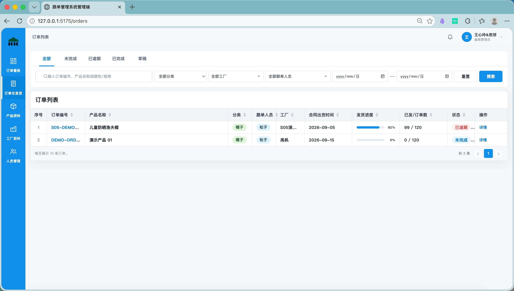
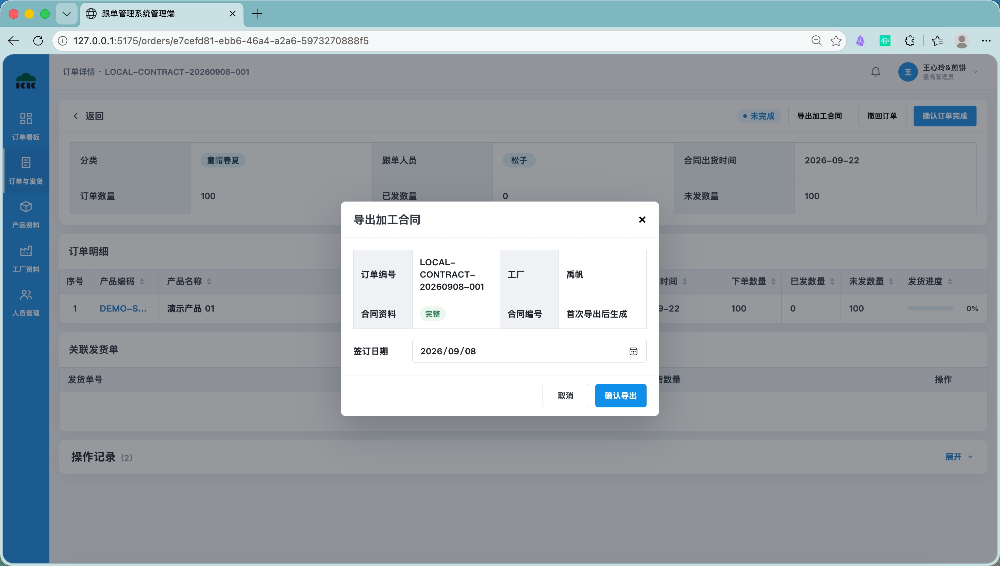
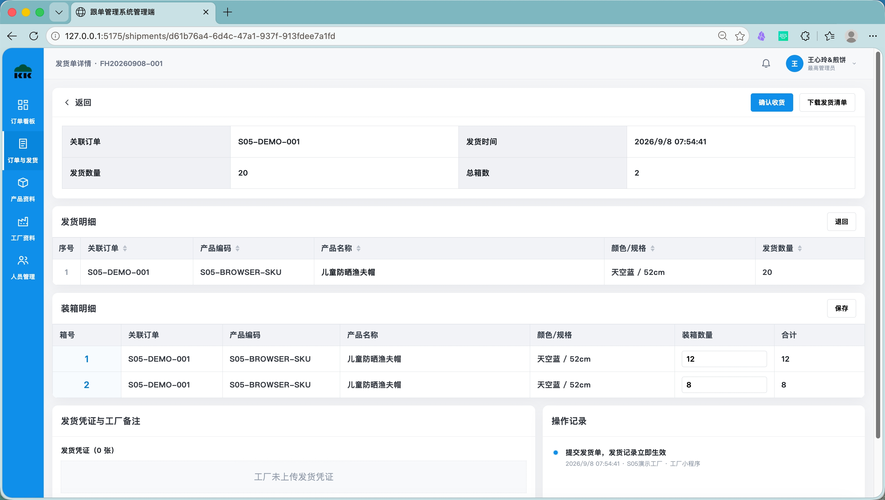
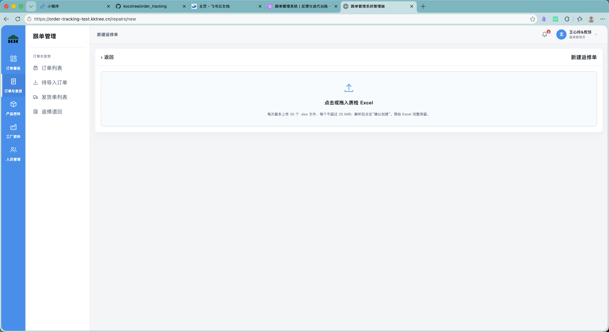
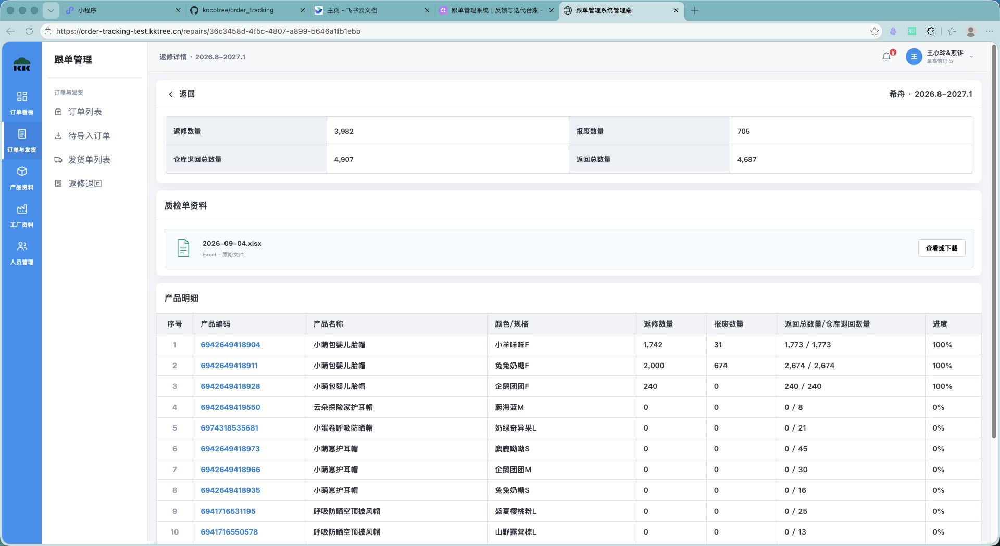
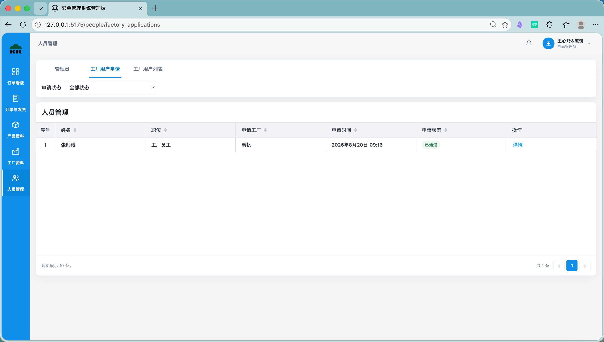

# 跟单管理系统｜管理员操作手册

适用：普通管理员、最高管理员。更新：2026-09-30；代码参考v1.1.6，实际开放功能及客户端版本见[交付清单](../交付清单.md)。本手册覆盖网页业务办理和管理员小程序查询。历史截图用于字段和操作位置示例，当前步骤以正文为准。

## 1. 登录与常用入口

打开管理员网页，点击“通过飞书登录”，使用本人企业账号授权。飞书必须返回有效已验证手机号，系统据此建立普通管理员；已有停用账号无法通过重新授权恢复。最高管理员使用同一登录入口。

登录后核对本人姓名。页面提示无手机号、停用或权限异常时，联系维护人员，提供错误及时间。不要借用他人账号。首次管理员微信登录前先完成网页飞书登录，用同一手机号唯一绑定内部管理员。

| 要做什么 | 入口 |
|---|---|
| 看进度、待处理及通知 | 看板、订单列表、通知记录 |
| 保存未派工资料、手动派工、合同、箱贴、完成 | 订单详情 |
| 核对收货、退回、下载发货清单 | 发货记录、发货单详情 |
| 批量质检、返修周期、附件、归档 | 返修单 |
| 工厂合同资料、用户审核和启停 | 工厂管理、人员管理 |
| 查询SKU及图片 | 产品资料 |
| 登记来货出入 | [飞书机器人手册](来货出入飞书机器人操作手册.md) |
| 在Codex办理管理员业务 | [Codex手册](Codex操作手册.md) |

## 2. 查找订单和理解数量

进入订单列表，搜索订单编号、产品名称或颜色/规格，按分类、工厂、跟单人员、合同出货时间、派工状态和业务状态筛选。点击详情查看逐行资料、数量、来货出入、发货记录和操作记录；返回时保留列表筛选。

下单是该明细要交的数量，已发包括来源初始已发及后续有效发货、收货差额、退回和来货出入；未发逐行最低为0，空值表示无法判断。派工状态与业务状态分别查看。合同出货时间按明细保存，同订单可能有多个日期。

## 3. 自动同步与未派工维护

系统每20分钟发现新订单、更新草稿／部分派工订单未派工资料，并按工厂自动派工。工厂、产品、合同出货时间、跟单集合和数量有效，工厂启用且有审核通过并启用的用户时，才可派工。同一厂一条无效会阻止本厂整组，其他工厂独立判断。

新来源订单任一明细原始进度低于95%或数量未知时，保留完整订单；全部明细均达到95%则跳过新建。找不到来源订单时联系维护人员查最近同步和筛选依据。

1. 在订单详情找到未派工行，核对产品、采购关联和工厂。
2. 选择工厂，填写合同出货时间、已发或联动未发数量。已发填0有效；人工清空日期有效，但日期缺失阻止派工。
3. 点击“保存”，等待成功；刷新确认已保存值及汇总正确。
4. 要读取最新来源时，点击“更新未派工明细”，核对预览，再确认更新。
5. 明确要派工时，勾选未派工行，点击“派工（已选…条）”，核对校验结果，全部通过后确认。

成功结果：所选明细显示已派工，工厂可见对应任务，操作记录可查。人工保存的工厂、日期、已发／未发覆盖不会被来源自动更新；已派工基线保持。显示有未保存修改时先保存，不能带未保存值确认更新或派工。

## 4. 手工草稿、撤回派工与完成

手工草稿页保留在网页`/orders/new`，当前订单列表没有新建按钮，日常使用由维护人员提供该页面链接。填写唯一订单编号、跟单人员、产品规格数量及工厂分配，保存后工厂不可见；核对各规格工厂分配合计及日期，在详情点击“发布订单”确认。来源明细订单使用第3节逐明细派工流程。

要撤回派工，在订单详情点击“撤回派工”，按弹窗选择可撤回工厂并确认。成功后仅该厂明细恢复未派工，其他厂不变，历史记录保留。人工撤回会暂停对应明细自动派工；后续需要恢复时补齐资料并手动派工。没有可撤回项时核对已有业务状态，按页面提示处理。

全部明细派工且全部交足后，点击“确认订单完成”，核对摘要后确认。仍欠货无法完成。完成后发生有效退回会自动恢复；补发交足后再次确认。需撤销完成时点击“撤销完成”并按弹窗核对原因及影响。

## 5. 导出加工合同和箱贴

### 加工合同

1. 打开订单详情，点击“导出加工合同”。
2. 选择工厂，检查产品、正整数下单数量及工厂代码、法定名称、地址、法定代表人。
3. 导出并下载xlsx，打开检查名称、颜色、尺码、数量、图片及文件名。
4. 需要填写加工单价时，在Excel中填写，核对金额公式。

首次合同可包含已匹配工厂的未派工明细，合同出货时间为空也可导出。首次合同编号、签订日期和明细快照固定，重复下载保留原内容。新合同按产品＋颜色分组，尺码数量逐行保留；历史合同按原布局。图片取同产品同色内SKU升序首张可用图，不能用其他颜色代替。合同单价和金额仅在导出文件填写。

### 箱贴

订单详情点击“导出箱贴”，按工厂、产品、颜色选择分组。可导出行点击导出，下载并核对图片、名称、颜色与打印内容；不可导出原因先处理。首次导出固定分组快照，来源图片之后更新不自动改写既有箱贴。Excel/WPS打开及实际打印结果须由业务核对。

## 6. 发货清单和收货核对

发货记录按工厂、日期、订单或产品查找。列表当前行下载该工厂当天汇总，文件为“工厂名称_YYYY-MM-DD_发货汇总.xlsx”；详情下载当前单。导出保留工厂原报装箱事实，包含发货明细和汇总。

1. 打开发货单详情，核对发货单号、日期、工厂、原报明细和凭证。
2. 在收货核对区逐箱逐规格输入实际收货数量，可填0；少收或多收按实际件数填写。
3. 点击保存，检查“核对草稿已保存”。此时订单进度尚未改变。
4. 再核对合计和每条差异，点击确认收货并确认弹窗。
5. 查看已确认状态、差异、订单数量和日志。重复点击应保持同一结果。

确认后原报装箱不会被改写，进度计入实际收货差额。已确认收货不能通过编辑草稿撤销；发现错误联系维护人员核查，不重复登记发货单。请求结果不明确时先刷新查询原单，再决定重试。

## 7. 按发货单退回和工厂撤回

按原单退货时，在发货单详情点击“按发货单退回”，勾选规格，填写不超过可退量的正整数及退回原因，核对后确认。成功后保留退回记录，对应订单已发减少、未发增加；工厂从正常订单任务登记补发。

工厂可自主撤回未确认收货且无有效退回的发货单，撤回立即冲销，修改重新提交后再计入，原单号保持。管理员查看状态与历史即可；已收货、有有效退回的单据需遵循页面限制。历史撤回审批记录只用于追溯。

## 8. 质检返修

1. 进入返修单，点击“新建返修单”，点击或拖入标准质检xlsx，可一次多份。
2. 核对每份文件对应工厂、规格、数量和解析错误；每份只属于一个工厂，单批最多20份、单份20MiB。
3. 修正有误文件后重新解析；预览校验通过后明确确认创建，检查生成结果。
4. 回返修列表，按工厂和返修周期查找，打开详情核对质检原件、退回量、返修／报废和历史发回。
5. 整周期全部返回并显示已完成后，点击归档，核对周期再确认。归档后三端隐藏，数据与日志继续保留。

周期为每年2—7月及8月—次年1月，未返完继续原周期。工厂提交返修＋报废发回立即计进度，系统按来源顺序分配，全部返回自动完成。质检返修不改变正常订单进度；原发货退回补发使用第7节。

## 9. 来货出入查询和修正

正式登记见[机器人手册](来货出入飞书机器人操作手册.md)。登记后在订单详情展开“来货出入”，逐条核对登记时间、采购单号、货号、产品、规格和有符号数量。

要更正已登记数量，修改数量框并离开输入框或按Enter，等待保存成功，核对汇总及操作记录。多货正数、少货负数，只接受非零整数；同SKU的不同记录逐条保留，修正只作用于新旧差额，不提供删除按钮。版本冲突刷新后重新核对。未派工记录由管理员可查，工厂可见性按当前有效派工判断。

## 10. 基础资料、人员和通知

工厂资料核对名称、供应商编号、合同代码及法定资料。新增供应商编号必填、自动大写并唯一；编辑时编号只读。工厂名称用于来源严格匹配。填写联系人用于申请审核，不填写已取消的银行、代理人或别名字段。

工厂用户申请详情核对姓名、电话、职位、申请工厂及联系人，批准时确认绑定工厂；拒绝必须填原因。普通管理员可办理工厂申请和工厂用户启停；仅最高管理员可管理普通管理员启停。

产品资料来自聚水潭七类启用产品，网页只读。图片问题按货号、SKU、颜色/规格、时间和现象提供证据，由维护人员处理来源和缓存。

Issue #215 上线后，新单同步和“更新未派工明细”遇到产品匹配失败，会自动按产品编码补拉聚水潭整款资料并重新匹配，图片随后异步缓存。查不到或资料仍不一致时继续显示异常。手动更新在预览时补齐产品库；取消预览保留补齐的产品资料，订单明细仍需确认才更新。上线状态见[版本发布记录](../版本发布记录.md)。

网页顶部、看板和通知记录可查通知，点击前往相应业务详情。管理员小程序“我的”可查看通知中心及发起微信提醒授权；授权拒绝不阻断正常登录和站内查询。合同出货提醒按角色走飞书／微信，真实外发受当前配置与平台授权影响。

## 11. 管理员小程序

首次微信手机号绑定同一管理员后，可查看订单／进度、发货概览与规格／逐箱／凭证／备注／记录、返修周期及质检附件、通知。小程序管理员入口以只读查询为主；订单维护、收货确认、来货数量修正、合同／箱贴导出和人员办理使用网页或对应已注册MCP工具。

出现与网页数据不一致时，先核对账号、环境、筛选和刷新时间，再记录订单／单号及现象交维护人员。退出仅清理相应会话，身份绑定保留；网页与Codex共同退出规则见Codex手册。

## 12. 遇到问题

| 现象 | 自查及提供的信息 |
|---|---|
| 找不到订单／工厂任务 | 清除筛选，检查派工状态、账号所属及自动同步；提供订单号和工厂 |
| 保存／确认失败 | 阅读具体问题，刷新当前版本；结果不明先查原单和日志；提供requestId／时间 |
| 图片／文件打不开 | 核对登录、文件归属、实际SKU和网络；提供文件名及错误，不共享私有链接 |
| 数量不符 | 提供订单明细、原报、收货、退回、来货及修改记录，由维护人员逐项核对 |
| 通知未到 | 先查站内和业务结果，再核对订阅／外发配置；不重复执行业务提交 |
