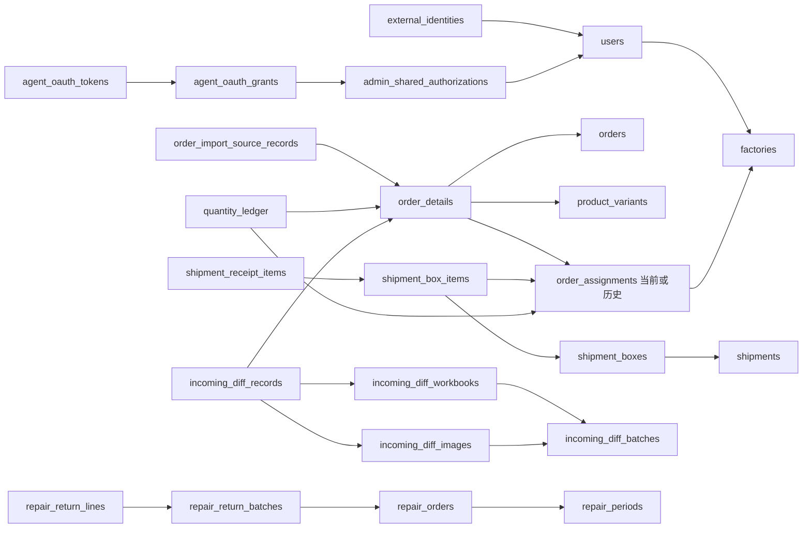

# 数据字典与关系图

## 自由整理与多文件登记（Issue #239）

迁移 `20261009_0052` 为本增量代码目标，生产迁移另行授权。

| 对象 | 新字段与约束 |
|---|---|
| `incoming_diff_batches` | `source_kind` 默认 PHOTO，文件导入 FILE；`source_message_id` 唯一；`source_sent_at` 为飞书毫秒时间；`attachments` 完整附件清单；`review_revision` 审核修订。新增 VALIDATING、NEEDS_DECISION、NEEDS_SELECTION、SUPERSEDED 状态 |
| `incoming_diff_workbooks` | direction 增加 IMPORTED；聚合导入的 file_id 可空，原件逐个保存在附件表；line_snapshot 包含最终单元格、匹配身份、稳定编号、重复证据及决定 |
| `incoming_diff_import_files` | import_file_id UUID 主键，workbook_id → 工作簿，file_id → StoredFile，position；工作簿内位置唯一 |
| `incoming_diff_records` | image_id 可空；新增 import_file_id、source_sheet_name、source_row_number；CHECK 要求图片来源或完整文件行来源，确认时再检查附件属于本次工作簿 |

原图片、历史工作簿和已登记记录继续保留；自由整理后的精确来源是保存的最终 Excel 及物理行号。已有文件导入或审核修订时拒绝有损降级。其余字段基线如下。

## 出货阶段汇总（Issue #227）

迁移 `20261006_0051` 增加以下表；已随 PR #228 合并。生产实际 revision 见交付清单的核验状态。

| 表 | 约束与用途 |
|---|---|
| `shipment_writeback_control` | 单行事务同步点，保存历史准备状态、来源范围、字段绑定与公式更新意图 |
| `shipment_writeback_facts` | 提交/撤回的不可变时间与原报明细快照，`event_key` 唯一；不依赖通知投递结果 |
| `shipment_writeback_stages` | 阶段主键、来源范围、UTC统计边界、排除记录 |
| `shipment_writeback_claims` | 根发货单主键，绑定唯一阶段及选用事实；成功或重试中均禁止跨期再领取 |
| `shipment_writeback_rows` | 阶段＋来源记录复合主键，保存身份、绝对数量、字段 ID、回读状态；`before_value` JSON 保存首次 `value`、最近 `observed_value` 和 `outcome`（`WRITTEN`／`SKIPPED_EXISTING`）。跳过行保持 `verified=false`，已验证或已跳过均为终态 |

来源链路沿 `ShipmentLine.order_assignment_id → OrderAssignment.detail_id → OrderDetail.source_record_pk`，保留重新派工前的历史关系。执行结果保存在 `audit_logs` 的 `shipment_writeback.execute`，调度与重试复用 `background_jobs`。时间在库内按 UTC 保存，统计边界与日志截止点按北京时间解释；既有原报、有效数量及订单进度定义保持各自职责。

核对：2026-10-07，代码 `8c924ae`，迁移目标 `20261006_0051`。依据[SQLAlchemy模型](../../../server/app/db/models.py)和[Alembic迁移](../../../server/migrations/versions/)核对；本轮未查询生产数据库。本文提供全表索引及关键业务字段，精确全列DDL、索引与默认值以模型和对应迁移为准，目标环境还须核对`alembic_version`。

MySQL8为正式事实库。UUID类ID通常为`VARCHAR(36)`，明细／文件／流水中的数值ID为`BIGINT`，数量为`INTEGER`，业务日期为`DATE`，时间戳为`DATETIME(6)`，快照为`JSON`；具体列类型见下表和模型。`NULL`代表未知或缺失，不能用0替代。`version`保护并发更新。

## 关系主链

图示关联主链，未声明所有基数。`order_details.assignment_id`指向当前有效派工，`order_assignments.detail_id`保留来源关联；同明细可有多个历史派工。`quantity_ledger`每行仅归属派工或未派工明细其中一个。返修独立于正常数量账本。

## 全表索引

### 身份、工厂与产品

| 表 | 主要标识／字段 | 用途与关系 |
|---|---|---|
| `users` | `user_id, role, is_super_admin, is_enabled, factory_id, version` | 内部用户；厂角色绑定一个工厂，管理员无工厂范围限制 |
| `external_identities` | `platform, scope, platform_subject, user_id` | 飞书、微信身份唯一映射内部用户 |
| `oauth_states` | `state_digest, terminal, return_to, expires_at, used_at` | 一次性OAuth状态 |
| `user_sessions` | `session_id, shared_auth_id, terminal, token_digest, refresh_token_digest, csrf_digest` | 网页／微信会话；失效、活动及续期时间 |
| `admin_shared_authorizations` | `auth_id, user_id, last_activity_at, revoked_at` | 网页和MCP共同授权 |
| `agent_oauth_requests` | `request_id, client_id, resource, code_challenge, browser_digest, code_digest, used_at` | PKCE授权请求与一次性兑换 |
| `agent_oauth_grants` | `grant_id, user_id, shared_auth_id, client_id, resource, scope` | Agent授权范围 |
| `agent_oauth_tokens` | `token_id, grant_id, token_digest, kind, expires_at, consumed_at, revoked_at` | Token摘要及轮换／撤销 |
| `mini_login_attempts` | `attempt_id, token_digest, scope, platform_subject, expires_at, used_at` | 微信手机号绑定前一次性凭据 |
| `sms_challenges` | `challenge_id, phone_digest, purpose, code_digest, attempts` | 历史／验证结构；当前管理员登录使用飞书验证手机号 |
| `admin_applications` | `application_id, user_id, status, reviewed_by, previous_application_id` | 历史管理员申请；当前无管理员申请审核入口 |
| `factories` | `factory_id, supplier_number, factory_name, factory_code, legal_name, address, legal_representative` | 供应商编号与合同工厂代码独立；合同法定资料 |
| `factory_contacts` | `contact_id, factory_id, name, phone, display_order, is_primary` | 工厂联系人与审核核对依据 |
| `factory_applications` | `application_id, requested_factory_id, bound_factory_id, status, rejection_reason, version` | 申请、审核与工厂绑定历史 |
| `products` | `product_id, source_i_id, name, is_available` | 款式资料；旧产品图字段保留兼容 |
| `product_variants` | `variant_id, product_id, source_sku_id, properties_value, source_category, is_available` | SKU资料及独立图片 |
| `product_sync_runs` | `run_id, run_type, status, active_key, next_page, success_cursor, image_jobs_created` | 同步互斥、分页、游标、结果统计 |
| `product_sync_staged_variants` | `staged_id, run_id, source_i_id, source_sku_id, pic, enabled` | 来源暂存，完整成功后应用 |

### 订单、来源及导出

| 表 | 主要标识／字段 | 用途与关系 |
|---|---|---|
| `order_import_runs` | `run_id, status, active_key, sync_result, pages_read, failed_records` | 自动同步和历史导入执行结果 |
| `order_import_source_records` | `source_record_pk, source_scope, source_record_id, raw_fields, normalized_fields` | 来源行身份、原文及解析结果 |
| `order_import_source_cursors` | `source_scope, successful_modified_at, successful_run_id` | 成功来源游标 |
| `order_import_candidates` | `candidate_id, order_no, status, field_overrides, trackers, imported_order_id` | 存量候选结构，自动流程承接；无当前候选页面 |
| `order_import_candidate_lines` | `candidate_line_id, source_record_pk, matched_variant_id, matched_factory_id` | 历史候选明细 |
| `order_import_validation_issues` | `issue_id, candidate_id, candidate_line_id, code, field_name` | 历史候选校验问题 |
| `orders` | `order_id, order_no, source, detail_mode, lifecycle, trackers, tracker_locked_at, version` | 订单主体、来源协议、跟单集合及生命周期 |
| `order_details` | `detail_id, order_id, source_record_pk, assignment_id, version` | 当前来源明细与人工覆盖，允许未派工 |
| `order_lines` | `order_line_id, order_id, product_variant_id, order_quantity, *_snapshot` | 手工订单／执行明细及产品固定快照 |
| `order_assignments` | `order_assignment_id, order_line_id, detail_id, factory_id, is_active` | 按厂执行基线与派工历史 |
| `order_change_previews` | `preview_id, order_id, actor_id, version, payload, expires_at, consumed_at` | 来源／派工预览、一次性确认 |
| `order_completion_records` | `record_id, order_id, action, reason, quantity_snapshot` | 完成／恢复证据，原完成历史保留 |
| `processing_contracts` | `contract_id, order_id, factory_id, contract_no, contract_snapshot, template_version` | 一订单一工厂固定合同 |
| `contract_number_counters` | `signing_date, factory_id, next_sequence` | 稳定合同序号 |
| `contract_exports` | `export_id, contract_id, status, export_snapshot, stored_file_id` | 每次导出任务及文件 |
| `box_label_exports` | `export_id, order_id, group_id, factory_id, product_id, color, snapshot, stored_file_id` | 一订单一分组的箱贴固定快照 |

### 发货、收货及数量

| 表 | 主要标识／字段 | 用途与关系 |
|---|---|---|
| `shipments` | `shipment_id, shipment_no, source_shipment_id, factory_id, status, active_draft_owner_id, version` | 原单、草稿、撤回及修改权限；同号重新发货 |
| `shipment_boxes` | `box_id, shipment_id, box_no, group_key` | 逐箱装箱及连续箱组 |
| `shipment_box_items` | `item_id, box_id, order_assignment_id, quantity` | 原报箱项数量和订单归属 |
| `shipment_lines` | `line_id, shipment_id, order_assignment_id, quantity, *_snapshot` | 原报规格汇总和导出快照 |
| `shipment_files` | `shipment_file_id, shipment_id, stored_file_id, display_order` | 凭证关系，历史与草稿可共享文件 |
| `shipment_receipts` | `shipment_id, status, version, saved_by, confirmed_by` | 收货草稿及整单确认 |
| `shipment_receipt_items` | `box_item_id, shipment_id, quantity, order_assignment_id` | 逐箱实际收货，允许0 |
| `shipment_void_requests` | `request_id, shipment_id, active_shipment_id, status, reason` | 仅保留历史审批归档；运行代码不再读写，当前自主撤回状态和操作记录由发货及审计结构保存 |
| `shipment_return_events` | `event_id, shipment_id, returned_by, return_date, reason, idempotency_key` | 按发货单退回事件 |
| `shipment_return_lines` | `return_line_id, event_id, shipment_line_id, quantity, before_shipped_quantity, after_shipped_quantity` | 退回数量和前后证据 |
| `quantity_ledger` | `ledger_id, order_assignment_id, order_detail_id, source_type, source_id, quantity_delta` | 正负流水及唯一归属 |
| `shipment_number_counters` | `business_date, next_sequence` | 当日发货单编号 |

### 质检返修

| 表 | 主要标识／字段 | 用途与关系 |
|---|---|---|
| `repair_previews` | `preview_id, original_file_id, source_sha256, factory_id, validation_errors, expires_at` | 原件解析预览，确认前无任务 |
| `repair_preview_lines` | `line_id, preview_id, source_sheet, source_row, source_sku_id, quantity, validation_errors` | 每行匹配与校验 |
| `repair_orders` | `repair_id, period_id, repair_no, factory_id, warehouse_return_quantity, repaired_quantity, scrapped_quantity, original_file_id` | 单份质检事实及返回进度 |
| `repair_inspection_lines` | `inspection_line_id, repair_id, source_order, box_number, variant_id, warehouse_return_quantity` | 来源顺序、规格及退回量 |
| `repair_return_batches` | `batch_id, repair_id, period_batch_id, submitted_by, idempotency_key` | 原单发回批次 |
| `repair_return_lines` | `return_line_id, batch_id, line_order, variant_id, repaired_quantity, scrapped_quantity` | FIFO分配后的返修／报废量 |
| `repair_return_drafts` | `repair_id, user_id, version, entries, submission_key` | 旧单级发回草稿 |
| `repair_periods` | `period_id, factory_id, start_date, end_date, label, archived_at` | 工厂半年周期，按厂＋开始日期唯一 |
| `repair_period_batches` | `batch_id, period_id, submitted_by, submitted_at, idempotency_key, request_sha256` | 周期发回提交及幂等 |
| `repair_period_drafts` | `repair_id, user_id, version, entries, submission_key` | 周期发回草稿，沿用历史列名 |
| `repair_number_counters` | `business_date, next_sequence` | 返修单编号 |

### 来货出入、文件及基础设施

| 表 | 主要标识／字段 | 用途与关系 |
|---|---|---|
| `incoming_diff_batches` | `batch_id, batch_no, submitter_id, status, current_workbook_id, frozen_at, confirmed_at` | 本人批次、冻结识别、当前表与整批确认 |
| `incoming_diff_images` | `image_id, batch_id, sort_order, file_id, content_sha256, recognition_payload, recognition_model` | 原图、识别候选、疑似重复及失败 |
| `incoming_diff_workbooks` | `workbook_id, batch_id, version, direction, file_id, signature, line_snapshot, validation_issues` | 生成／回传核对表、HMAC与固定行身份 |
| `incoming_diff_records` | `record_id, batch_id, workbook_id, image_id, order_id, detail_id, order_assignment_id, quantity, version` | 已确认逐行记录和采购／SKU身份 |
| `incoming_diff_adjustments` | `adjustment_id, record_id, before_quantity, after_quantity, delta, actor_id, request_id` | 每次数量修正的差额证据 |
| `stored_files` | `file_id, bucket, object_key, original_filename, mime_type, size_bytes, content_sha256, uploaded_by` | 私有文件索引和摘要 |
| `idempotency_records` | `scope, idempotency_key, status, request_hash, result` | 同作用域业务动作去重，保存结果 |
| `background_jobs` | `job_type, dedupe_key, payload, status, available_at, attempts, locked_by, locked_at` | 后台队列、重试与租约 |
| `outbox_messages` | `dedupe_key, event_type, message_kind, channel, recipient_id, status, manual_review_required` | 事务事实与投递，失败及告警字段 |
| `notification_authorizations` | `user_id, template_key, result, authorized_at, consumed_at` | 微信订阅机会与消耗 |
| `notifications` | `recipient_id, event_type, target_type, target_id, dedupe_key, read_at` | 站内通知及当前对象权限 |
| `audit_logs` | `request_id, action, target_type, target_id, changes, actor_id, source_terminal` | 人工／系统操作前后及时间 |

## 核心字段定义

### 订单明细与派工

| 字段 | 类型／可空 | 含义和维护规则 |
|---|---|---|
| `order_details.purchase_order_id / purchase_order_item_id` | `TEXT`／是 | 精确采购主／子单，禁止猜测；正式来货记录内保存必填`VARCHAR(191)`快照 |
| `accepted_raw_fields` | `JSON`／否 | 已接受来源原文，保留`_purchase`等采购快照 |
| `accepted_source_modified_at / accepted_source_hash` | `DATETIME(6)`、`VARCHAR(64)`／是 | 来源更新版本及内容哈希 |
| `source_sku_id / product_name / properties_value / category / factory_name` | `TEXT`／是 | 来源SKU、名称、规格、分类和工厂，缺失可保留草稿 |
| `matched_variant_id / matched_factory_id` | `VARCHAR(36)`／是 | 严格匹配系统SKU和工厂 |
| `order_quantity / source_shipped_quantity` | `INTEGER`／是 | 来源下单／初始已发，未知保留空 |
| `source_trackers` | `JSON`／否 | 合法多人跟单集合；单数旧字段保留兼容 |
| `source_contract_ship_date / contract_ship_date` | `DATE`／是 | 来源日期与有效合同出货时间；来源减4自然日、人工直接值 |
| `date_override_enabled / factory_override_enabled / shipped_override_enabled` | `BOOLEAN`／否 | 区分未人工覆盖与明确清空／0覆盖 |
| `parse_issues` | `JSON`／否 | 未满足匹配／派工条件的问题 |
| `assignment_id` | `BIGINT`／是 | 当前有效派工外键，可空且唯一；历史派工保留 |
| `dispatch_batch_id / dispatch_state` | `VARCHAR(36)`、`VARCHAR(16)`／前者可空 | 派工批次与逐行状态 |
| `auto_dispatch_paused` | `BOOLEAN`／否，默认0 | 人工撤回后暂停自动派工，手动再派成功解除 |
| `order_assignments.detail_id` | `VARCHAR(36)`／是 | 来源明细关联；同明细可保留多个inactive历史 |
| `is_active` | `BOOLEAN`／否 | 当前执行是否有效，不能用删除历史代替撤回 |
| `assigned_quantity` | `INTEGER`／否，正数 | 固定派工下单基线 |
| `initial_shipped_quantity` | `INTEGER`／否，非负 | 固定初始已发，可超过派工量 |

`orders.detail_mode`决定来源明细与手工订单协议；旧`orders.contract_ship_date`仅兼容，不作为现行逐明细日期来源。`orders.trackers`保存多人集合，`tracker_locked_at`标记首派锁定。

### 数量和来货出入

| 字段 | 类型／可空 | 定义 |
|---|---|---|
| `quantity_ledger.order_assignment_id / order_detail_id` | `BIGINT`、`VARCHAR(36)`／各可空 | CHECK保证恰有一种归属；已派工指派工，未派工指来源明细 |
| `source_type / source_id` | 字符串／否 | 业务动作类型和唯一动作标识；按各归属建立来源唯一约束 |
| `quantity_delta` | `INTEGER`／否，非零 | 对累计已发的有向增量 |
| `incoming_diff_records.detail_id / variant_id` | `VARCHAR(36)`／否 | 唯一订单明细和SKU身份 |
| `order_assignment_id / shipment_id` | `BIGINT`、`VARCHAR(36)`／是 | 未派工记录派工为空；无原发货单也可登记 |
| `quantity / initial_quantity` | `INTEGER`／否 | 当前非零有符号数量／首次确认值；正多货、负少货 |
| `source_business_date` | `DATE`／是 | 原凭证可无日期；不得补造日期 |
| `product_code_snapshot / product_name_snapshot / spec_snapshot` | `VARCHAR(100/255/255)`／否 | 登记时货号、名称及规格，颜色与尺码直接拼接 |
| `registered_at / registered_by` | `DATETIME(6)`、`VARCHAR(36)`／否 | 正式登记时间与本人管理员 |
| `incoming_diff_adjustments.delta` | `INTEGER`／否 | 新quantity减旧quantity；追加审计，不覆盖首次值 |
| `incoming_diff_workbooks.version / direction` | `INTEGER`、`VARCHAR(16)`／否 | 同批版本唯一；`GENERATED / UPLOADED` |
| `signature / line_snapshot` | 字符串、`JSON`／否 | HMAC签名和来源行身份；手工新增行不能登记 |

批次状态CHECK：`COLLECTING / RECOGNIZING / READY / CONFIRMED / FAILED`。每个正式差异对应原始流水，后续修改只增加新旧差额；同SKU多行保留每次来源。匹配唯一性是业务确认校验，不能误写成全局工厂＋SKU唯一。

### 文件、图片与导出

| 字段 | 类型／可空 | 定义 |
|---|---|---|
| `product_variants.image_source_ref` | `VARCHAR(1000)`／是 | 该SKU来源图引用 |
| `image_object_key` | `VARCHAR(500)`／是 | 私有缓存对象，不向客户端暴露公开永久地址 |
| `image_cache_status / image_cache_error` | `VARCHAR(32/100)`／错误可空 | 缓存状态及脱敏失败码；初始status为`missing` |
| `image_revision / image_source_modified_at` | `VARCHAR(36)`、`DATETIME(6)`／是 | 取图版本与来源时间，拒绝跨版本误用 |
| `order_lines.image_object_key_snapshot` | 字符串／是 | 新建订单执行图快照，历史不随来源图片覆盖 |
| `processing_contracts.contract_snapshot / template_version` | `JSON`、`VARCHAR(32)`／否 | 首次固定业务内容和渲染版本；订单＋工厂、合同号均唯一 |
| `contract_exports.export_snapshot / stored_file_id` | `JSON`、文件外键 | 每次导出快照与文件；以导出状态判断成功 |
| `box_label_exports.snapshot / template_version / stored_file_id` | `JSON`、字符串、文件外键 | 首次订单＋group固定内容，`order_id,group_id`唯一 |
| `stored_files.content_sha256 / size_bytes / mime_type` | 字符串、整数、字符串 | 实际内容校验；不得仅靠扩展名判断 |

`products`旧款式图片字段为兼容结构，现行图片以SKU为主。导出代表图只在同产品、颜色内按SKU升序选首张可用图片。原图片、质检和来货原图长期保留；删除草稿文件关系后，仍须保留被历史记录引用的共享对象。

### 身份与后台约束

手机号在`users`中保存密文`phone_encrypted`、匹配摘要`phone_digest`和脱敏显示`phone_masked`；禁止为交接补明文。Token、refresh、CSRF、OAuth code和state保存摘要。共同授权的活动与撤销分别由`last_activity_at`、`revoked_at`控制。

幂等约束：`idempotency_records(scope,idempotency_key)`、`background_jobs(job_type,dedupe_key)`、`outbox_messages.dedupe_key`。锁字段`locked_by/locked_at`是任务租约，业务对象仍需事务行锁及version校验。`audit_logs.source_terminal`区分web、mini、agent、system等当前业务来源，`changes`只保存必要脱敏证据。

## 迁移与历史数据

迁移链至0049：0040采购关联、0041Agent OAuth、0042收货派工关联、0043来货出入、0044可空原日期、0045图片下载失败、0046自动订单同步／撤回暂停、0047SKU图片、0048箱贴、0049未派工来货数量归属。精确操作见迁移文件；当前schema不能从旧0031／0037交接快照判断。

`order_details`与`order_assignments`互相引用，模型通用自动排序会报告环形依赖；实际建表和外键顺序由Alembic管理。不能用`metadata.create_all()`替代正式迁移。0049对已有未派工数量记录设置降级保护；部署与恢复规则见[运维](部署与运维手册.md)。历史候选、申请、派工、文件引用及旧合同模板的存在不代表当前页面仍开放旧流程。
