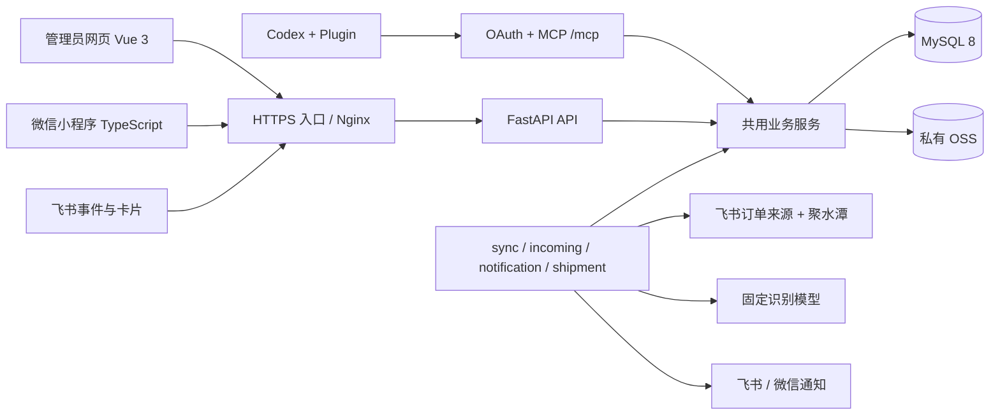

# 系统说明与架构

基线：2026-09-30，服务器 `v1.1.6`。系统用于生产部与外协工厂协作，贯通订单来源、派工、合同、装箱发货、收货差异、退回补发、质检返修及来货出入登记。功能交付状态见[交付清单](交付清单.md)。

## 角色和入口

| 角色 | 入口 | 权限边界 |
|---|---|---|
| 普通管理员 | 网页、管理员小程序、本人授权的 Codex、飞书机器人 | 全部业务数据；网页／MCP办理管理员业务，管理员小程序以查询为主；机器人仅处理本人批次 |
| 最高管理员 | 同一管理员入口 | 另可启停普通管理员；最高管理员账号禁止在人员页面停用 |
| 工厂老板、工厂员工 | 工厂小程序 | 仅所属工厂任务、附件、发货、返修与通知 |
| 后台系统 | worker | 自动同步、按工厂派工、识别、缓存与消息投递；系统审计与人工操作区分 |

网页管理员通过飞书已验证手机号建立内部用户；工厂首次微信授权后提交申请，管理员审核并绑定工厂。管理员微信手机号须唯一匹配已有管理员。最高管理员由受控飞书身份白名单识别。外部身份归并到内部 `user_id`，客户端不能自行指定操作人。

## 架构

后端使用 Python 3.13、FastAPI、SQLAlchemy、Alembic。三客户端复用业务服务和 MySQL，MCP权限沿用管理员规则。API 与 worker 共用 server 镜像；网页使用独立镜像。小程序独立上传发布。正式运行代码不依赖 `prototype/`。

MySQL 保存业务事实、并发版本、文件索引、审计、后台任务和 outbox；OSS 保存私有图片、质检文件及导出文件。飞书是订单上游，聚水潭提供商品及采购数据；系统不自动回写飞书订单。模型输出是核对候选，正式登记由管理员明确确认。

## 业务主链

| 流程 | 处理顺序及关键控制 |
|---|---|
| 来源订单 | 每20分钟获取→严格采购和 SKU 匹配→自动草稿／更新未派工明细→按工厂校验→自动派工；同厂任一无效明细阻止该厂，其他厂独立判断 |
| 人工维护 | 工厂、合同出货时间、已发／联动未发明确保存；0和清空日期有效；来源更新只预览读取一次，确认应用快照；派工读取系统值 |
| 派工 | 工厂启用且存在启用、审核通过用户，SKU可用、数量及日期和跟单集合有效；部分派工保留未派工明细；撤回所选厂保留历史并暂停该明细自动派工 |
| 合同、箱贴 | 管理员选择分组→首次生成固定快照→下载受控文件；合同按订单＋工厂，箱贴按订单＋工厂＋产品＋颜色 |
| 正常发货 | 工厂建箱→逐箱关联订单派工规格→凭证→预览→提交；草稿不记数量，提交计入原报数量 |
| 收货 | 管理员保存逐箱草稿→整单确认→差额只入账一次；原报装箱与发货清单保留 |
| 撤回、退回 | 合法未收货、无有效退回单由工厂撤回、修改、同号重新提交；管理员按原发货单退回形成负向账本，工厂从正常任务补发 |
| 完成 | 全部派工且全部交足后管理员确认完成；退回造成欠货自动恢复，补发后再次确认 |
| 质检返修 | 批量 `.xlsx` 解析预览→确认创建→按工厂半年周期汇总→分批返修／报废发回→FIFO分配原单→全部返回自动完成→整周期归档 |
| 来货出入 | 飞书发图→冻结识别→按工厂生成签名 Excel→人工核对／回传→提交人明确确认整批→数量流水、正式记录和通知；管理员后续调整数量留差额和审计 |

## 数量与状态

采购下单数量来自 `qty`，来源初始已发来自 `inQty`，采购退货数量不参与。新订单全部明细可判断且原始进度均达到95%时跳过；任一严格低于95%或数量未知时保留完整订单。该发现门槛不能作为系统完成判断。

已派工已发量＝固定初始已发＋有效数量流水；流水含发货、确认收货差额、撤回／退回冲销、来货出入及调整。未派工读取已接受来源及人工覆盖，并计入该明细的来货出入流水。派工与撤回迁移流水归属须保留同一业务事实。逐明细未发取 `max(下单－已发, 0)` 再汇总；未知数量保留未知。

来货出入多货为正、少货为负，必须唯一定位工厂、订单明细、采购子单和 SKU；发货单可空。匹配覆盖未派工、部分派工、全部派工。单一候选可忽略未发数量；多个候选按现行需求过滤及日期规则处理，歧义保持待确认。相同 SKU 的不同差异逐条保存。

订单业务状态为未完成、已逾期、已完成；派工进度独立显示未派工、部分派工、全部派工。逾期只看仍欠货且有合同出货时间的可见明细。返修使用未完成、已完成，无逾期；返修返回＝返修量＋报废量，与正常订单账本独立。

合同首次签订日期和编号稳定；首次可包含未派工、日期为空的匹配明细。新合同 v3 按产品＋颜色合并名称、图片等，保留尺码数量；历史 v1/v2 按原快照布局下载。SKU 独立保存图片，导出时才在同产品、颜色内按 SKU 升序选首张可用代表图。

## 后台可靠性

业务事务内写数量、审计和通知事实，外发由 outbox处理。幂等键、唯一约束、行锁及乐观版本分别保护重复提交和并发更新。文件下载重新校验当前权限；数据库只存 Token 摘要、手机号密文和匹配摘要。

单 worker 容器管理 `sync`、`incoming`、`notification`、`shipment` 四个串行子进程。Issue #231 将出货汇总到期扫描及执行迁至 `shipment`，`sync` 保留订单与产品六类任务；该进程变更待发布。领取和过期任务恢复都按角色过滤；子进程异常退出会终止兄弟进程并重启整容器。业务动作成功、站内通知入库和外部送达应分别验证。详见[运维手册](部署与运维手册.md)。

正式业务定义见[一期需求](../../一期/requirements/一期需求文档.md)、[二期来货出入需求](../../二期/requirements/二期需求文档.md)、[箱贴需求](../../二期/requirements/箱贴导出需求.md)与[领域术语](../../../CONTEXT.md)。
