

# 跟单管理系统｜工厂操作手册

适用：工厂老板、工厂员工。更新：2026-09-10。

**正常发货：建箱号 → 填装箱 → 加凭证 → 提交。**

截图仅作示例，请填写本次实际发货内容。

## 常用入口

| 要做什么 | 点哪里 |
|---|---|
| 查订单、看还差多少 | **「任务 → 订单」** |
| 登记正常发货 | **「任务 → 创建发货单」**，见第 3 节 |
| 查记录、撤回修改 | **「发货记录」**，见第 4、5 节 |
| 发回返修品 | **「任务 → 返修」**，见第 6 节 |
| 查通知、开提醒 | **「我的」**，见第 7 节 |

## 1. 首次使用：申请加入工厂

1. 从管理员提供的入口打开小程序，同意协议，点 **「微信授权登录」**，授权本人手机号。
2. 填真实姓名，选职位和自己的工厂，点 **「提交申请」**。
3. 等管理员审核，点 **「刷新审核结果」**。
4. 通过后到 **「我的」**，确认所属工厂正确。

找不到工厂或账号停用，请联系管理员；申请被拒绝，查看原因后点 **「修改并重新提交」**。

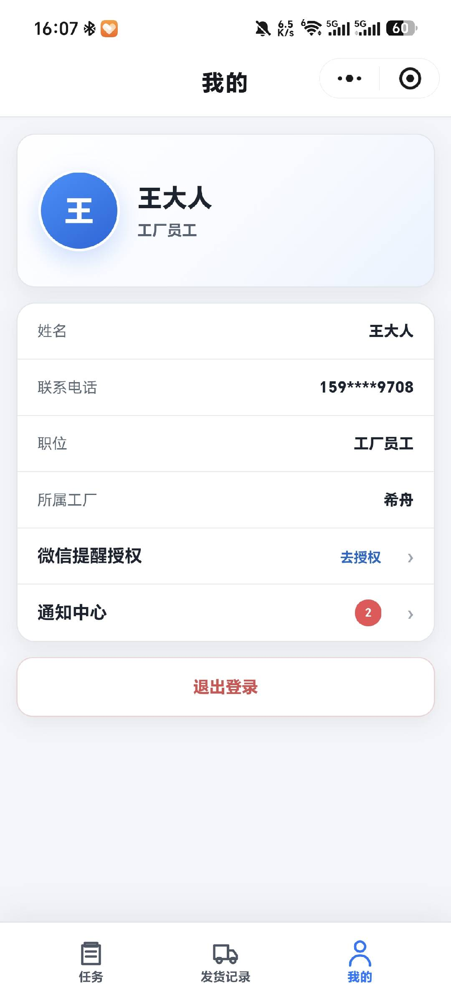

图 1｜先核对所属工厂，再开始操作。

## 2. 查任务：看订单、规格和未发数量

1. 点 **「任务 → 订单」**，按订单编号或产品名称查找。
2. 点订单卡片，查看具体规格的 **「未发」** 数量及合同出货时间。

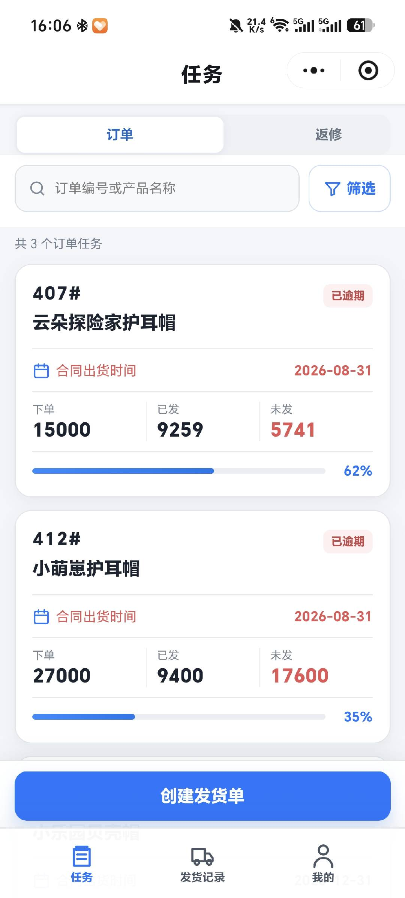

图 2｜点卡片查任务；点底部 **「创建发货单」** 登记发货。

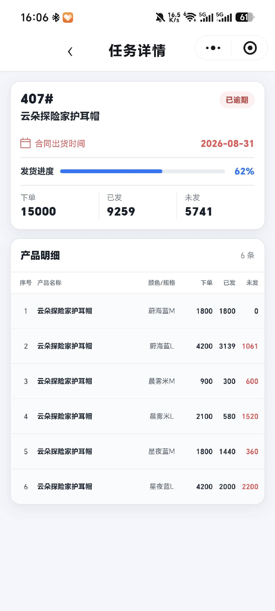

图 3｜下单＝本厂要交的；已发＝当前累计；未发＝还差的。不同规格可能有不同合同出货时间。

## 3. 正常发货：四步完成

**先准备总箱数、每箱规格、订单和件数。下面以 5 箱、每箱 10 件为例。**

### ① 箱号：这次发几箱

1. 点 **「创建发货单」**，总箱数填 `5`，点 **「生成箱号」**。
2. 确认出现箱号 1～5，点 **「下一步：装箱」**。

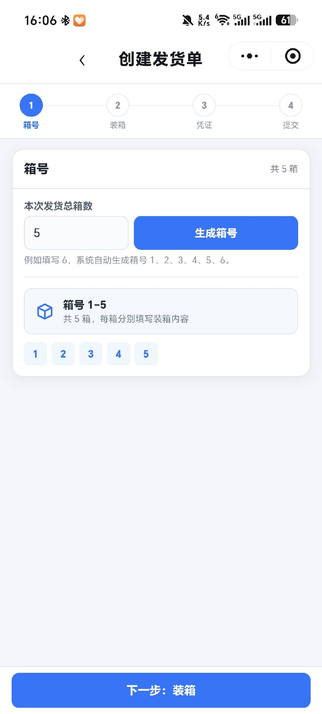

图 4｜这里填 **箱数，不是总件数**。

### ② 装箱：每箱装什么

1. 点箱号 **「1」**，依次选产品、颜色/规格、订单编号。
2. 装箱数量填 `10`，点 **「添加明细」**，检查下方出现 10 件。
3. 换下一箱继续填；混装箱在同一箱添加多条明细。
4. 每箱填好后，点 **「下一步：凭证」**。

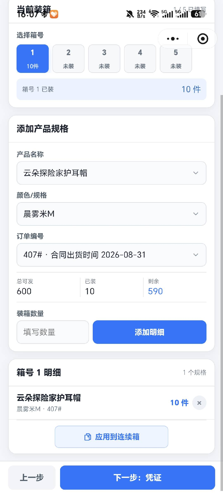

图 5｜**填数字后必须点「添加明细」**。重复添加会累加数量；填错点明细右侧 **「×」** 删除后重填。

### 多箱完全相同：复制到连续箱

1. 填好第一箱，点 **「应用到连续箱」**。
2. 后续连续箱数填 `4`，点 **「确认应用」**。
3. 检查箱号 2～5 是否正确。

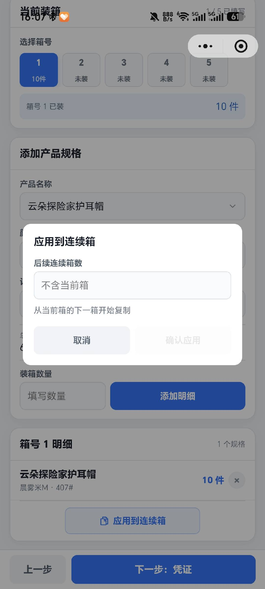

图 6｜**共 5 箱，第一箱已填，这里填 4**。只复制装法完全相同的箱；尾箱不同就单独填。复制沿用当前订单，先核对目标箱已有内容。

### ③ 凭证：照片和备注可选

有凭证点 **「添加照片」**，最多 3 张；备注可写物流说明。填好或不需要时，点 **「下一步：预览」**。上传失败先重试。

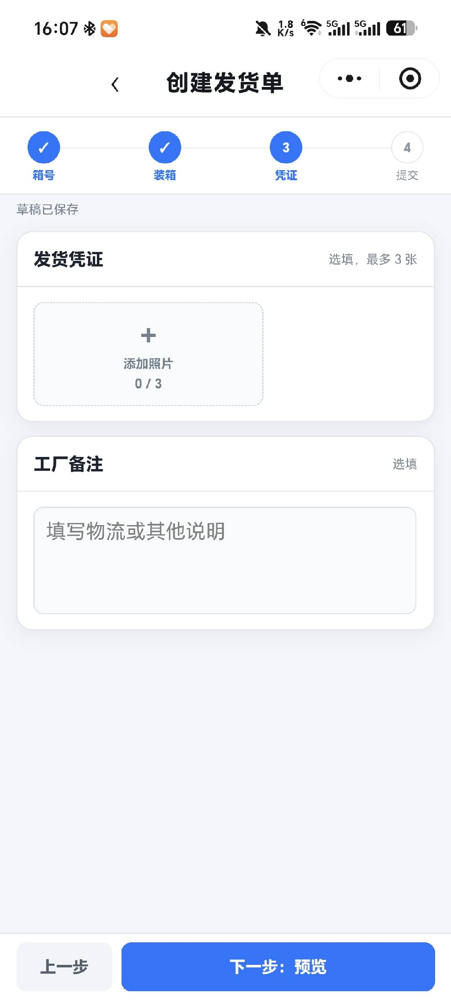

图 7｜照片、备注均可不填。

### ④ 提交：核对总数再登记

1. 核对 **5 箱、50 件**，展开产品和箱号检查规格、订单。
2. 有误点 **「上一步」**；正确后点 **「提交发货单」**。
3. 到 **「发货记录」** 找到新单，核对日期、数量和箱数。

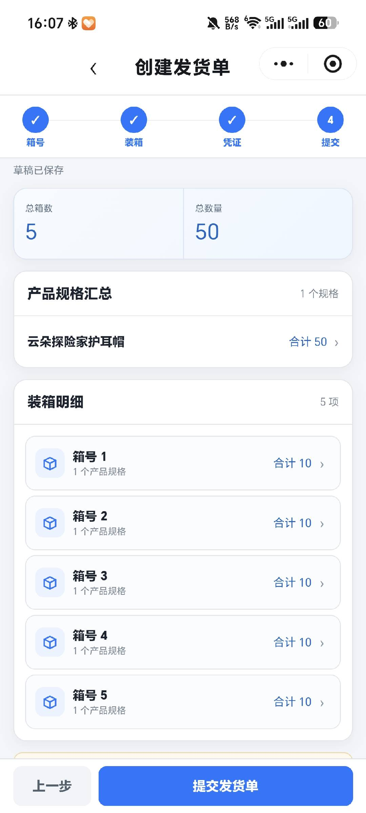

图 8｜**发货记录中出现新单才算成功；「草稿已保存」不等于提交。**

- 提示 **「确认多发」**：核对件数和归属订单，确实多发才确认。
- 提交后需要改动，先按第 5 节撤回；结果不明确时先查记录，避免重复登记。
- 中途退出前等 **「草稿已保存」**；再次进入选 **「继续填写」**。选 **「重新创建」** 会放弃原草稿。

## 4. 查发货和收货差异

1. 点 **「发货记录」**，按订单或产品查找，核对日期和发货单号。
2. 点记录进入详情，展开订单行或箱号查看明细。

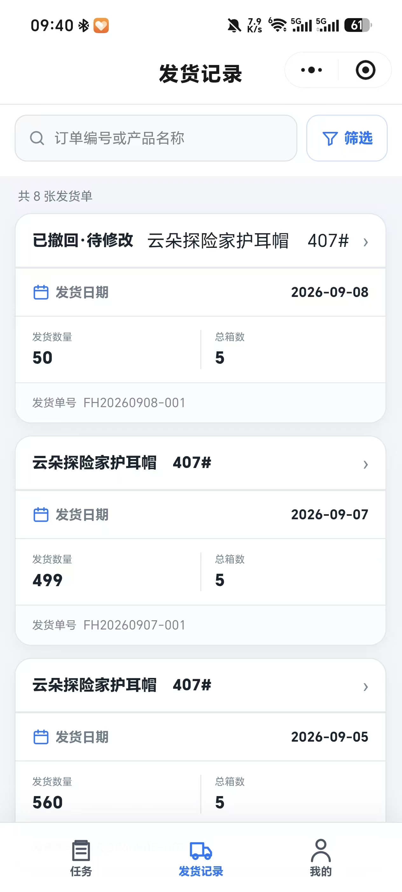

图 9｜先选对批次。显示 **「已撤回·待修改」** 的单据，需要进入详情继续修改并提交。

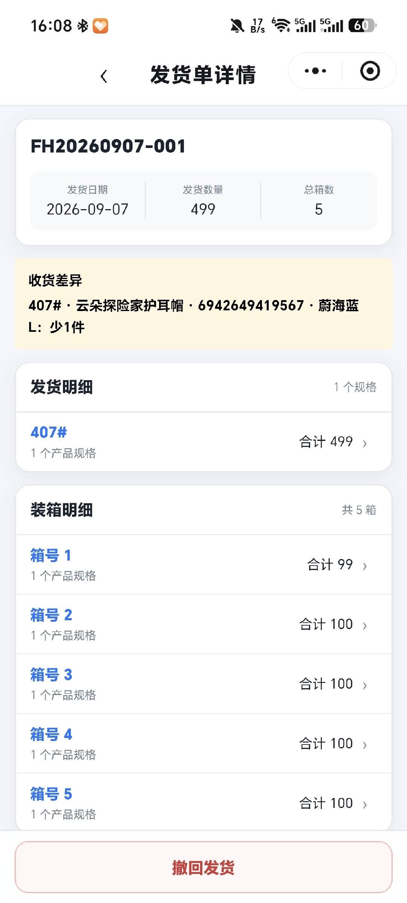

图 10｜黄色区域显示收货差异，明细已显示管理员确认后的数量。示例为 **少 1 件，确认数量 499 件**。

**不用再填负数发货单**。有疑问联系管理员；需要补发时，按实际货物登记普通发货。

## 5. 填错了：撤回后继续修改

**只有未确认收货、没有有效退回的发货单，才能撤回。无需管理员审批。**

1. 打开发货单，点 **「撤回发货」**，填写原因并按弹窗确认。
2. 看到 **「已撤回·待修改」** 后，点底部 **「继续修改」**。
3. 核对并修改箱数、装箱明细或凭证，预览无误后提交。
4. 回发货记录检查状态和数量，确认不再是待修改。

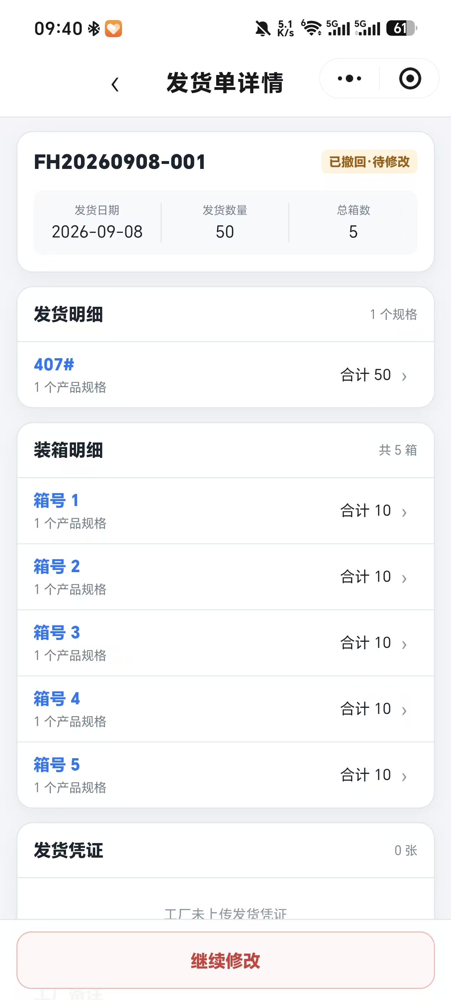

图 11｜**撤回立即扣回已发数量；重新提交后再计入，原单号不变**。图中仍是待修改，尚未重新提交成功。

原提交人或本次撤回人可继续修改；没有按钮时联系管理员核对收货状态、退回记录及操作人。

## 6. 发回返修品

**找任务 → 选规格 → 填本次数量 → 核对提交。**

### ① 找返修任务

点 **「任务 → 返修」**，按 **「返修周期」** 查找，打开对应卡片。**同一周期的质检任务已合并，不必逐张找返修单。**

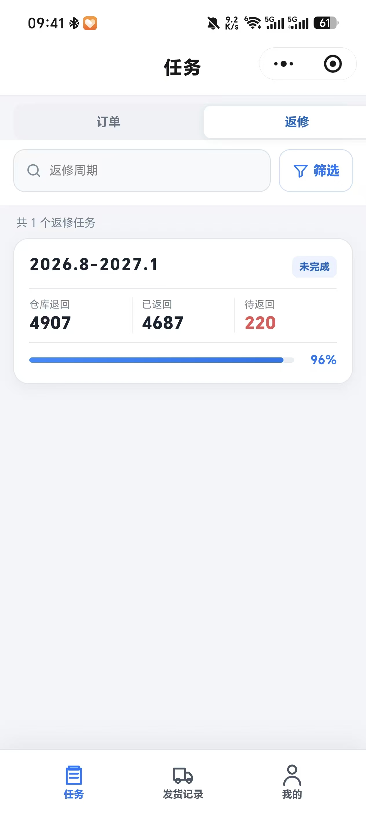

图 12｜示例已返回 4,687 件，还差 **220 件**。周期为每年 2—7 月、8 月—次年 1 月；未返完仍在原周期处理。

### ② 核对要求，开始填写

在质检附件点 **「查看」** 或 **「下载」**，核对要求，再点底部 **「发回返修品」**。

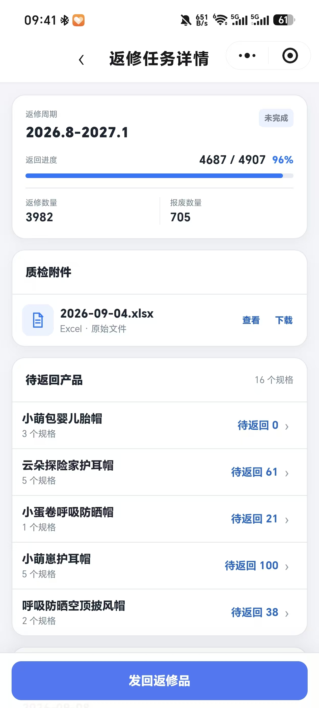

图 13｜先看本周期质检附件；**待返回为 0 的产品不用再填**。

### ③ 展开产品，勾选规格

点产品名称展开，再勾选 **本次实际发回** 的颜色/规格。同周期相同规格已合并，按本次实物填总件数即可。

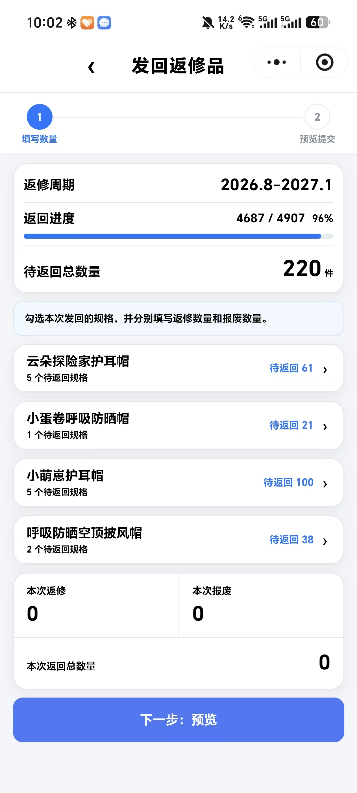

图 14｜本周期还差 **220 件**，不必一次全部发回；点产品展开规格。

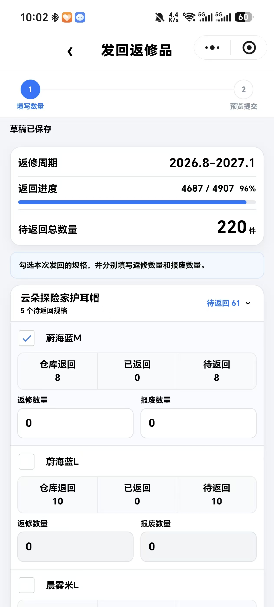

图 15｜**先勾选方框，再填数量**。示例选中 **「蔚海蓝M」**，该规格待返回 8 件，此图尚未填写数量。

### ④ 填本次返修、报废数量

- **「返修数量」**：本次修好并发回的件数。
- **「报废数量」**：无法修好但一起返回仓库的件数，没有填 `0`。

本例将 **「返修数量」** 填 `8`、**「报废数量」** 填 `0`。**只填本次件数，合计不能超过该规格待返回数量；报废品也要返回仓库。**

其他规格照样填写。填完向下滑，点 **「下一步：预览」**。

### ⑤ 核对并提交

核对本次总数，展开产品检查规格。有误点 **「返回修改」**，正确点 **「确认提交」**。

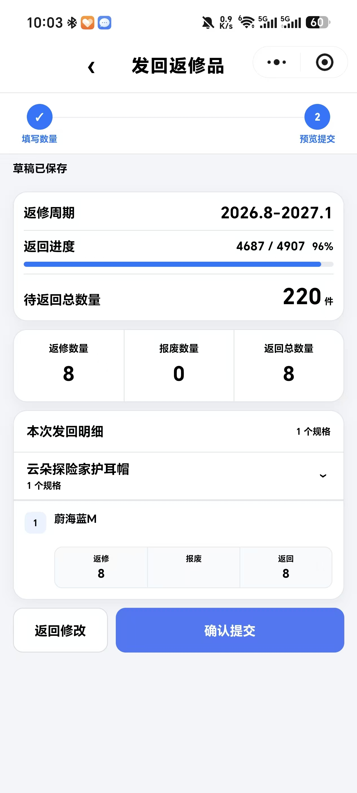

图 16｜核对本次 **返修 8 件＋报废 0 件＝返回 8 件**，再点 **「确认提交」**。此图尚未提交；**「草稿已保存」只表示暂存。**

### ⑥ 看是否成功

回返修详情，在 **「历史发回记录」** 找到本批，检查剩余待返回数量。

**出现本批记录、进度更新才算成功**。本例若期间没有其他发回或新增质检单，提交成功后待返回应为 **220－8＝212 件**；以实际更新结果为准。全部返回才自动完成，不用管理员再次确认收回。

- 返修记录在 **返修任务详情** 查，不在普通 **「发货记录」** 里。
- 中途退出先等草稿保存成功；结果不明确先查历史，勿重复提交。
- **原发货单退回后的补发走「任务 → 订单」，不走返修入口。**

## 7. 查通知、开提醒

- 查消息：**「我的 → 通知中心 → 未读」**，点通知进入详情。
- 开提醒：**「我的 → 微信提醒授权 → 去授权」**，按微信弹窗允许。

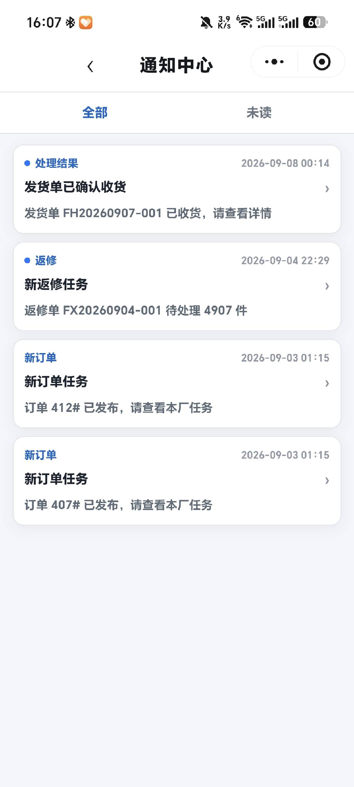

图 17｜平时主动查看任务和通知中心，不只等微信提醒。

## 遇到问题

找不到任务，先清除筛选、核对所属工厂；仍找不到，请管理员确认已发布并分配给本厂。
保存或上传失败，检查网络后重试。
