# 跟单管理系统｜管理员网页操作手册

适用：普通管理员、最高管理员。更新：2026-09-08。

**日常顺序：导入订单 → 核对草稿并发布 → 查看发货 → 核对收货 → 确认订单完成。**

截图仅演示位置和操作。请从公司提供的正式系统入口登录，不使用截图中的 `127.0.0.1` 本地地址；图中数量、工厂和日期勿直接照填。

## 常用入口

| 要做什么 | 入口 |
|---|---|
| 看待办与逾期 | 左侧**「订单看板」** |
| 获取、核对飞书订单 | **「订单与发货 → 待导入订单」** |
| 发布草稿、查进度、导合同 | **「订单与发货 → 订单列表」** |
| 收货核对、退回、审核撤回 | **「订单与发货 → 发货单列表」**→ 详情 |
| 建质检返修任务 | **「订单与发货 → 返修退回」** |
| 查产品 | 左侧**「产品资料」** |
| 补工厂资料 | 左侧**「工厂资料」** |
| 审核工厂申请、管理账号 | 左侧**「人员管理」** |

## 1. 登录并查看待办

1. 打开公司提供的网页入口，点**「通过飞书登录」**，使用本人企业飞书账号完成授权。
2. 登录成功后进入**「订单看板」**，查看待导入订单、今日发货记录和逾期订单。
3. 查具体订单时，在搜索框输入订单编号或产品名称；要查看完整列表，点**「查看全部订单」**。

**完成标志：**右上角显示本人身份，可以打开业务页面。首次有效飞书登录自动开通普通管理员，无需提交管理员申请；登录失败或账号停用时联系系统负责人。

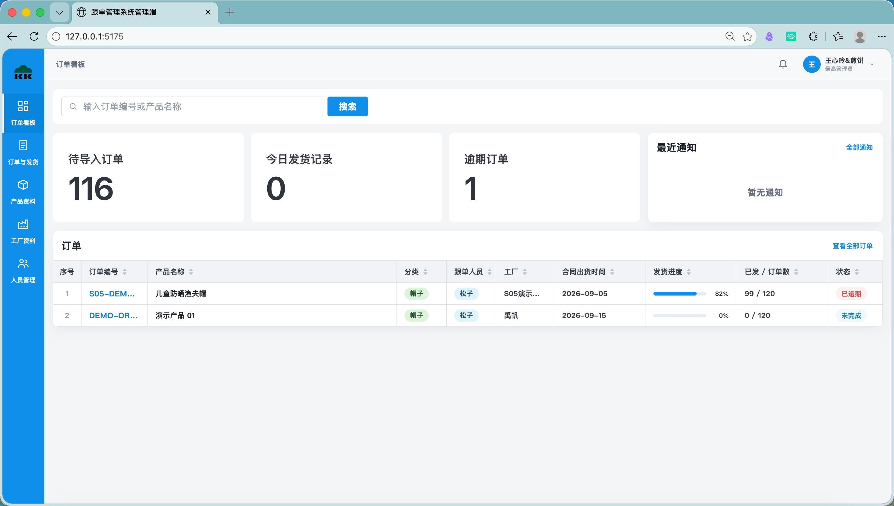

图 1｜看板用于快速查看，完整查询进入**「查看全部订单」**。

## 2. 从飞书导入订单

### 第一步：获取候选——把飞书新订单取到待处理列表

1. 进入**「订单与发货 → 待导入订单」**。
2. 点列表右上角**「获取飞书新订单」**，等获取结束。
3. 在**「待处理」**中查找本次要导入的订单，点该行**「详情」**。

**完成标志：**列表出现待处理订单。获取不会直接下单给工厂。

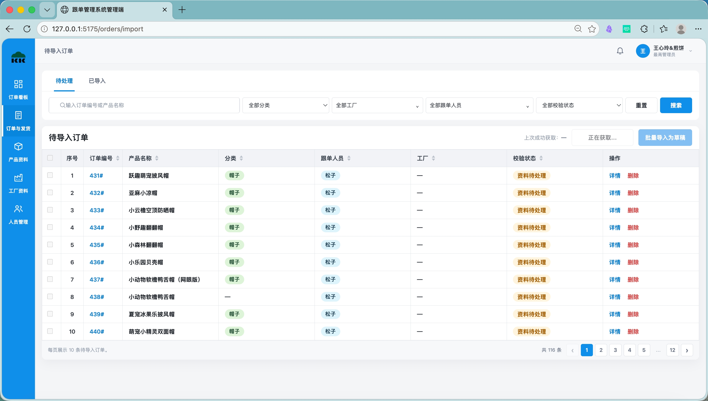

图 2｜截图里的**「正在获取…」**表示还在处理，等完成后再核对、导入。

### 第二步：核对全部明细——处理阻止导入的问题

1. 核对订单编号、跟单人员、产品、颜色/规格、工厂和数量。
2. 逐行核对**「合同出货时间」**，缺失或有误时在日期框填写。
3. 等日期保存完成；若提示保存失败，先重试，不能直接继续导入。
4. 按黄色提示处理资料问题，再重新打开详情核对校验结果。

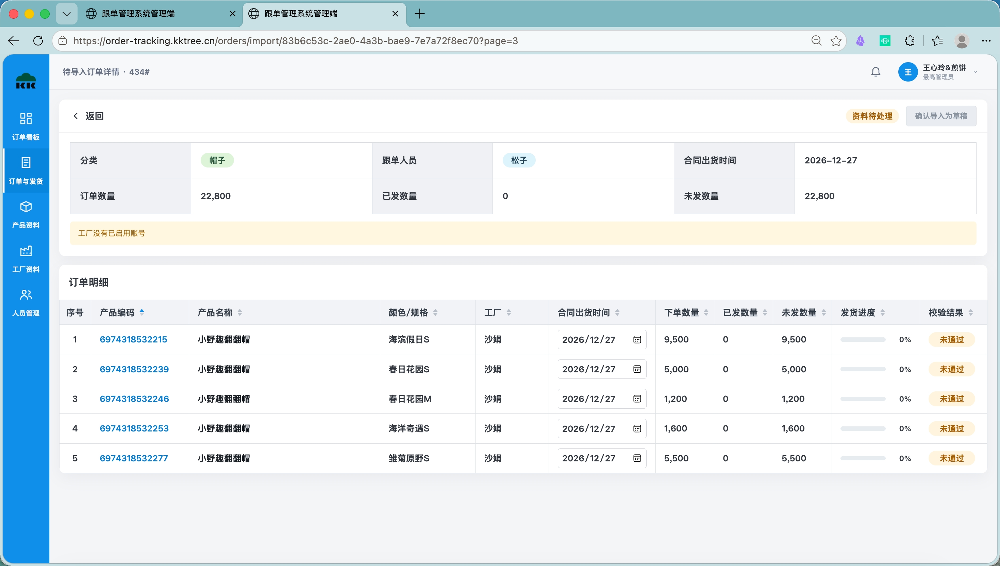

图 3｜图中**「工厂没有已启用账号」**会阻止导入，需先审核并启用该工厂用户。

| 页面问题 | 怎么处理 |
|---|---|
| 工厂没有已启用账号 | **「人员管理」**审核申请，并确认至少一名该厂用户已启用 |
| 工厂未匹配 | 核对**「工厂资料」**与飞书名称是否一致，缺失时先建立资料 |
| 产品或规格未匹配 | 在**「产品资料」**核对；联系产品资料维护人员处理聚水潭来源和同步 |
| 合同出货时间为空 | 在该条明细填写日期并确认保存成功 |
| 跟单人员为空或不一致 | 核对来源，统一该订单跟单人员后重新校验 |

飞书来源日期已由系统提前 4 个自然日；**人工填写时直接填最终合同出货时间，不要再减 4 天。**不同工厂、规格可有不同日期。

### 第三步：导入草稿——先保存订单，稍后发布

1. 全部明细校验通过后，点右上角**「确认导入为草稿」**。
2. 批量处理时回列表勾选完整订单，点**「批量导入为草稿」**，查看每单结果。
3. 去**「订单列表 → 草稿」**核对已生成的订单。

**完成标志：**在草稿中找到该订单。**「已导入」**不代表已发布，工厂此时仍看不到。

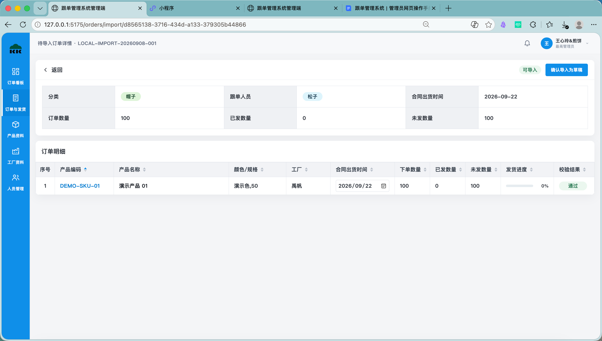

图 3a｜明细校验显示**「通过」**、顶部显示**「可导入」**后，点右上角**「确认导入为草稿」**。

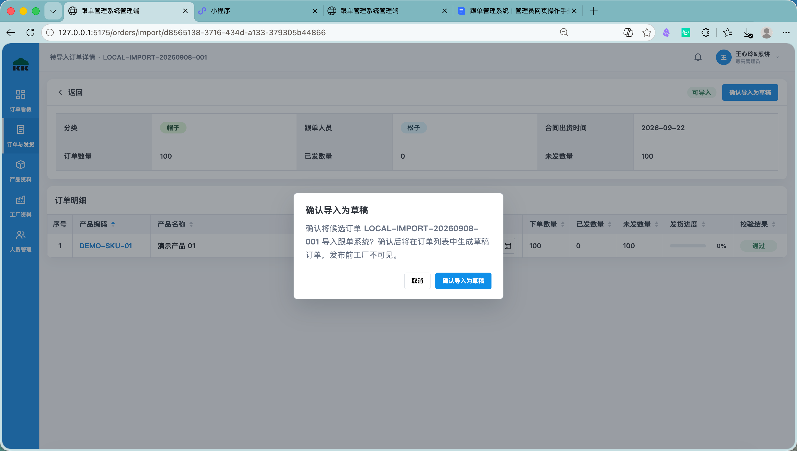

图 3b｜弹窗中再次核对订单编号，点蓝色**「确认导入为草稿」**。这一步只生成草稿，工厂还看不到。

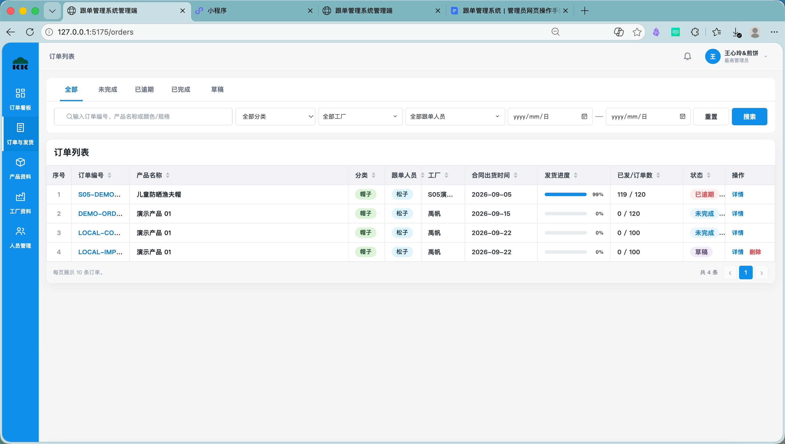

图 3c｜导入后在订单列表找到紫色**「草稿」**记录，点该行**「详情」**继续核对；也可点顶部**「草稿」**页签筛选。

删除待处理候选会将该来源排除，后续获取不会重新出现，也没有恢复入口；不要用**「删除」**处理暂时缺资料的订单。

## 3. 核对草稿并发布给工厂

1. 进入**「订单列表 → 草稿」**，打开订单详情，点**「编辑草稿」**。
2. 在**「产品明细与工厂派工」**核对每个规格的工厂、下单数量、合同出货时间。
3. 同一规格分给多个工厂时，用**「增加工厂派工」**逐项填写；**派工合计必须等于该规格订单数量**。
4. 点**「保存草稿」**，回到详情再次核对。
5. 点**「发布订单」**，在弹窗点**「确认」**。

**完成标志：**订单离开草稿阶段，显示正式状态；所属工厂可以看到各自任务。

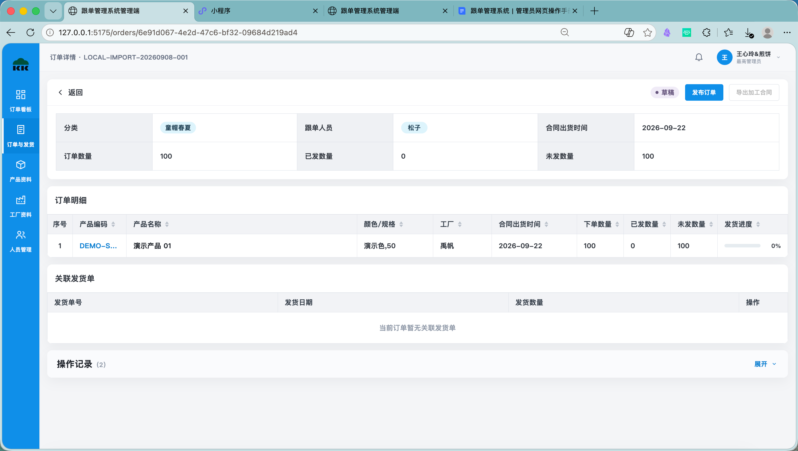

图 3d｜在草稿详情核对工厂、数量和合同出货时间，确认无误后点右上角**「发布订单」**。草稿阶段**「导出加工合同」**暂不可用。

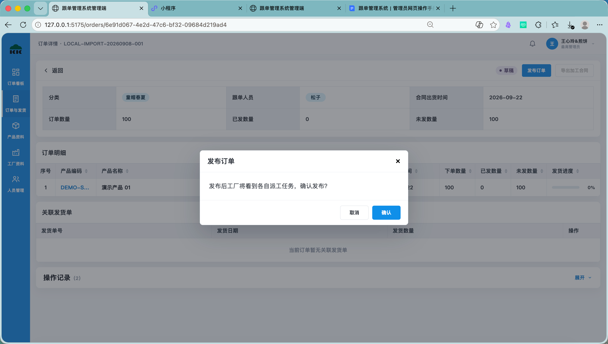

图 3e｜发布弹窗再次提示工厂将看到任务，确认无误点**「确认」**。此图为提交前确认页；提交成功后再检查订单状态。

已发布后不能直接修改派工和日期。尚未产生正式发货单时，可在详情点**「撤回订单 → 确认」**，回草稿修改后重新发布；已有正式发货单时不能这样处理。

导入前已有的发货数量会作为初始已发数量保留，编辑草稿不能将它清零或调小。

## 4. 查询订单、查看进度

1. 打开**「订单列表」**，选择**「全部 / 未完成 / 已逾期 / 已完成 / 草稿」**。
2. 输入订单号、产品名称或颜色/规格，按需选工厂、跟单人员和日期范围，点**「搜索」**。清除条件点**「重置」**。
3. 点订单编号或**「详情」**，查看各规格及工厂的下单、已发、未发数量。
4. 在**「关联发货单」**查看具体批次；展开**「操作记录」**追查变化。

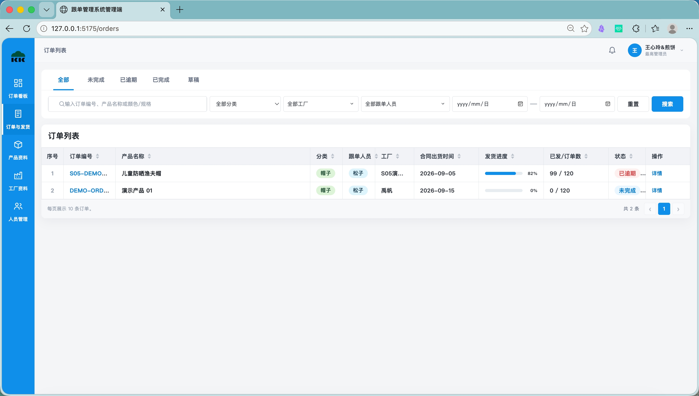

图 4｜先选状态再筛选；列表底部点页码翻页。

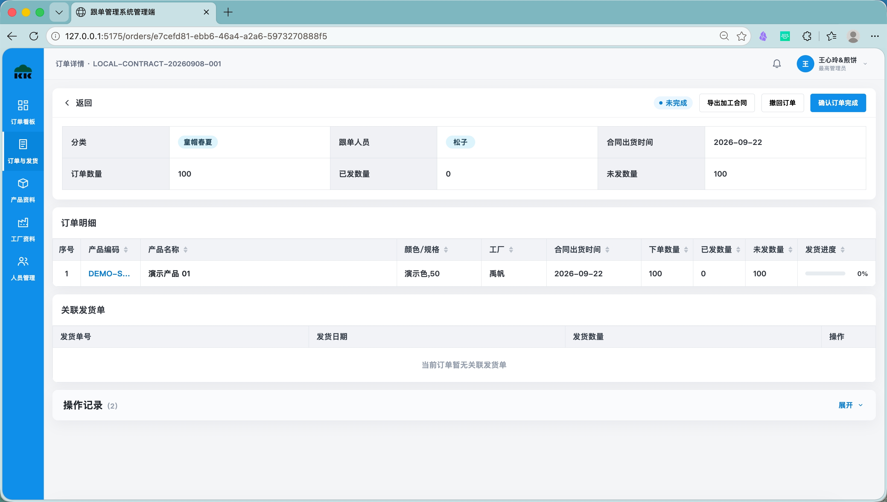

图 5｜订单详情用于核对明细、打开关联发货单以及执行订单操作。

## 5. 导出加工合同

**前提：订单已发布、整单已发数量为 0，且对应工厂合同资料完整。**

1. 在订单详情点右上角**「导出加工合同」**。
2. 订单有多个工厂时，选择本次要导出的工厂，逐厂导出。
3. 核对工厂和首次**「签订日期」**，点**「确认导出」**。
4. 打开下载的 Excel，检查内容，按业务需要补填加工单价等空白项。

**完成标志：**下载到对应订单和工厂的合同 Excel。

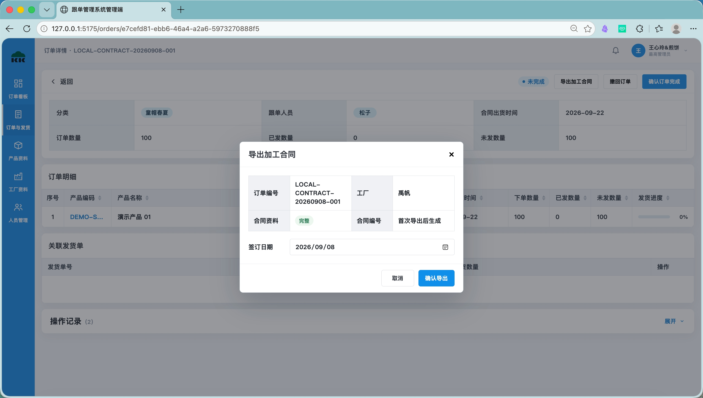

图 6｜签订日期用于合同，不是订单的合同出货时间。

提示资料不完整时，到**「工厂资料」**补齐工厂代码、单位全称、单位地址、法定代表人。合同中的出货日期及正文交货期限留空；重复导出沿用首次快照、合同编号和签订日期。

## 6. 核对收货并确认

**入口：订单与发货 → 发货单列表 → 找到单据 → 详情。**

1. **选对单：**核对发货单号、关联订单、工厂及发货时间。
2. **按箱核对：**在**「装箱明细」**逐箱填写实际核对数量。只能填 0 或正整数；原报正确的明细不必修改。
3. **暂存：**点**「装箱明细」**右上角**「保存」**，等保存成功。
4. **正式确认：**核对全单后点顶部**「确认收货」**。没有差异也要确认。
5. **看结果：**确认页面显示**「已收货」**，再核对最终总数及明细。

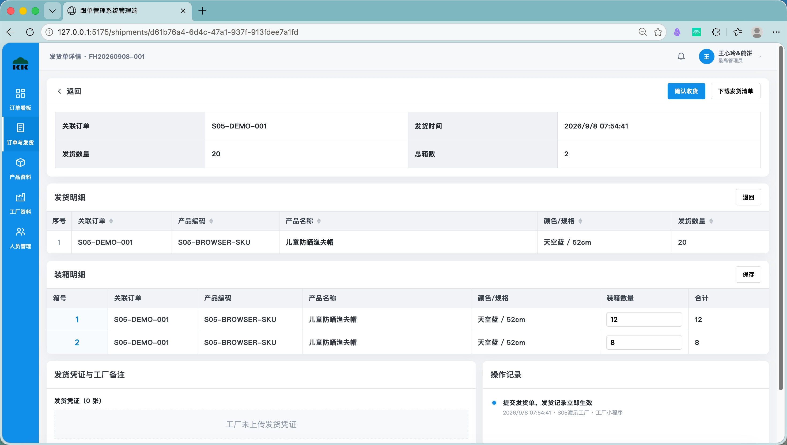

图 7｜**「保存」**在装箱明细右侧，**「确认收货」**在页面右上角。

**保存仅暂存；确认收货才更新订单、工厂数量，并锁定全单结果。确认后没有修改或撤销确认入口，提交前务必核对。**

已作废、撤回处理中或已经发生退回的单据不能进行收货核对。图中**「退回」**属于另一种操作，不能代替少收数量核对。

### 下载发货清单

在发货单详情点**「下载发货清单」**，打开下载的 Excel 核对。**清单保留工厂提交时的原报装箱数据**，因此发生收货差异后可能与页面确认数量不同。

## 7. 工厂申请撤回：审核整张发货单作废

1. 打开对应发货单详情，在**「撤回申请」**查看申请人和原因。
2. 确认整单应作废时，点**「通过」**，核对弹窗数量后点**「确认」**。
3. 不应作废时点**「拒绝」**，填写拒绝原因后确认。

**完成标志：**通过后显示**「已作废」**并回退数量；拒绝后原单继续有效。已有退回记录的单据只能拒绝撤回，不能重复扣减。

## 8. 仓库将货退回工厂：在原发货单操作

1. 在有效发货单详情的**「发货明细」**右侧点**「退回」**。
2. 勾选要退回的规格，填写**「本次退回数量」**，不得超过**「可退数量」**。
3. 填写本次共用的**「退回原因」**，点**「确认退回」**。
4. 在原发货单和订单的操作记录核对退回结果，并通知工厂按原订单普通补发。

**完成标志：**原订单已发数量减少、未发数量增加。此操作不创建独立返修任务；已完成订单会重新进入未完成或已逾期状态。

实际少收到的货先走第 6 节收货核对；不要对同一差异同时核对少收又登记退回。

## 9. 质检返修：上传质检单、跟踪发回

### 新建返修任务

1. 进入**「订单与发货 → 返修退回」**，点**「新建返修单」**。
2. 点**「上传质检 Excel」**，选择已有的 `.xlsx` 质检单。
3. 在**「导入预览」**核对工厂、产品规格、数量、箱号和次品原因。
4. 有匹配错误时修正资料或文件，点**「重新上传」**；全部校验通过后点**「确认创建」**。

**完成标志：**生成返修单号和详情，所属工厂可在小程序**「任务 → 返修」**处理。

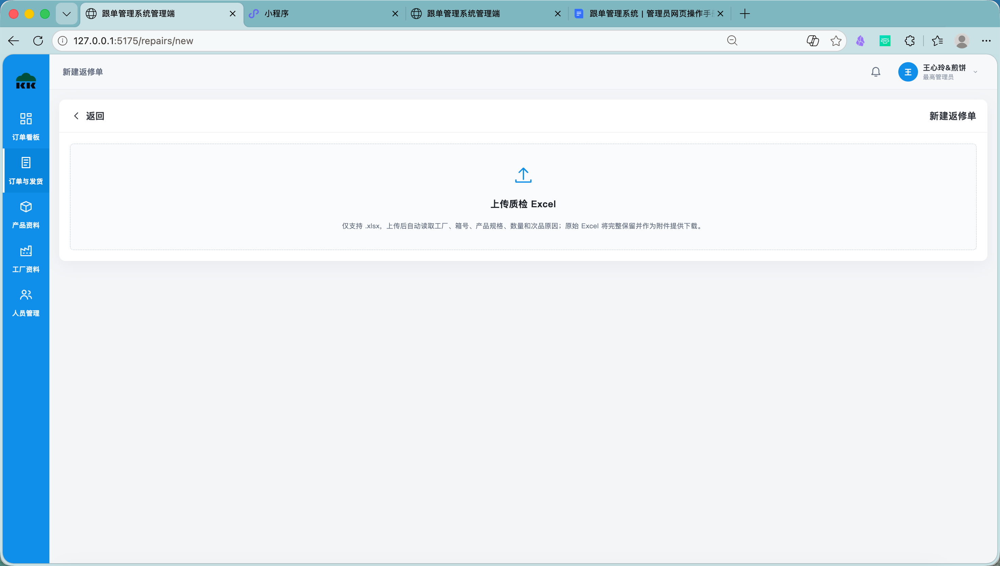

图 7a｜点**「上传质检 Excel」**，选择 `.xlsx` 文件；系统自动读取明细，并保留原文件作为附件。

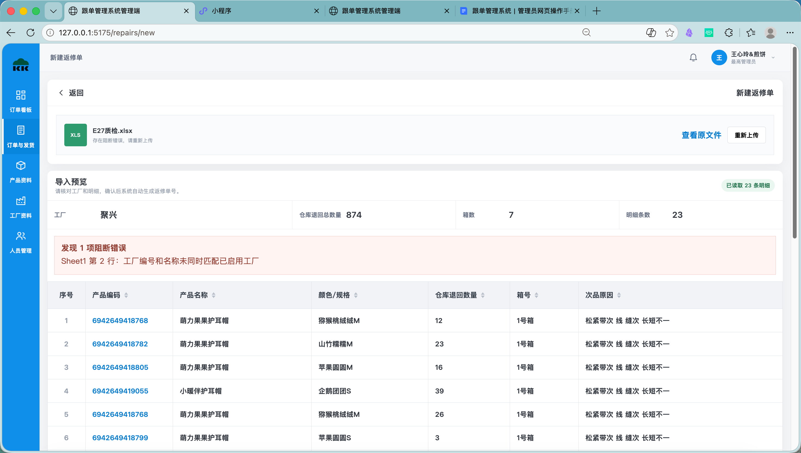

图 7b｜这是**校验未通过**的示例，还未创建返修单。按红色提示核对 Excel 的工厂编号、名称是否与系统中同一家已启用工厂一致，修正后点**「重新上传」**。

### 看发回进度、归档

1. 打开返修详情，查看仓库退回总数量、返修数量、报废数量和返回总数量。
2. 在**「工厂发回记录」**按日期查看各批明细；原始附件点**「查看或下载」**。
3. 全部返回后系统自动完成；需要从日常列表隐藏时，回到**「返修退回」**列表，点该已完成单据所在行的**「归档 → 确认归档」**。

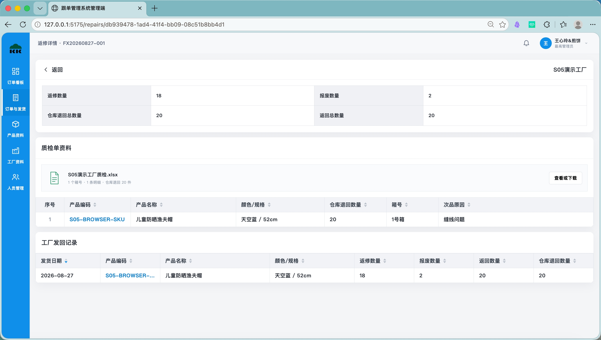

图 8｜示例：仓库退回 20 件，工厂修好返回 18 件、报废返回 2 件，共返回 20 件。

工厂发回提交后立即生效，管理员不用再确认收回。归档后各端都不再展示该任务，数据保留，页面没有恢复入口。质检返修不改变正常订单发货进度。

## 10. 确认订单完成

1. 在**「订单详情」**检查所有大货发货记录、数量和收货结果，确认业务已结束。
2. 点右上角**「确认订单完成」**。
3. 核对弹窗中的订单数量、已发数量、未发数量，确认后提交。

**完成标志：**订单显示**「已完成」**。发货达到 100% 不会自动完成订单；少发结案也应先核实业务实际情况。

误操作时，在已完成订单详情点**「撤销完成」**，填写原因并确认，恢复为未完成或已逾期。

## 11. 工厂资料、人员和产品

### 新增或修改工厂资料

**为什么维护：生成加工合同时，系统会带入单位全称、地址和法定代表人，并用工厂代码生成合同编号。这四项缺一项，就不能首次生成合同。**

1. 点左侧**「工厂资料」**，先搜索，避免重复建厂。
2. 新工厂点**「新增工厂」**，填写供应商**「编号」**及工厂名称；已有工厂点所在行**「编辑」**。
3. 按实际资料补填工厂代码、单位全称、法定代表人、单位地址、联系人及电话，点**「保存」**。
4. 回列表确认**「合同资料」**显示**「完整」**，再到已发布且整单未发货的订单导出合同。

供应商编号保存后普通编辑不能修改。**工厂代码与供应商编号不同**，用于生成合同，只能是 1～32 位大写英文字母；不确定时向资料维护人员确认。

**首次导出前核准资料；已生成的合同再次导出仍沿用原快照，不随工厂资料修改。**

### 审核工厂用户申请

1. 点**「人员管理 → 工厂用户申请」**，筛选待审核申请，点**「详情」**。
2. 核对姓名、验证联系电话、职位和申请工厂。
3. 通过时再次确认绑定工厂；拒绝时填写具体原因。
4. 去**「工厂用户列表」**确认所属工厂与**「已启用」**状态。

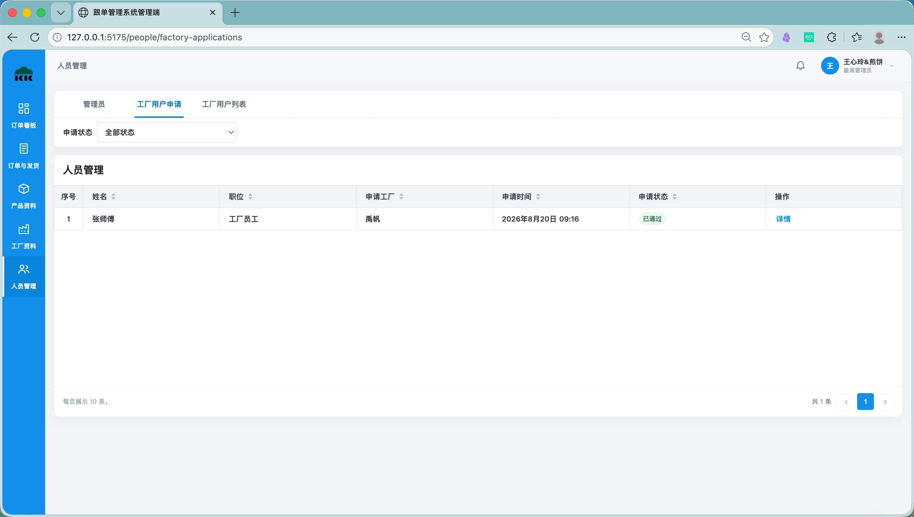

图 9｜从**「详情」**进入审核。截图为已通过申请，待审核申请才显示审核操作。

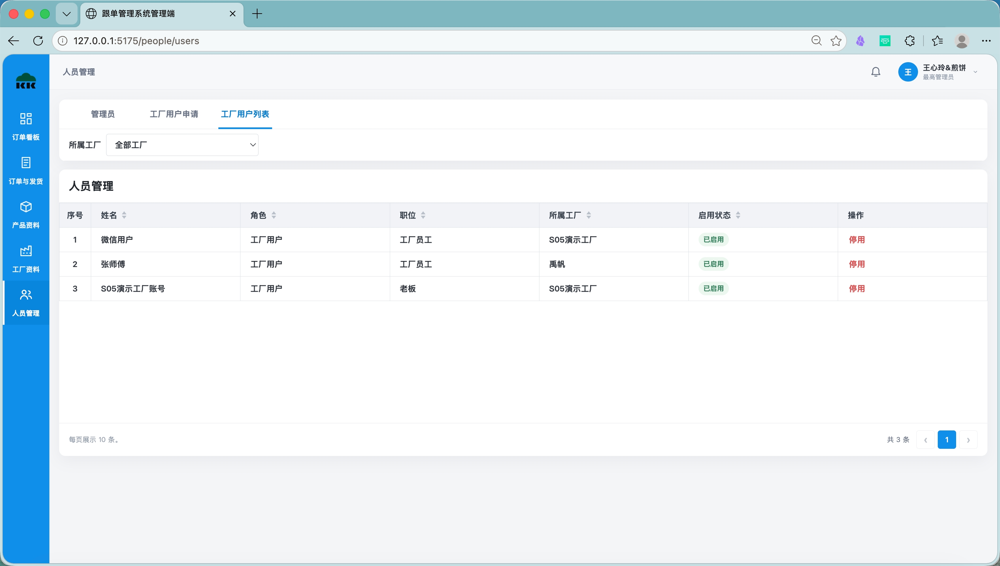

图 10｜启停用户前先核对姓名和所属工厂；停用后该用户不能继续访问业务数据。

### 管理员账号启停（仅最高管理员）

1. 进入**「人员管理 → 管理员」**。
2. 找到普通管理员，按需点**「停用」**或**「启用」**，按页面提示完成。
3. 核对启用状态已更新。

普通管理员看不到此页签；最高管理员账号不能在这里停用。

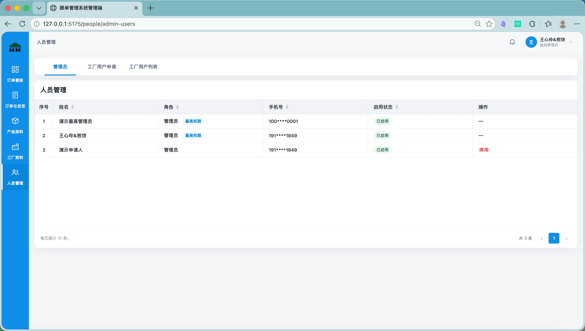

图 11｜**「管理员」**页签用于普通管理员账号启停，不用于审批管理员申请。

### 查询产品资料

1. 点左侧**「产品资料」**。
2. 输入货号、产品编码、产品名称或颜色/规格，点**「搜索」**。
3. 核对目标规格；找不到或资料有误时联系维护人员检查聚水潭资料与同步。

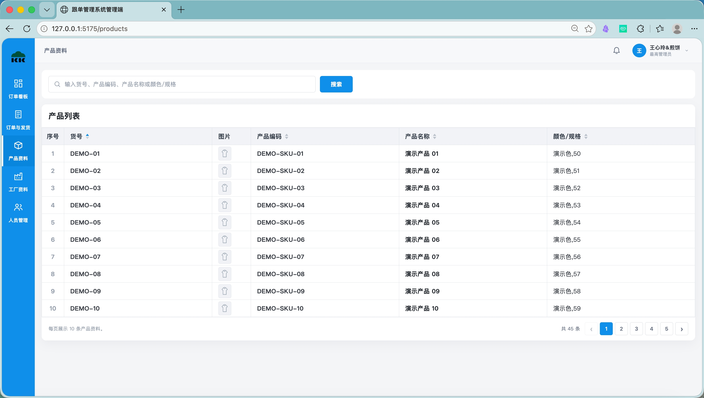

图 12｜产品资料只读，本系统不提供手工新增或修改产品规格。

## 12. 常见问题

| 问题 | 怎么处理 |
|---|---|
| 导入成功，工厂却看不到 | 检查是否还在草稿，是否已发布，工厂用户是否启用且归属正确 |
| 改了飞书，系统订单没变 | 已导入订单不会自动跟随飞书后续修改；先核对系统订单所处阶段 |
| 已发数量有值，但查不到对应历史单据 | 可能包含导入前的初始已发数量，查看导入操作记录 |
| 合同导不出 | 检查是否已发布、整单已发是否为 0、工厂合同资料是否完整 |
| 收货数量改了，工厂仍看到旧数 | **「保存」**仅暂存，需要整单**「确认收货」**后才生效 |
| 提交提示数据已变化 | 重新打开页面核对最新内容，再操作，不反复点击旧页面 |
| 已完成订单又显示未完成/逾期 | 检查是否发生少收确认、退回或撤销完成 |

反馈问题请附：**单据编号 + 操作步骤 + 错误提示截图**。
