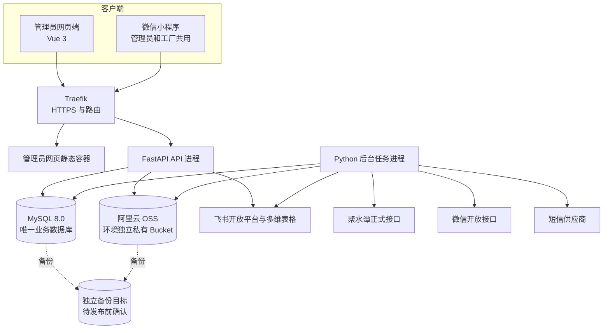
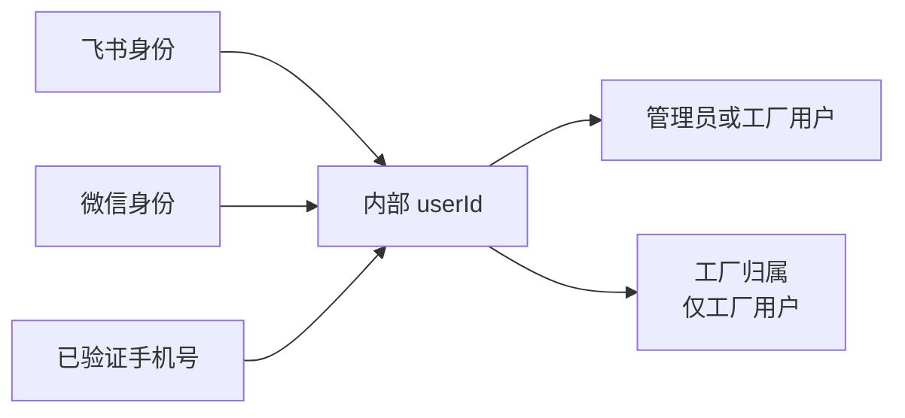

# 跟单管理系统一期技术设计方案

> **当前实现阅读说明（2026-09-08）：** 本地 Git `3b2c90d` 已包含 PR #62 与 #64。本文保留原 V1.0 设计与批准历史；下表及文末已确认变更专节用于识别当前实现，旧章节不应独立作为最新接口或字段定义。此次文档整理不新增设计批准，也不证明生产已运行最新代码。

> 状态：已确认
>
> 版本：V1.0
>
> 日期：2026-08-20
>
> 需求基线：`docs/一期/requirements/一期需求文档.md` V1.60
>
> 原型基线：已确认的管理员网页端、管理员小程序端和工厂小程序端低保真原型
>
> 适用范围：一期正式实现，不包含旧 CloudBase 实现

## 当前实现与历史设计对照

| 主题 | 当前口径及阅读入口 |
|---|---|
| 身份与权限 | 飞书授权获得有效手机号后自动取得普通管理员角色；最高管理员走同一入口的受控白名单；旧管理员申请表存在不代表仍开放该流程 |
| 合同出货时间 | 订单＋SKU＋工厂明细日期；来源减四个自然日，人工日期直接保存；旧订单根字段只作兼容输出。见 Issue #61 专节 |
| 收货数量 | 保留工厂原报，管理员网页独立保存核对草稿并整单确认；确认追加差额，发货清单仍取原报。见 Issue #44 专节 |
| 返修草稿 | 按用户与返修单隔离，版本保护；正式提交后在事务中清理草稿，草稿不影响数量。见需求第 5 节及实际模型 |
| 列表分页 | 数据库先筛选、计数、排序再分页；候选列表只读取当前页明细，网页辅助请求独立。见里程碑 Issue #63 |
| 生产发布 | 同提交 main CI → 已批准标签 → 两镜像 → 自动备份、迁移、部署、健康检查；普通 main 推送不部署。见运维手册 |
| 当前资料 | [字段及关系](一期数据字典与关系图.md)、[接口使用](一期API使用说明.md)、[运维步骤](一期部署与运维手册.md) |

下文“未开始编码”“当前是设计同步”等文字描述对应日期的阶段，不代表现状。涉及未完成验收，应以[验收矩阵](一期验收与需求追溯矩阵.md)的证据来源核对，不能通过更新文档直接改成通过。

## 1. 文档职责

本文确定一期的实现方式，包括：

- 总体架构和代码目录；
- 前端、小程序、后端和数据库技术栈；
- 业务模块、数据模型、状态与数量实现；
- HTTPS API、身份、权限和防重复提交；
- 飞书、聚水潭、微信、短信和文件存储接入；
- 部署、环境隔离、备份、监控和回滚；
- 自动化测试、集成验收和试运行策略。

本文不重新定义业务范围和页面视觉：

- 业务字段、状态、数量、权限和验收以 V1.60 需求为准；
- 页面层级和交互以已确认原型及页面地图为准；
- 开发顺序、单次修改文件和验收步骤由后续开发计划与工单确定。

本技术设计已经用户整体确认。项目进入“开发计划与工单”阶段；开发计划再次获得用户确认前，不创建正式工程脚手架，不开始功能编码。

## 2. 已确认的技术结论

| 主题 | 一期结论 |
|---|---|
| 管理员网页端 | Vue 3、TypeScript、Vite、Element Plus |
| 微信小程序 | 微信原生小程序、TypeScript、默认 WebView 渲染 |
| 跨端框架 | 一期不使用 Taro、uni-app，不把 Skyline 作为基础要求 |
| 后端 | Python、FastAPI、SQLAlchemy 2、Alembic、Pydantic 2 |
| Python 工具链 | uv 管理依赖、虚拟环境和锁文件 |
| JavaScript 工具链 | pnpm 管理前端和小程序依赖 |
| 正式数据库 | 公司 ECS 上的 MySQL 8.0 独立数据库和最小权限账号 |
| 文件存储 | 阿里云 OSS；共享测试和生产各使用一个独立私有 Bucket 与独立 RAM 凭证，桶内按对象前缀分类 |
| 公网入口 | 复用服务器现有 Traefik 提供域名路由和 HTTPS |
| 后台任务 | 一个独立 Python worker，使用 MySQL 记录任务和发件箱，不引入 Celery |
| 飞书订单来源 | 管理员手动“获取飞书新订单”，不设置五分钟或其他定时发现 |
| 产品来源 | 聚水潭首次扫描、后续按修改时间自动增量读取；只纳入六个指定分类中的启用产品和规格 |
| 正式数据源 | MySQL 是唯一正式业务数据源，飞书不接收自动回写 |
| 测试原则 | 核心 API、事务、权限、状态、数量和 Excel 优先 TDD |

## 3. 总体架构

一期采用模块化单体，不拆分微服务。管理员网页端和微信小程序独立构建，但调用同一个 FastAPI 后端；后端按业务模块组织，所有模块使用同一个 MySQL 正式数据库。



### 3.1 进程职责

- 管理员网页静态容器只返回编译后的 HTML、CSS 和 JavaScript，不处理业务规则。
- API 进程处理登录、查询、写入、文件上传下载授权和同步任务创建。
- worker 处理飞书手动获取任务、聚水潭产品同步、定时提醒、微信和短信发送及失败重试。
- MySQL 保存业务事实、当前状态、任务、通知、幂等记录和操作日志。
- OSS 保存原始质检 Excel、照片、发货凭证、头像和需要留档的导出文件；产品图片作为可重建缓存保存。同一环境使用一个私有 Bucket，并通过 `contracts/`、`repairs/`、`shipments/`、`avatars/`、`products/` 前缀分类。

API 与 worker 使用同一套后端代码和业务模块，仅启动入口不同。worker 不绕过业务模块直接修改业务表。

## 4. 代码项目结构

```text
order_tracking/
├── server/
│   ├── app/
│   │   ├── api/                 # HTTP 路由、请求与响应模型
│   │   ├── modules/             # 业务模块
│   │   ├── adapters/            # 飞书、聚水潭、微信、短信、阿里云 OSS 适配器
│   │   ├── db/                  # SQLAlchemy、迁移入口和事务支持
│   │   ├── worker/              # 后台任务领取、调度和重试
│   │   └── settings/            # 环境配置，不含真实密钥
│   ├── migrations/              # Alembic 迁移
│   ├── tests/
│   ├── pyproject.toml
│   └── uv.lock
├── admin-web/
│   ├── src/
│   │   ├── api/                 # OpenAPI 类型和统一请求封装
│   │   ├── modules/             # 按业务模块组织页面逻辑
│   │   ├── pages/
│   │   ├── components/
│   │   └── stores/
│   ├── tests/
│   ├── package.json
│   └── pnpm-lock.yaml
├── miniprogram/
│   ├── miniprogram/
│   │   ├── api/
│   │   ├── pages/
│   │   ├── modules/
│   │   ├── components/
│   │   └── utils/
│   ├── tests/
│   ├── project.config.json.example
│   ├── package.json
│   └── pnpm-lock.yaml
├── docs/
├── compose.yaml
└── .github/workflows/
```

管理员和工厂共用一个小程序 AppID 和一套小程序代码。登录后由后端返回角色及终端能力，小程序跳转到管理员或工厂页面，不创建两个小程序项目。

真实 AppID、域名、密钥和服务器地址不写入仓库；仓库只提供示例配置和环境变量名称。

## 5. 后端业务模块

每个模块通过少量公开操作承载完整业务规则，HTTP 路由、worker 和测试均调用这些公开操作，不复制规则。

| 模块 | 主要职责 | 关键公开操作 |
|---|---|---|
| identity_access | 内部用户、外部身份、申请、会话和权限 | 登录解析、手机号验证、身份绑定、申请审核、会话撤销、权限判断 |
| order_import | 飞书手动获取、候选校验和候选转草稿 | 创建获取任务、读取结果、排除候选、确认导入为草稿 |
| orders | 草稿、派工、发布、撤回、完成和删除 | 保存草稿、发布、撤回、确认完成、撤销完成、删除 |
| shipments | 工厂任务、装箱、发货、作废和按发货单退回 | 保存草稿、提交、申请作废、审核作废、确认退回 |
| repairs | 质检 Excel 预览、返修单、发回和归档 | 解析预览、创建返修单、提交发回记录、归档 |
| master_data | 产品同步和工厂资料 | 同步产品、维护工厂、按统一工厂名称严格匹配来源数据 |
| files_exports | 私有文件、发货清单和加工合同 | 上传、授权下载、生成发货清单、生成加工合同 |
| notifications_audit | 系统通知、外部发送、去重和操作证据 | 记录通知、投递、重试、查询日志 |

模块间通过内部公开操作协作。例如发货单提交由 shipments 模块完成数量事务，再调用 notifications_audit 记录待发送通知；不能由路由先改数量、再自行拼通知。

## 6. 身份、会话与权限

### 6.1 内部身份模型

系统以内部 `userId` 作为唯一人员身份。飞书和微信只是登录身份，不直接作为业务表外键。



外部身份唯一键至少包含平台、应用或租户标识和平台用户标识，避免测试 AppID 与公司正式 AppID 的 `openid` 混用。测试号身份和测试数据不迁入生产；切换公司正式 AppID 后，用户通过正式微信身份和已验证手机号重新绑定同一内部账号。

手机号用于唯一匹配，需要同时保存：

- 加密后的完整号码，用于授权后的业务显示；
- 不可逆查询摘要，用于唯一匹配；
- 脱敏显示值，用于日志和普通页面。

`sms_challenges` 是 V1.36 已实现的历史兼容表；V1.43 起管理员申请不再创建或读取短信挑战，后续可在独立数据库清理工单中删除，不在本次变更中破坏性删表。`admin_applications` 自 V1.57 起不再写入新记录，既有记录只保留用于审计，同样不在本次变更中破坏性删表。V1.58 取消最高管理员的单独数据库初始化流程，改为同一飞书 OAuth 入口按服务端受控白名单授权。

### 6.2 管理员网页端登录

1. 网页端跳转飞书 OAuth，并使用随机 `state` 防止请求伪造。
2. 后端使用授权结果解析飞书身份和企业通讯录已验证手机号，并映射内部 `userId`；飞书应用需开通当前用户手机号读取权限。
3. 飞书身份校验通过且取得有效已验证手机号后，飞书唯一标识命中服务端受控最高管理员白名单的用户直接获得管理员角色和最高管理员标记；其他尚未取得角色的用户自动获得普通管理员角色并启用。
4. 飞书未返回手机号、权限被拒绝、号码格式无效或号码已被其他用户占用时登录失败并提示联系管理员处理，不创建账号、不建立会话。系统不再提供管理员申请提交、待审核、通过和拒绝流程，既有申请记录只保留用于审计。
5. 最高管理员和普通管理员使用同一 OAuth 回调和会话建立流程，不提供单独初始化命令。最高管理员白名单只匹配飞书平台和应用范围下的唯一用户标识，当前配置值格式为 `tenant_key:open_id`，多名使用英文逗号分隔；不匹配姓名、手机号或登录顺序。已被最高管理员停用的普通管理员再次完成飞书授权时仍保持停用且不建立会话，只有最高管理员可以重新启用。
6. 网页端使用 Secure、HttpOnly、SameSite Cookie 保存短期不透明访问凭证和滚动续期凭证；写请求增加 CSRF 校验。访问凭证失效时网页端只自动续期一次并重试原请求；续期凭证轮换，服务端只保存摘要，最长连续30天未活动后失效。

### 6.3 小程序登录与绑定

1. 小程序把 `wx.login` 临时 code 发送后端，后端向微信换取平台身份。
2. 已绑定身份直接恢复内部账号；未绑定身份请求用户授权手机号。
3. 后端使用手机号授权 code 从微信服务端取得号码，不信任客户端自行提交的号码。
4. 管理员微信授权手机号必须与网页端飞书登录已建立的内部管理员唯一匹配；未匹配时提示先在管理员网页端完成飞书登录，重复、冲突或不一致时提示联系最高管理员，不在小程序创建管理员账号，也不自动合并账号。
5. 工厂用户填写真实姓名、职位和申请工厂后等待管理员审核。
6. 小程序使用短期访问凭证和滚动续期凭证；服务端只保存凭证摘要并支持统一撤销。访问凭证失效时自动续期并重试原请求，同一时刻的并发失败共享一次续期，避免旧续期凭证被重复轮换。

退出登录只撤销当前会话，不删除外部身份绑定。账号被停用、角色被撤销或工厂归属失效时，已有会话立即失效。

### 6.4 权限矩阵

| 操作 | 最高管理员网页端 | 普通管理员网页端 | 管理员小程序 | 工厂小程序 |
|---|---:|---:|---:|---:|
| 查看全部业务数据 | 是 | 是 | 是，按原型只读展示 | 否 |
| 获取和确认导入飞书订单 | 是 | 是 | 否 | 否 |
| 编辑、发布、撤回和完成订单 | 是 | 是 | 否 | 否 |
| 创建返修单、处理发货单退回 | 是 | 是 | 否 | 否 |
| 维护工厂和合同资料 | 是 | 是 | 否 | 否 |
| 审核工厂用户 | 是 | 是 | 否 | 否 |
| 停用和启用普通管理员 | 是 | 否 | 否 | 否 |
| 查看本厂任务 | 不适用 | 不适用 | 不适用 | 是 |
| 创建正常发货单和返修发回 | 否 | 否 | 否 | 是，仅本厂 |
| 申请撤回本厂发货 | 否 | 否 | 否 | 是，仅本厂 |
| 修改头像和通知设置 | 小程序内 | 小程序内 | 是 | 是 |

后端同时校验角色、会话终端、工厂归属、记录归属和业务状态。工厂查询必须在数据库查询条件中加入 `factory_id`，不能先读取全部数据再由前端过滤。

## 7. 数据模型

### 7.1 通用约定

- 数据库使用 MySQL 8.0、`utf8mb4` 和 InnoDB。
- 业务数量统一使用非负整数，数据库和业务层双重校验。
- 数据库时间戳统一保存 UTC；合同出货时间、签订日期、发货业务日期等使用东八区业务日期。
- 正式业务事实只追加或通过反向事件纠正，不直接覆盖历史记录。
- 列表所需进度可以使用同事务更新的汇总字段或汇总表；初始已发数量是导入历史基线，发货、退回、作废和返修发回明细是系统有效发货的可重算权威事实。统一已发数量为两者之和。
- 关键唯一规则同时使用数据库唯一索引和业务校验，不能只依赖页面校验。
- 所有可编辑资料带 `version` 字段，用于检测并发覆盖。

### 7.2 身份与人员

| 表 | 关键内容与约束 |
|---|---|
| users | 内部用户、角色、最高管理员标记、启停状态、工厂归属、脱敏手机号、头像引用；最高管理员不能由普通申请产生 |
| external_identities | `user_id`、平台、应用或租户、平台用户标识；组合唯一 |
| user_sessions | 会话摘要、终端类型、过期时间、撤销时间和最后活动时间 |
| sms_challenges | 手机号摘要、用途、验证码摘要、过期时间、尝试次数和发送状态 |
| admin_applications | 飞书申请人、已验证手机号、审核状态、审核人、时间和拒绝原因 |
| factory_applications | 申请人、职位、目标工厂、已验证手机号、审核状态和审核记录 |
| notification_preferences | 用户对各类小程序业务通知的开关；用户与通知类型唯一 |

### 7.3 产品与工厂

| 表 | 关键内容与约束 |
|---|---|
| products | 聚水潭 `i_id`（页面货号）、产品名称、图片引用、来源更新时间、是否至少有一个可用规格；`i_id` 全局唯一，产品名称可重复 |
| product_variants | `product_id`、聚水潭 `sku_id`、颜色/规格、来源商品分类、来源启用状态、是否可用于新订单；`sku_id` 全局唯一，同一产品内颜色/规格可重复 |
| product_sync_runs | 全量或增量、成功游标、来源分页检查点、下一页、来源读取是否完成、开始结束时间、数量、状态和错误摘要 |
| product_sync_staged_variants | 单次同步批次逐页写入的来源产品规格暂存；批次与 `sku_id` 唯一，成功发布后清理，失败时保留供同一任务续跑 |
| factories | 供应商编号、工厂名称、工厂代码、单位全称、地址、法定代表人、启用状态和版本；供应商编号、名称、工厂代码分别唯一；不保存委托代理人、开户银行和银行账号 |
| factory_contacts | 工厂联系人、电话、顺序和是否主要联系人 |

飞书来源工厂名称直接与系统日常工厂名称严格匹配，不建立来源别名表，也不使用模糊匹配。名称不一致时阻止导入并要求修正上游数据。

产品同步范围使用服务器端固定白名单，分类名称按“童帽春夏、童配春夏、童装春夏、童帽秋冬、童配秋冬、童装秋冬”精确匹配，不进行包含、前缀或模糊判断。首次扫描只落库白名单分类中来源状态为启用的产品和规格；增量读取需要处理资料进入白名单、移出白名单、启用和停用四种变化。已同步资料移出范围后标记为不可用于新订单，不物理删除。

产品资料从聚水潭同步后作为本地快照使用。同步不会覆盖已经保存的订单、发货或合同导出快照。产品图片需要用于页面或 Excel 时，由 worker 下载并缓存到项目私有文件桶；下载失败不伪造图片，记录错误并重试。

### 7.4 飞书候选与订单

| 表 | 关键内容与约束 |
|---|---|
| feishu_import_runs | 手动获取任务、发起管理员、任务状态、新增/跳过/失败数量、开始结束时间和错误摘要 |
| feishu_source_records | 飞书记录ID、来源表和视图、原始快照、来源修改时间、获取时间；飞书记录ID在该来源内唯一 |
| import_candidates | 订单编号、待处理/已导入/已排除、校验结果、来源快照摘要、对应订单、排除和导入信息；未排除的同一订单编号唯一 |
| import_candidate_lines | 候选订单明细、原始字段、匹配后的产品规格和工厂、数量及来源记录ID |
| import_validation_issues | 候选或明细、错误代码、字段和用户可读提示 |
| orders | 内部订单ID、唯一订单编号、来源、订单日期、跟单人员、合同出货时间、生命周期、版本、发布/完成/删除信息 |
| order_lines | 订单产品规格和订单数量；同一订单和规格唯一 |
| order_assignments | 订单明细分配的工厂、下单数量和不可降低的初始已发数量；同一订单明细和工厂唯一，初始已发数量与系统后续发货事实分开保存 |
| order_completion_records | 每次确认完成、撤销完成或退回后恢复的操作人、时间和原因，保留多次完成历史 |

订单持久化生命周期只使用：

- `DRAFT`：系统内草稿，工厂不可见；
- `PUBLISHED`：已发布正式订单；
- `COMPLETED`：管理员确认完成。

“未完成”和“已逾期”是已发布订单的展示状态：`PUBLISHED` 且当前日期不晚于合同出货时间时显示未完成，晚于时显示已逾期。`deleted_at` 仅用于保留删除证据，不构成“已删除”或“已取消”业务状态。

### 7.5 加工合同

| 表 | 关键内容与约束 |
|---|---|
| processing_contracts | 订单、工厂、签订日期、合同编号和同日序号；订单和工厂唯一，合同编号唯一 |
| contract_exports | 合同、导出人、时间、完整字段快照、模板版本和文件引用；每次导出追加一条 |

同一日期和工厂的合同编号生成必须在事务中锁定对应计数，避免两名管理员同时导出得到相同编号。第一份使用无后缀基础编号，第二份使用 `-1`，第三份使用 `-2` 并依次增加；已生成编号永不重排。历史导出只读取自己的快照，不因后续合同、工厂或产品资料变化而改变。完整规则见第17节。

### 7.6 发货、装箱与退回

| 表 | 关键内容与约束 |
|---|---|
| shipments | 全局唯一发货单号、工厂、草稿/已发货/作废申请中/已作废、业务日期、备注、提交人和时间 |
| shipment_lines | 发货单、订单派工明细和原报发货数量；提交后不可直接编辑 |
| shipment_boxes | 发货单、箱号和装箱组来源；同一发货单箱号唯一 |
| shipment_box_items | 箱号、发货明细和数量；同一箱可以包含多条发货明细 |
| shipment_files | 发货单和凭证文件关系，顺序限制为0至3张 |
| shipment_void_requests | 申请人、原因、待处理/通过/拒绝、审核人、时间和审核原因；同一发货单最多一个待处理申请 |
| shipment_return_events | 原发货单、管理员、退回日期、共用原因和请求编号；是内部操作证据，不生成业务单号、独立列表或独立状态 |
| shipment_return_lines | 退回事件、原发货明细、数量和数量变更前后值 |
| quantity_ledger | 发货提交、收货确认差额、作废通过、按发货单退回和补发产生的派工数量增减；来源事件唯一且只追加 |

发货单提交前，所有 `shipment_box_items` 按 `shipment_line` 汇总后必须与发货明细数量完全一致。正常发货允许超过剩余下单数量，但超过部分必须显式分配到具体订单派工明细，不能形成没有归属的数量。

### 7.7 质检单返修

| 表 | 关键内容与约束 |
|---|---|
| repair_orders | 唯一返修单号、工厂、未完成/已完成、创建信息、原始质检文件、归档信息 |
| repair_inspection_lines | 箱号、产品规格、仓库退回数量、次品原因、照片引用和原始行顺序 |
| repair_return_batches | 工厂一次提交、提交人、提交时间和幂等编号 |
| repair_return_lines | 发回批次、产品规格、返修数量、报废数量；返回数量由两者相加 |
| repair_files | 原始质检 Excel、解析图片和补传图片与返修单或明细的明确关系 |

返修完成状态由有效发回记录合计推导。归档使用 `archived_at`、`archived_by`，不是返修状态，也不删除数据。

### 7.8 文件、通知、后台任务与审计

| 表 | 关键内容与约束 |
|---|---|
| stored_files | 私有桶、随机对象键、原文件名、类型、大小、摘要、上传人和时间；对象键唯一 |
| notifications | 站内通知、接收人、业务目标、内容、已读时间和去重键 |
| outbox_messages | 微信或短信待发送消息、去重键、状态、重试次数、下次重试时间和最后错误 |
| background_jobs | 飞书获取、产品同步和维护任务的类型、参数、状态、租约、次数和结果 |
| idempotency_records | 用户、操作、幂等键、请求摘要、响应摘要和过期时间；组合唯一 |
| audit_logs | 操作人、终端、动作、业务对象、变更前后摘要、请求编号和时间；不保存密钥或验证码 |

文件与业务对象使用明确关系表，避免只靠文件名或前端传入的任意对象类型判断权限。

## 8. 关键事务和并发控制

### 8.1 飞书候选确认导入为草稿

单个数据库事务中完成：

1. 锁定待处理候选；
2. 重新执行完整订单、产品、工厂、用户、部分发货范围和唯一性校验；订单日期可空且不参与候选校验；
3. 创建草稿订单、产品明细和工厂派工，并逐派工保存初始已发数量；
4. 把候选标记为已导入并关联草稿订单；
5. 写入来源快照和“从飞书导入订单：订单数量…，初始已发数量…，未发数量…。”订单操作日志。

任一步失败均整体回滚，不产生部分订单。候选状态、订单编号和飞书来源记录的唯一索引共同保证重复确认不会重复建单。

### 8.2 草稿发布与撤回

发布时锁定订单、明细和派工，校验：

- 订单仍为草稿且版本一致；
- 合同出货时间存在；
- 每个订单明细的派工数量合计等于订单数量；
- 所有工厂均有效且至少有一名启用用户。

事务内改为已发布、生成工厂任务所需数据、记录操作日志并写入通知发件箱。通知实际发送失败不回滚订单发布。

撤回时再次检查没有任何有效正式发货单；通过后回到草稿，撤销站内任务并写入通知。已产生正式发货单时拒绝撤回。

### 8.3 正常发货提交

提交时使用客户端幂等键并锁定涉及的订单派工进度：

1. 校验提交用户归属发货单工厂；
2. 校验所有订单派工均属于本厂且订单已发布；
3. 校验箱号、箱内明细和发货数量完全一致；
4. 校验超过待交数量的部分已显式分配到订单；
5. 固化发货单、明细和装箱事实；
6. 追加数量台账并更新可重算的进度汇总；
7. 写入日志和通知发件箱。

重复请求返回首次提交结果。正式发货单不能直接修改或删除。

### 8.4 发货单作废与按发货单退回

工厂提交撤回申请不设置时限，也不立即改变数量；同一发货单最多一个待处理申请。已经发生有效退回仍允许提交申请，但管理员不得审核通过，只能拒绝。待处理申请期间禁止新增退回。

作废审核通过时锁定发货单、待处理申请和受影响派工，再次确认不存在任何有效退回，追加与当前有效数量相反的台账记录（已确认时按确认数量，未确认时按原报数量），并把原发货单标记为已作废。重复审核、存在有效退回或状态不匹配时拒绝操作。

按发货单退回时锁定原发货明细和派工：

- 本次退回数量必须为正整数；
- 累计退回不得超过当前可退数量；
- 追加退回事件和负数量台账，不修改原发货明细；
- 原订单已完成时恢复为已发布，展示状态再按日期计算未完成或已逾期；
- 写入原发货单与订单操作日志并通知工厂补发。

### 8.5 质检单返修发回

按返修单和产品规格锁定进度，校验返修数量、报废数量均为非负整数，至少一项大于0，且合计不超过该规格待返回数量。事务内追加发回批次和明细；总返回数量等于仓库退回总数量时将返修单改为已完成。

### 8.6 可编辑资料的并发覆盖

草稿订单、工厂资料和用户管理记录返回 `version`。保存时客户端提交原版本；版本已经变化时返回 HTTP 409 和明确提示，不采用最后写入者静默覆盖。

## 9. HTTPS API 设计

### 9.1 通用约定

- 所有接口使用 `/api/v1` 前缀和 JSON；文件上传下载除外。
- 日期使用 `YYYY-MM-DD`，时间使用带时区的 ISO 8601。
- 数量字段使用整数，不接收小数或数字字符串的模糊转换。
- 列表接口统一分页、允许字段白名单排序并返回总数。
- 高风险写操作要求 `Idempotency-Key` 请求头。
- 可编辑资料保存时提交 `version`，冲突返回 409。
- 每个请求生成 `requestId`，响应和日志使用同一编号。
- FastAPI OpenAPI 是接口契约来源，网页端和小程序生成 TypeScript 类型。

统一错误结构示例：

```json
{
  "code": "REPAIR_QUANTITY_EXCEEDED",
  "message": "本次返回数量超过该规格待返回数量",
  "fieldErrors": {
    "items[0].repairQuantity": "请检查返修数量"
  },
  "requestId": "req_xxx"
}
```

HTTP 状态使用：401 未登录、403 无权限、404 对当前用户不可见或不存在、409 状态或版本冲突、422 字段和业务校验失败、503 外部系统暂不可用。

### 9.2 接口分组

下表是一期接口清单的稳定分组；具体请求和响应字段在开发工单中依据 OpenAPI 完成。

| 分组 | 代表性路径 | 调用终端 |
|---|---|---|
| 网页身份 | `/auth/feishu/start`、`/auth/feishu/callback`、`/auth/refresh`、`/auth/logout`、`/me` | 管理员网页端 |
| 身份申请 | `/factory-applications` | 工厂小程序；管理员不提供申请接口，飞书授权成功后自动授予普通管理员 |
| 小程序身份 | `/mini/auth/wechat`、`/mini/auth/phone`、`/mini/auth/refresh` | 微信小程序 |
| 飞书获取 | `/admin/import-runs`、`/admin/import-runs/{id}` | 管理员网页端 |
| 待处理候选 | `/admin/import-candidates`、`/{id}`、`/{id}/confirm` | 管理员网页端 |
| 订单 | `/orders`、`/orders/{id}`、`/admin/orders`、`/publish`、`/withdraw`、`/complete` | 查询三端共用，写操作仅网页端 |
| 工厂任务 | `/factory/tasks`、`/factory/tasks/{id}` | 工厂小程序 |
| 发货单 | `/shipments`、`/factory/shipments`、`/submit`、`/void-requests` | 按角色和终端限制 |
| 发货单退回 | `/admin/shipments/{id}/returns` | 管理员网页端 |
| 质检返修 | `/repairs`、`/admin/repair-previews`、`/factory/repairs/{id}/return-batches`、`/archive` | 按角色和终端限制 |
| 产品和工厂 | `/products`、`/factories`、`/admin/factories` | 查询按终端裁剪，维护仅网页端 |
| 人员审核 | `/admin/factory-applications`、`/admin/users` | 按最高管理员和管理员权限限制；普通管理员启停仅最高管理员可用 |
| 文件与导出 | `/files/{id}/download`、`/shipments/{id}/export`、`/orders/{id}/contracts/{factoryId}/export` | 后端逐次授权 |
| 通知与日志 | `/notifications`、`/notification-preferences`、`/audit-logs` | 按终端和角色限制 |

查询可以复用同一个业务模块，但响应按终端裁剪。例如管理员小程序的发货单详情不返回产品图片和产品编码，工厂接口不返回其他工厂名称、数量和进度。

## 10. 外部系统与后台任务

### 10.1 适配器

后端通过适配器隔离外部接口，业务模块不依赖具体 SDK：

- FeishuIdentity：飞书 OAuth 与企业用户身份；
- FeishuOrderSource：读取指定多维表格和视图；
- JstProductSource：分页扫描和按修改时间增量读取产品资料，返回商品分类、启用状态和来源修改时间供业务模块严格筛选；
- WechatIdentity：微信登录和手机号授权；
- WechatNotifier：微信订阅消息；
- ObjectStorage：阿里云 OSS 上传、下载和删除；客户端不直接持有 OSS 凭据。

自动化测试使用内存或本地假适配器；正式环境配置真实适配器。Codex 当前只读聚水潭能力不是生产接口，不能直接作为正式系统依赖。

### 10.2 飞书手动获取任务

1. 管理员点击“获取飞书新订单”。
2. API 校验权限和当前是否已有活动任务，在 MySQL 创建后台任务后立即返回任务编号。
3. worker 领取任务，分页读取指定飞书视图。
4. 以飞书记录ID和订单编号幂等更新未导入、未排除候选，保存来源快照并执行校验。
5. 页面轮询任务结果，显示新增、跳过和失败数量及上次成功时间。

同一时刻只允许一个有效飞书获取任务；两名管理员同时点击时复用活动任务或返回“正在获取”。单行失败记录错误，其余候选可以正常保存；任务失败不能修改已有订单。

### 10.3 聚水潭产品同步

- 上线初始化执行一次分页扫描，只把六个白名单分类中来源状态为启用的产品和规格保存为可用于新订单的本地快照；其他商品不进入产品库。
- 正式 `sku.query` 请求按修改时间窗口读取，单次窗口不超过7天、每页最多50条；接口没有分类或启用状态请求条件，因此来源页必须完整读取后在业务模块本地严格筛选。返回页数超过内部每窗口200页的运行目标时继续二分时间窗口；200页是本系统的检查点粒度，不是聚水潭官方分页上限。同一修改秒内仍超过该目标时，时间条件已不能继续细分，系统保留该一秒窗口并按上游真实页数继续分页。
- 每个来源页在独立短事务中幂等写入批次暂存表，同时保存下一页的非敏感检查点。worker 或进程失败后，同一任务从检查点续跑，不重新把已完成页全部读入内存；来源读取完成前不改变正式产品表。
- 后续 worker 按配置间隔读取修改时间游标后的产品和规格，默认建议30分钟一次；实际间隔在正式接口限频核验后通过环境变量确定。
- 增量请求不能只读取当前白名单或当前启用记录，必须能够观察已经同步记录被停用或移出分类的变化；符合白名单且启用的记录幂等新增或更新，已同步后退出范围的记录标记为不可用于新订单，完全无关且从未同步的记录忽略。
- 同步批次保存游标、分页检查点、读取数、纳入数、忽略数、停用数和错误；来源读取完成后，在一个 MySQL 事务内从暂存表发布正式产品、建立必要图片任务、标记成功并推进成功游标。发布失败保留暂存数据，可直接重试发布而不重新请求聚水潭。
- 来源分类使用精确字符串比较；任何缺失分类、未知分类、缺失启用状态或不符合字段契约的记录都不得猜测纳入，需记录可追溯错误。
- 删除、停用或移出白名单的来源规格不删除历史订单引用；订单候选匹配只读取已成功落库且当前可用于新订单的产品快照。

正式开发前必须确认聚水潭生产接口授权、字段、分页、限频、增量时间语义和测试环境；未验证前不能把只读插件结果当作生产接口验收。

### 10.4 MySQL 任务与发件箱

业务事务只负责把待发送通知写入 `outbox_messages`。worker 使用租约领取记录，发送成功后标记完成，失败时记录错误并按退避策略重试。超过重试上限后进入人工处理状态并触发运维告警。

相同用户、业务对象和提醒节点生成稳定去重键，数据库唯一索引阻止重复发送。临期、到期和逾期提醒按 Asia/Shanghai 业务日期计算，早上执行时间由生产配置确定，默认建议09:00。

worker 重启后继续领取未完成任务；不能依赖 FastAPI 进程内的临时 BackgroundTasks 承担必须完成的业务任务。

## 11. 文件与 Excel

### 11.1 私有文件

- 共享测试和生产各使用一个独立私有 OSS Bucket 与最小权限 RAM 凭证；两个环境的数据和权限互不复用。
- 单个环境的合同、返修、头像和产品图片分别使用 `contracts/`、`repairs/`、`avatars/`、`products/` 对象前缀，不额外拆分 Bucket。
- 对象键使用随机值，原文件名只作为元数据，不能参与权限判断。
- 上传由后端验证登录、业务归属、扩展名、MIME、大小和文件摘要。
- 文件下载必须先经过后端权限校验；通过后返回短时间有效的签名地址或由后端流式返回。
- 质检 Excel 仅解析 `.xlsx`，不执行宏、公式或外部链接；需要防止超大压缩包和异常图片占满磁盘或内存。
- 删除业务记录不直接删除必须留存的审计附件；文件清理只处理无引用的临时上传和失败预览。

### 11.2 质检 Excel 解析

上传后先创建临时预览，不直接生成返修单：

1. 保存原始文件并计算摘要；
2. 读取供应商、工厂、产品、规格、数量、箱号、原因和嵌入图片；
3. 按原始行和箱号保留明细；
4. 严格匹配工厂和产品规格，输出字段级错误；
5. 管理员确认后以事务生成返修单、明细和正式附件关系。

解析失败只影响当前预览，不创建部分返修数据。

### 11.3 发货清单

发货清单从已经提交且有效的发货事实生成，不读取小程序缓存。使用现有《厂家发货模版.xlsx》，最终只保留“发货明细”和“汇总”两个 Sheet，删除空白 `Sheet3`；“发货明细”保留每行原订单编号，“汇总”按“发货日期＋产品名称＋颜色/规格”跨订单合并。超出模板行数时按模板行复制必要格式并扩展。

每次下载可以根据不可变发货数据重新生成；生成结果需要经过 ZIP/OOXML 结构、公式、图片关系和 `openpyxl` 重新打开检查。

### 11.4 加工合同

首次导出在数据库事务中生成合同编号和字段快照，再基于《0529成品加工合同模版(1).xlsx》生成文件。加工单价保持空白，金额只写公式且未完整填写单价时保持空白。

每次导出保存字段快照、导出人、时间、模板版本和生成文件引用；重复导出沿用原合同编号和签订日期。历史文件不读取修改后的产品或工厂资料重新解释。

Excel 由 `openpyxl` 完成常规单元格、公式和图片处理；模板中 `openpyxl` 不能可靠保留的关系使用最小 OOXML 修改。不能为了方便把模板整体重建成不同版式。

## 12. 部署与环境隔离

### 12.1 环境

| 环境 | 数据与外部系统 | 用途 |
|---|---|---|
| 本地开发 | 本机开发库、临时目录、假外部适配器 | 日常开发 |
| 自动化测试 | 独立 MySQL 8 测试库、临时文件桶、假适配器 | pytest、前端测试和 CI |
| 共享测试 | ECS 独立测试容器、数据库、账号、桶、域名和测试凭证 | 网页、微信开发版、真机和外部接口联调 |
| 生产 | ECS 独立正式容器、数据库、账号、桶和正式凭证 | 试运行和正式业务 |

共享测试和生产可以位于同一台 ECS，但必须使用不同 Compose 项目、网络、数据库、账号、桶、环境文件和域名。测试容器没有生产数据库凭证，生产环境不写入演示数据。

### 12.2 ECS 容器

生产 Compose 至少包含：

- `admin-web`：内部 Nginx 容器返回静态文件；
- `api`：FastAPI；
- `worker`：同一后端镜像的 worker 入口。

Traefik 继续占用服务器 80/443，负责证书和路由。Nginx 只存在于 `admin-web` 容器内部，不安装为宿主机反向代理，也不占用宿主机 80/443。

MySQL 管理端和容器内部端口不直接暴露公网。正式应用数据库使用项目独立账号，不使用 root；OSS Bucket 保持私有，应用使用仅限对应环境 Bucket 的最小权限 RAM 凭证，并优先使用同地域内网 Endpoint。

### 12.3 配置和密钥

- 非敏感默认值保存在代码内配置模型或 `.env.example`。
- 正式密钥只保存在 ECS 受控环境文件或后续选定的密钥服务中，文件权限限制为部署账号可读。
- GitHub、前端代码、小程序代码、数据库业务表、日志和文档均不得出现真实密钥。
- 日志必须脱敏手机号、授权码、Cookie、访问凭证和外部接口响应中的敏感字段。

### 12.4 发布和数据库迁移

1. CI 通过后生成以 Git 提交编号标识的构建产物或镜像。
2. 生产发布必须人工触发和确认，不在普通 push 后自动上线。
3. 发布前检查数据库备份、磁盘空间、外部配置和迁移计划。
4. Alembic 迁移完成后再切换应用容器，优先使用向前兼容的分步迁移。
5. 保留最近两个已验证应用版本；应用回滚不能假设所有数据库迁移都可安全逆向执行。

## 13. 备份、监控与安全

### 13.1 备份和恢复

- MySQL 每天完整备份，并把用于时间点恢复的增量日志定期复制到独立存储。
- OSS 项目 Bucket 的版本保护、增量备份和独立恢复目标须在发布前确认；备份目标不得与源 Bucket 共用相同故障边界。
- ECS 本地只保留最近少量成功备份；确认上传和校验成功后清理旧本地副本，防止磁盘持续增长。
- 独立存储默认保留30天，正式上线前根据公司制度确认最终期限。
- 上线前必须在隔离环境实际恢复一次数据库和附件并完成业务抽查；上线后建议每季度重复恢复验证。
- 备份成功不等于可恢复，未完成恢复演练不能通过上线检查。

创建 OSS、快照或其他付费资源前仍需用户或公司明确批准。

### 13.2 健康检查、日志和告警

API 提供：

- `/health/live`：进程是否存活；
- `/health/ready`：数据库和必要依赖是否可用。

容器日志使用结构化 JSON 和轮转，至少包含请求编号、用户ID、终端、路由、耗时、状态码和错误代码，不记录请求密钥或完整文件内容。

监控和告警覆盖：

- API 不可用和连续 5xx；
- worker 停止、任务积压和重试耗尽；
- 飞书、聚水潭、微信和短信接口连续失败；
- 数据库和 OSS 连接失败；
- 备份失败或长时间没有成功备份；
- 磁盘、内存和容器异常重启；
- HTTPS 证书和域名配置异常。

默认使用专用飞书告警群或公司现有运维渠道。业务微信通知与运维告警分离，避免同一外部故障同时隐藏业务问题和系统告警。

### 13.3 安全控制

- 公网仅暴露 Traefik 的 HTTPS 和现有受控 SSH 入口。
- 登录、短信、上传和手动获取接口设置频率与并发限制。
- 网页 Cookie 使用 Secure、HttpOnly、SameSite，写请求校验 CSRF；小程序使用可撤销不透明凭证。
- OAuth 回调校验 `state`，微信和短信结果只在服务端验证。
- 所有数据库查询按角色和工厂归属过滤；文件下载再次校验业务归属。
- 上传文件随机命名、限制类型和大小，防止路径穿越、压缩炸弹和恶意公式。
- 数据库迁移和正式配置使用受控命令并记录操作，不通过日常页面外的手工 SQL 代替业务管理。最高管理员只配置飞书唯一标识白名单，不执行用户初始化命令。

## 14. 测试设计

### 14.1 已确认的测试入口

自动化测试只通过以下公开入口观察行为：

1. 后端业务模块的公开命令和查询；
2. `/api/v1` HTTP 接口；
3. 飞书、聚水潭、微信、短信和阿里云 OSS 适配接口；
4. 实际生成和下载的 Excel 与文件；
5. 网页和小程序的用户操作入口。

测试不直接调用私有函数或复制实现算法计算期望结果。

### 14.2 TDD 和测试层次

- 核心业务使用“失败测试 → 最小实现 → 下一个场景”的垂直切片 TDD。
- Python 使用 pytest；数据库集成测试使用真实 MySQL 8 测试库，不使用 SQLite 替代事务、唯一索引和行锁行为。
- API 集成测试通过 HTTP 调用并使用公开查询验证结果。
- 管理员网页端使用 Vitest 和 Vue Test Utils 测试表单及交互逻辑，使用 Playwright 覆盖少量关键完整流程。
- 小程序对可独立运行的 TypeScript 校验和数量逻辑执行自动化测试；页面使用微信开发者工具和真机验收。
- 外部系统在 CI 中使用假适配器；共享测试环境再使用真实测试凭证执行契约和集成验证。

### 14.3 必测场景

| 范围 | 必测内容 |
|---|---|
| 身份与权限 | 飞书登录及手机号读取、飞书授权自动授予普通管理员、停用管理员重新授权仍停用、无有效手机号时不创建账号、微信手机号绑定、账号停用、最高管理员权限、工厂互相隔离、跨终端身份一致 |
| 聚水潭产品 | 六分类精确白名单、启用筛选、分页、全量与增量幂等、进入和退出范围、批次失败不推进游标、图片失败重试 |
| 飞书候选 | 手动获取、分页、重复点击、部分失败、候选排除、严格小于50%边界、整单导入、订单日期可空、候选转草稿、初始已发数量与导入日志、已导入不再更新 |
| 草稿与正式订单 | 多产品、多规格、多工厂派工、初始已发数量不变量、统一已发/未发/进度、版本冲突、发布、撤回、删除、完成和撤销完成 |
| 发货 | 多订单混装、装箱组、尾箱、数量一致、超出待交数量显式分配、重复提交、并发提交 |
| 作废和退回 | 作废申请通过或拒绝、数量回退、累计可退上限、完成订单恢复、补发重新计入 |
| 质检返修 | Excel 解析、字段匹配、照片缺失、分批发回、返修与报废混合、超量、自动完成和归档隐藏 |
| 文件权限 | 管理员下载、本厂下载、其他工厂拒绝、签名地址过期、无引用临时文件清理 |
| 通知 | 站内通知、外部发送、用户关闭通知、重复节点去重、失败重试、重试耗尽告警 |
| Excel | 文件名、Sheet、字段、图片、公式、空白加工单价、扩展行、WPS/Excel打开、历史快照 |
| 并发与幂等 | 两名管理员确认同一候选、同日同厂合同编号、同一派工同时发货、同一返修规格同时发回 |

不以追求100%行覆盖率代替业务验收。每条 V1.59 验收标准必须映射到自动化测试、人工验收或真实环境验证证据。

### 14.4 持续集成检查

每次合并前至少执行：

- 后端 Ruff、类型检查、pytest 和 Alembic 迁移检查；
- 管理员网页端 ESLint、TypeScript 检查、Vitest 和生产构建；
- 小程序 TypeScript、ESLint、逻辑测试和构建检查；
- OpenAPI 生成类型无未提交漂移；
- Docker 构建、依赖锁文件和 `git diff --check`；
- 关键依赖和镜像的已知漏洞检查。

失败测试必须说明原因和影响，不删除测试、不降低断言来掩盖问题。

## 15. 集成验收、试运行与正式切换

### 15.1 集成验收

1. 管理员网页端使用真实测试数据走飞书获取、草稿、派工、发布、发货查询、返修、退回和 Excel 全流程。
2. 微信开发者工具分别验证管理员和工厂身份。
3. 使用不同微信账号真机验证跨角色权限、通知和文件访问。
4. 使用真实但非生产的质检 Excel、发货模板和加工合同模板验证文件结果。
5. 使用测试或受控账号验证飞书、聚水潭、微信、短信和阿里云 OSS。
6. 完成数据库和附件备份恢复演练。
7. 核对 V1.59 每条验收标准的证据和遗留问题。

页面视觉由用户按已确认原型检查；自动化测试通过不能替代视觉确认和真机操作确认。

### 15.2 试运行

- 选择2至3家配合度高的工厂；
- 只导入至少一个颜色/规格原始发货进度严格小于50%的完整订单，并保留全部规格的初始已发数量；
- 同一完整订单只能在一套系统中执行，不拆到新旧系统；
- 试运行订单进入新系统后，以新系统发货记录为准；
- 记录问题、修复并复验后才扩大范围。

### 15.3 正式切换

正式切换前必须确认：

- 生产域名、HTTPS、微信请求域名和外部凭证可用；
- 最高管理员飞书唯一标识白名单已正确配置，工厂用户已正确审核；
- 生产数据库和私有桶为空或仅包含批准的初始化数据；
- 自动备份和实际恢复验证通过；
- 应用回滚、数据库迁移和告警渠道通过演练；
- 用户批准统一切换日期。

切换日期前的订单只在满足至少一个颜色/规格原始发货进度严格小于50%的整单导入条件时进入新系统；其余继续按旧方式结束。切换后的新订单通过手动“获取飞书新订单”进入待处理候选。

## 16. 需求到设计的对应关系

| V1.59 范围 | 设计位置 | 主要验证 |
|---|---|---|
| 统一 API、MySQL 和终端职责 | 第3、4、9节 | API、权限和三端集成测试 |
| 飞书手动获取、候选、草稿和正式订单 | 第7.4、8.1、10.2节 | 幂等、严格小于50%边界、完整订单、初始已发数量、导入日志和状态转换测试 |
| 聚水潭产品资料 | 第7.3、10.3节 | 六分类启用筛选、分页、增量、退出范围、严格匹配和游标测试 |
| 身份自动授予与跨端绑定 | 第6节 | 飞书授权、自动授予、微信绑定和停用测试 |
| 多工厂派工与订单状态 | 第7.4、8.2节 | 数量相等、发布、撤回、完成和逾期测试 |
| 正常发货、装箱、作废和退回 | 第7.6、8.3、8.4节 | 装箱、台账、退回上限和并发测试 |
| 质检单返修 | 第7.7、8.5、11.2节 | Excel、分批返回、自动完成和权限测试 |
| 文件和 Excel | 第11节 | 模板、结构、公式、图片和权限测试 |
| 通知、审计和提醒 | 第7.8、10.4节 | 去重、重试、偏好和日志测试 |
| 环境、备份和上线 | 第12、13、15节 | 环境隔离、恢复和切换演练 |

## 17. 已确认的合同编号规则

合同编号按同一签订日期、同一工厂下“首次生成编号成功”的先后顺序稳定分配：

1. 第一份使用无后缀基础编号，例如 `20260713-KK-XZ`；
2. 第二份使用 `20260713-KK-XZ-1`；
3. 第三份使用 `20260713-KK-XZ-2`，以后后缀依次增加；
4. 已保存和已导出的编号永不重排或修改；
5. 订单编号不写入合同编号。

数据库中的同日序号以 `0` 表示无后缀基础编号，以 `1`、`2` 表示对应后缀。分配序号、保存合同编号和创建首次导出记录必须在同一事务中完成，并由唯一约束防止并发重复。

## 18. 开发前必须完成的外部确认

以下事项不改变本技术结构，但没有确认时会阻塞对应集成工单：

1. 公司正式微信小程序 AppID、主体、成员权限和可配置请求域名；
2. 飞书企业自建应用的 OAuth、多维表格和用户身份权限；
3. 聚水潭正式 OpenAPI 授权、字段、分页、限频和增量规则；
4. 短信供应商、签名、验证码模板和费用账号；
5. 微信订阅消息模板和用户授权方式；
6. 正式域名、DNS 和 Traefik 证书路由；
7. 测试/生产 OSS Bucket、独立 RAM 凭证以及异机或跨故障域备份位置；
8. 专用运维告警渠道；
9. 生产最高管理员飞书唯一标识白名单。

登录、授权、验证码、密钥和付费资源由用户或公司管理员操作。开发文档和代码只记录配置名称，不记录真实值。

## 19. 明确不采用的方案

- 不使用 CloudBase 作为正式后端或第二套正式数据库；
- 不让网页端或小程序直接连接 MySQL；
- 不为管理员和工厂创建两个小程序代码项目；
- 不使用 Taro、uni-app 或把 Skyline 作为一期基础要求；
- 不拆分微服务，不引入 Kubernetes；
- 不引入 Celery 作为一期后台任务框架，不依赖服务器现有 Redis；
- 不设置飞书订单五分钟定时发现，不检测已导入订单后续修改，不自动回写飞书；
- 不把质检单返修复用成普通发货单，也不为按发货单退回增加独立业务单号或状态；
- 不在系统保存加工单价和合同金额，不生成合同 PDF；
- 不用 SQLite 代替 MySQL 验证核心事务和并发；
- 不以浏览器自动化代替微信真机、Excel 文件和恢复演练。

## 20. 批准门

本文件已于 2026 年 8 月 20 日获得用户整体确认，项目进入“开发计划与工单”阶段。开发计划应按可独立演示的垂直切片拆分任务，并为每个切片明确：

- 需求和原型依据；
- 修改目录和模块；
- 数据库迁移和 API；
- TDD 测试入口和关键场景；
- 演示与验收步骤；
- 外部账号或环境前置条件；
- 回滚和未完成事项。

在开发计划再次获得用户确认前，仍不开始正式功能编码。

## Issue #8 管理员飞书通知修订（2026-09-05）

本节记录用户最新确认，覆盖本文中“管理员正常发货/返修外发微信、撤回申请不外发”的旧口径；其余业务规则及历史验证记录保持原有含义。用户随后已确认开始本地实施；实施与验证状态见 `docs/一期/project/issue-8-本地交付与后续步骤.md`。

- 管理员新生成的外部通知统一飞书；合同出货提醒规则与卡片不变。正常发货、返修发回、撤回申请三类飞书提醒只发给已启用管理员中的煎饼、花卷、怡宝、蜜桔。站内通知接收人、页面、未读数及跳转保持原状。
- 管理员登录微信订阅请求与“我的 → 微信提醒授权”行保留；工厂全部通知行为保持现状。
- 不处理历史管理员微信任务和授权；旧队列仍可能发送微信，只变更新生成通知的渠道。
- 正常发货卡片按单张发货单汇总订单编号、商品名称、颜色规格、发货数量，同订单商品规格跨箱合并，另列发货总数量，不按日合并多张发货单。
- 返修发回卡片展示工厂、返修数量、报废数量、返回总数量；用户确认均为本次发回批次数量：返修数量取本批修好数量，报废数量取本批报废数量，返回总数量为二者之和。卡片注明“本次发回”，不改变领域术语中整单累计返回总数量的定义。一次发回触发一条，不额外重复发送完成消息。
- 撤回申请卡片展示工厂、发货单号、申请人、申请时间、申请原因。卡片按钮分别进入管理员网页发货单/返修详情；不在卡片内执行审批。
- 沿用现有飞书应用与代码卡片发送器；飞书 CLI 已确认完整名称为王心玲&煎饼、张小薇&花卷、陆小易&怡宝、程月红&蜜桔。按完整名称精确且唯一匹配已启用系统管理员，再由现有发送器解析跟单应用作用域内的飞书身份；不使用 CLI 应用的 open_id 代替业务应用绑定。缺失/歧义不扩大接收范围；外部接收人筛选独立于站内通知，不依赖微信授权。
- 微信长期模板研究和工厂一次性订阅修复退出本次范围，既有未送达历史原因未核实，不视为已解决。
- 执行门：当前仅分支、Issue、文档；待用户指令才编码，必要测试完成即停止，不自动提交/推送/PR，随后提供执行步骤与命令。真实发送和发布部署独立授权。

执行单：[GitHub Issue #8](https://github.com/kocotree/order_tracking/issues/8)。

## Issue #26 通知接收人追加（2026-09-05，已确认）

本节覆盖 Issue #8 修订中三类外部通知接收人规则，其他范围保持原状。

- 固定名单增加杨嘉彬&核桃，与王心玲&煎饼、张小薇&花卷、陆小易&怡宝、程月红&蜜桔共同接收三类通知；完整姓名唯一匹配已启用管理员。
- 发货提交及撤回申请追加本张发货单明细所关联订单的跟单人。每订单一名，多订单合并接收人；不按工厂查询其他订单的跟单人。
- 通过 ShipmentLine → OrderAssignment → OrderLine → Order 取得当前 tracker；沿用订单跟单人姓名来源（完整姓名或 & 后的花名），匹配必须唯一，缺失、歧义、停用不外发并记录诊断。用户级投递沿用现有幂等键。
- 质检返修不关联订单，用户明确本次返修发回只通知固定五人；订单关联另议，不新增返修字段或猜测负责人。
- 站内通知、D3 及其他合同提醒、工厂通知、微信授权入口、历史任务和卡片内容不变。无数据库迁移、API 或客户端变更。
- 验收覆盖三类固定名单、对应订单跟单人、多订单并集/去重、同厂无关订单排除、停用/歧义/缺失以及既有通知回归。

执行单：https://github.com/kocotree/order_tracking/issues/26 。本轮只修改及本地测试，不提交、推送、PR、远程 CI、部署或真实发送。

## Issue #16 工厂代码实现约定（2026-09-05）

- `factories.factory_code` 保留长度 32 与唯一索引，改为 nullable；多家空代码使用 SQL NULL 共存。API 输入、输出仍使用字符串，空字符串映射为 NULL，避免扩大客户端类型改动。
- 工厂资料服务统一处理截断、ASCII 字母校验、大小写及冲突提示。中文拼音转换仅在一次性脚本中进行，使用锁定版本的 pypinyin 逐字枚举读音；有多个读音即留空，保守交由人工处理。
- 合同首次生成检查代码；已有合同重新导出读取既有快照，不依赖现时工厂代码。编号计数器仍按工厂 ID 与签订日期递增。
- Alembic 仅改变字段可空性；存量转换独立执行。脚本默认 preview，受控本地 JSON 对照包含原值、版本、新值及原因；apply 锁定工厂集合并复核计划，独占创建权限 0600 的备份，事务更新代码/版本/审计后回读。rollback 按备份反向恢复并保护后续编辑；不更改合同表。真实运行须暂停相关写入，先做环境数据库备份并分别授权。
- 数据库降级前必须恢复/人工补齐所有 NULL 代码，否则明确拒绝降级，不猜测填充值。

## Issue #44 收货确认技术设计（2026-09-07）

业务口径以需求V1.59第4.3节为准。保留`shipments.status`的原发货/作废生命周期，收货结果独立存储；原`shipment_lines.quantity`与`shipment_box_items.quantity`及原正向台账不覆盖。页面显示新数量不等同于更新原报字段。

### 数据与读模型

- 新增收货核对头记录：发货单唯一关联、核对版本、草稿/已确认、最后保存人和时间、确认人和时间。每张正式单最多一个核对结果。
- 新增核对明细：关联核对头和原箱内明细、非负整数核对数量；同一原箱内明细唯一。服务器校验完整集合与原单相同，不允许跨单、重复ID、增删箱/SKU或改变派工归属。
- 原明细正整数约束继续保护工厂发货提交；核对明细独立允许0，箱数和原始记录不因0而删除。
- 管理员网页专用草稿接口读取未确认数量；工厂和管理员小程序的正常读取接口不得暴露草稿。
- 生效读模型集中计算：未确认使用原报，确认后使用确认明细，按箱、派工、订单和SKU汇总。发货列表、订单关联列表和三端详情复用该口径；退回数量另计，不能混入收货差异提示。
- 导出明确只读原报箱内事实，不使用页面确认后数量。原清单模板和格式不改。

### 保存、确认与并发

- 保存采用版本校验：不存在草稿时以原报初始化；保存完整已有箱明细集合并递增版本。两管理员持有旧版本时后提交者冲突，不覆盖新版本。客户端汇总不是可信数量来源。
- 确认提交已保存版本及幂等键；无差异可直接按原报确认，页面有未保存修改时必须先保存。服务器确认前重新核验最新版本与发货单有效性。
- 在统一事务与稳定锁顺序内，锁定发货单、核对头、相关订单及派工，并校验无待审撤回/已作废/有效退回，再固化结果、追加派工差额、恢复受净少收影响的已完成订单、写审计和唯一通知发件箱事件。
- `quantity_ledger`新增收货差额来源类型；来源键为核对结果与派工，差额为0不写零台账（现有约束禁止0），但仍确认、审计及通知。差额按派工聚合，不跨订单抵消。
- 重复确认同一结果返回已有结果，不再计数；过期版本或确认后保存被拒绝。确认、退回、撤回申请/审批必须共享发货单互斥锁，不能各自通过旧状态检查后同时生效。
- 任一写入失败整体回滚；worker投递失败不回滚已经完成的业务事务。

### API 与权限

沿用现有`/api/v1/admin/shipments/{shipmentId}`资源，增加核对草稿读取、版本化保存和收货确认接口，具体请求字段与OpenAPI在实现时一致定义。写接口仅允许已启用管理员网页会话，沿用CSRF及幂等约束；小程序管理员和工厂账号不能调用。详情读取继续验证工厂归属和当前权限。

确认信息与按订单/SKU的非零差异作为只读结果加入原详情契约；新增字段向后兼容，不在客户端重算可信订单进度。同步`server/openapi/openapi.json`及网页/小程序生成类型。

### 作废、退回与迁移

- 退回上限改读确认基数；未确认仍使用原报，累计退回算法不变。有效退回存在时不能再保存/确认收货。
- 无有效退回的已确认单仍可沿用撤回审核；通过时冲销确认后的有效数量，不能只冲销原报。全单确认0时不得因“无可逆数量”阻止合法作废，仅记录状态与审计，不创建0台账。
- 原始正向台账、收货差额和后续逆向记录都保留，可重算，不修改初始已发基线。
- 新迁移只新增核对结构和必要索引/约束；不把现有测试单自动确认，不清理任何数据。降级前检查是否存在已确认业务记录，不通过删数据/删差额实现回滚。

### 验证范围

MySQL测试覆盖保存隔离、版本冲突、混装/多订单同SKU、正负零差额、原报不可变、重复确认、并发互斥、失败回滚、已完成订单恢复、确认后退回/作废及原报导出。网页Playwright覆盖保存/重入/确认/锁定/失败反馈与汇总；受控响应只证明UI行为，真实API事务另由集成测试证明。

用户明确不进行Browser手动操作和旧原型对照；小程序编译、真机、订阅授权与真实送达交由用户验收。当前是设计文档同步，未执行上述功能测试。


## Issue #61 明细合同出货时间实施方案（2026-09-08）

本节替代旧整单日期设计。用户明确授权在当前分支开发、测试、本地提交，文档先行提交为661be33；不创建Worktree。业务依据为需求V1.60第3.4节及五项补充确认。

- 数据库：新增`order_assignments.contract_ship_date`；候选行保存原始解析日期与有效日期。候选根上的`date_overrides`以规范化SKU／工厂组合为键，保存人工日期（包括显式清空）；来源行重建不会删除人工值。来源原始字段仍在原有来源快照中，不回写飞书。
- 导入：按名称与类型验证原列“合同出货时间”，支持日期公式常见value／单元素数组／文本结构；多值或无效值留空。来源快照保存原日期，重建候选时减四个自然日，人工覆盖优先。同SKU同厂的多来源日期不一致时全部留空；人工编辑同步该组合的来源行，导入时继续合并为一条派工，数量与初始已发量累计。标准化快照记录日期映射版本，升级后首次读取同时间戳记录不会误判为已处理。
- 并发：待导入日期PATCH携带候选版本；保存、确认和来源刷新使用候选行锁，刷新强制读取最新人工覆盖与状态。保存及重建候选递增版本；单条确认导入带`X-Candidate-Version`校验。前端保存期间禁用其他日期输入及导入，失败保持禁止导入，重新保存成功或刷新后才恢复；草稿沿用订单版本和整份保存事务。
- 写入：手工创建／编辑草稿的日期放入每个assignment；服务端不接受旧的整单日期写入字段。未派工或日期为空允许保留手工草稿，发布必须派工完整、全部日期非空；飞书候选存在空日期不能导入。已发布日期禁止编辑，保留原有撤回后编辑机制。
- 查询：新增`contractShipDates`，由当前可见派工去重升序生成；保留旧`contractShipDate`只读输出为最早可见日期或空，三端已改用集合及明细字段，禁止使用旧根字段参与业务判断。列表先按角色、筛选、明细逾期和全局排序处理，再统计与分页；升序最早、降序最晚、空值最后。默认优先级保持。已完成优先，逾期只看未交完派工；数量沿用初始基线＋数量流水，因此收货差异、退回和作废后自动反映最新状态。
- 提醒：按未交完派工日期选取10／5／3天及当天节点，同订单同日期按接收人合并；工厂及飞书卡片明细均限制到该日期未交完的派工。站内及工厂外发去重键包含订单、日期、节点，外发继续包含接收人。既有管理员飞书按节点批量卡片机制保留；一个业务日期和节点对应一个明细日期，不混入其他日期。
- 合同：渲染器清空日期列并保留正文空白年月日占位；签订日期与编号规则不变。发货选单目录输出对应派工日期，空日期排序最后；不扩展跨订单自动分配。
- 迁移`20260908_0031`：增加明细字段，把旧订单已有日期原值回填派工，不对旧数据统一减四天；旧根日期改可空。已有新明细日期订单不能直接降级丢失数据，需先恢复升级前备份。迁移不清空订单、来源标记或同步进度。

正式数据重取仍是独立发布后操作：先盘点关联数据、备份恢复及维护窗口，按批准清单清理正式订单并重置来源／候选／标记／游标，之后由用户重新拉取。代码及本地迁移通过不代表已处理正式历史数据。


## Issue #66 五页面性能实施补充（2026-09-09）
用户在讨论四个执行 Issue 后授权并行本地实施、测试和提交。沿用现有页面和交互，无原型或视觉变更；不运行 Playwright 或浏览器验收。
- #68：首页主请求与通知解耦；全局订单聚合、筛选、排序、计数后分页，批量读取当前页；首页统计全局逾期与北京时间今日有效正式发货。
- #69：发货记录专用分页摘要读接口，完整工厂筛选独立获取；保留详情和其他端调用。
- #70：返修单质检和发回数量分别聚合，筛选排序后分页；工厂选项覆盖未归档返修全集。
- #71：工厂数据库分页，联系人 EXISTS 搜索、人数聚合与当前页联系人批量取；订单选项契约为 GET /api/v1/admin/factories/options，无参数，管理员权限，返回 {items: [{factoryId, supplierNumber, factoryName}], total}，字段均非空字符串，范围及顺序沿用原管理员全量列表，包含停用工厂。客户端 identityApi.listFactoryOptions()。旧 listFactories 保留。
各列表保持原搜索、中文数字排序、空值与同值顺序；不得先截取再筛选排序。执行方案及专项验收分别见 GitHub #68–#71。
最新 main e0b81a4 已包含 #65 自主撤回：统计与列表沿用其当前状态及有效数量规则，撤回即扣数；不恢复旧审批。历史 VOID_PENDING 如仍存在沿当前有效规则统计，不新增过渡流程。

## Issue #76 三端返修周期与批量上传设计边界（2026-09-09）

业务及页面范围以[需求专节](../requirements/一期需求文档.md#issue-76-三端返修周期汇总与批量质检上传2026-09-09已确认)为准，覆盖#76旧版仅工厂端汇总方案。用户已授权按当前方案编码、测试及本地提交。下面记录本次实现方式；发布与正式迁移不在本轮授权内。

### 已确认实现约束

- 三端统一周期读取，底层分开保存原始质检单、发回批次和来源分配；Web摘要和SKU进度无需加载全部箱明细或发回历史。两个小程序需要周期发回历史。
- 汇总分别聚合质检与发回数量后关联，避免多对多重复求和；不得将批次总数与来源分配重复累计。跨单分配及草稿清理原子完成，权限、锁顺序、余额重校验和幂等保护在服务端执行。
- 点击与拖入复用文件选择后的同一处理流程；批量解析和确认按文件返回状态/错误，错误关联原始文件名。逐文件确认事务隔离，失败不能导致已成功文件重建。
- 以内容身份判定已成功创建文件，不以文件名判重；数据库唯一约束及并发确认幂等需要覆盖同批重复和再次上传。创建成功时取得业务日期，用于归期及展示/下载命名；同厂同日序号稳定且并发不冲突，文件对象和原始内容保留。
- 整周期归档事务重新校验已全部返回，三端及附件读取使用同一归档边界；不建设部分原单归档或自动重开流程。意外向已归档周期创建数据时，不得静默恢复、复制周期或隐藏新数量。
- 用户说明无旧草稿和相关归档记录，本次不实现历史转换；新周期草稿仍需按用户及本厂周期隔离、版本保护、成功提交清理。上线前发现前提不符应停止相关切换，不能清数据代替兼容。

### 本次实现方式

- 迁移0033新增`repair_periods`（工厂+开始日期唯一）、`repair_period_batches`（一次实际发回）和`repair_period_drafts`（周期+用户）；原单新增`period_id`，来源发回批次新增`period_batch_id`，原始明细不合并删除。
- 新单确认、发回和归档均先锁工厂，再锁周期、来源单；事务内重读余额。原单按创建时间、原单号、ID排序，同SKU先消耗旧单剩余量；本次返修数量先分配，再分配报废数量。一笔跨单发回保存一个周期批次及多个来源批次，历史与通知按周期批次汇总一次。
- 列表新增`GET /admin/repair-periods`、`GET /factory/repair-periods`，Web周期选项为`GET /admin/repair-periods/options`；工厂/状态/周期/关键词筛选和全局排序后再分页。列表仅聚合原单数量，不加载箱明细。现有详情、提交、草稿、归档路径接受周期ID；原通知的原单ID映射到所属周期。响应的`repairId`为周期ID、`repairNo`为周期标签，附件放在`attachments`；两个客户端生成类型随OpenAPI更新。
- Web详情返回SKU汇总和附件，省略箱明细及发回历史；两个小程序详情返回按实际发回批次汇总的历史。附件下载仍以源文件ID校验权限和周期归档状态，按业务日期命名，同厂同日多份按创建时间和原单号稳定编号。
- 批量上传由Web逐文件调用现有上传、确认接口，每份文件独立状态和稳定幂等键；失败重试不重建成功文件。服务端按文件字节SHA256判重，数据库唯一约束保护并发；同名不同内容不判重。
- 迁移只为已有原单补齐周期；已有发回批次保持独立历史。迁移前发现非空旧草稿或原单归档时明确报错停止，不转换、不删除。降级保留原单与来源发回事实，但会移除周期分组和新周期草稿，不能作为无损业务回滚。
- 通知接收范围不扩展，只把跨单数量合并成一次通知并跳转周期详情。原单来源仍可从数据库追溯，不新增逐单Web入口。

基线为main `4fe5df0`，已包含#52草稿与#70列表分页。新周期列表延续#70先筛选/排序/计数再分页的规则。Web沿用共享表格规范，小程序沿用复刻规范；用户明确免除本轮Playwright与微信开发者工具验证，人工视觉验收尚待用户完成。

## Issue #82 工厂三列表分页（2026-09-10已确认）

订单复用SQL分页表达式并以可选factory_id约束日期、逾期、名称及数量分子分母，当前页批量快照。返修复用GET /factory/repair-periods的keyword/status/page/pageSize，不串行获取全部页。新增GET /factory/shipment-page，keyword/shipDateFrom/shipDateTo/page/pageSize，从身份限定本厂，返回shipmentId/shipmentNo/status/businessDate/totalQuantity/totalBoxes/productSummary/orderSummary及分页元数据；旧全量入口和详情兼容。摘要查询不加载附件，不创建详情快照；按submittedAt降序、shipmentId稳定收尾。客户端实例保存请求序号、页数及总数，追加防并发、按ID去重，失败不递增页数。会话内版本仅标记业务成功后的列表失效，不持久化业务缓存；旧版本在途响应不得应用。已读取task-list/shipment-records原型，沿用卡片和#76周期例外，增加已确认的加载/重试/末页提示。

用户明确不用Playwright及开发者工具；人工视觉及真机首屏计时待验收，接口耗时不能替代首屏时间。本地测试、远程CI、部署与业务验收分别记录。

## Issue #81 工厂搜索多选设计（2026-09-10）

四页复用既有多选菜单样式，菜单顶部加入带独立标签的搜索框；候选通过 computed 按名称包含匹配，选中数组独立保存。搜索框回车不提交外层业务表单。发货菜单从单选改为复选框，沿用名称选项接口。管理员摘要 GET /admin/shipments/summary 新增重复查询参数 factories，保留原 factory 单名称参数；同时提供时去重合并为或关系。SQL 使用展开绑定参数在全局计数、排序、分页之前筛选，保留二进制精确名称匹配；不新增迁移，不修改工厂端接口。OpenAPI及两端生成类型同步。

验证边界沿用已授权的 API/MySQL 集成与 Vue 页面组件交互：多厂组合、跨页、旧单厂兼容及候选搜索、选择保持、重置。用户明确不使用 Playwright 或开发者工具，实际视觉由用户人工验收。
