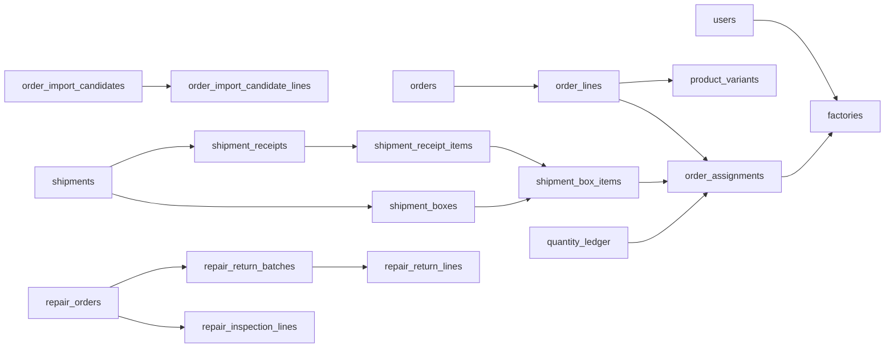

# 一期数据字典与关系图

核对日期：2026-09-08；本地代码基线：`3b2c90d`；业务基线：V1.60。

## Issue #65 本地模型增量（2026-09-09）

迁移 `20260909_0032`：`shipments.status` 增加 `WITHDRAWN`；新增可空并带索引的 `source_shipment_id`（关联原单的派生草稿或历史内容），普通列表及有效发货判断排除派生行。原单号在撤回与重新发货后保持不变，每轮数量流水使用独立来源 ID。

`shipment_files.stored_file_id` 从唯一约束改为普通索引，允许正式历史与编辑草稿共享同一附件；删除草稿关系不删除历史引用。存在撤回历史时迁移拒绝直接降级，需要走经核验的备份恢复方案。本段替代下文旧快照中涉及上述字段、约束和最新 revision 的描述，不表示已升级生产数据库。

## 来源与使用方法

字段、MySQL 类型、可空性、默认值、主外键、唯一约束与检查约束从 [SQLAlchemy 模型](../../../server/app/db/models.py) 提取，反映当前代码结构，不代表生产数据库实查。数据库实际结构需结合 [Alembic 迁移](../../../server/migrations/versions/) 与目标环境 revision 核对；本地最新迁移为 `20260908_0031`。

本文不重新定义业务规则。状态允许值以表约束及服务实现为准，不把历史表的存在当作仍开放功能。`admin_applications` 为历史结构；当前管理员由飞书登录流程授予角色。

## 关键业务字段与计算

| 字段／结构 | 含义和限制 |
|---|---|
| `order_assignments.contract_ship_date` | 订单＋SKU＋工厂的合同出货时间；来源原日期减4个自然日，人工日期直接使用；发布必须齐备 |
| `orders.contract_ship_date` | 历史兼容字段，不应作为现行业务日期判断来源；客户端使用可见明细日期汇总 |
| 候选 `date_overrides` | 按规范化 SKU／工厂组合保留人工日期，包括显式清空；再次获取不覆盖人工值 |
| 派工 `initial_shipped_quantity` | 导入前已发基线，不属于系统发货记录，普通草稿编辑不得降低 |
| `shipment_box_items.quantity`、`shipment_lines.quantity` | 工厂提交时的原报数量；不由收货确认覆盖，清单导出仍读原报 |
| `shipment_receipt_items` | 独立收货数量，可为0；草稿不影响进度，整单确认才生效 |
| `quantity_ledger.quantity_delta` | 有正负方向的派工数量变化；发货、确认差额、退回和作废留流水，不能靠覆盖总数取代 |
| `repair_return_lines` | 返修与报废数量相加形成返回数量，不进入正常订单数量流水 |
| `version` | 乐观并发版本，旧版本提交应刷新后重试，不强制覆盖 |
| `phone_encrypted` / `phone_digest` / `phone_masked` | 手机号密文、匹配摘要及脱敏显示；不得把明文补进日志或字典样例 |

统一已发数量＝初始已发数量＋系统有效发货数量；系统有效量含正常原报、已确认收货差额及退回／作废逆向流水。不同派工不能相互抵消。质检返修与正常订单独立；按发货单退回则影响原订单并走普通补发。定义见 [CONTEXT](../../../CONTEXT.md) 与正式需求。

## 核心关系图

箭头表示关联方向，不声明一对一／一对多的数据库基数；精确唯一性及可空性见后续字段表。图仅展示业务主链，完整外键在每表列出。

图中父到子箭头用于阅读主链；外键实际由子记录保存。质检返修没有连到正常订单，二者数量不可混算。

## 全表索引

- [users](#table-users)：内部用户与角色。
- [external_identities](#table-external-identities)：第三方身份绑定。
- [oauth_states](#table-oauth-states)：OAuth一次性状态。
- [user_sessions](#table-user-sessions)：网页和小程序会话。
- [sms_challenges](#table-sms-challenges)：短信验证记录。
- [admin_applications](#table-admin-applications)：历史管理员申请结构，当前登录不经过申请审核。
- [factories](#table-factories)：工厂资料。
- [factory_contacts](#table-factory-contacts)：工厂联系人。
- [factory_applications](#table-factory-applications)：工厂用户申请。
- [products](#table-products)：产品主资料。
- [product_variants](#table-product-variants)：SKU规格。
- [product_sync_runs](#table-product-sync-runs)：产品同步批次。
- [product_sync_staged_variants](#table-product-sync-staged-variants)：产品同步暂存规格。
- [order_import_runs](#table-order-import-runs)：飞书手动获取任务。
- [order_import_source_records](#table-order-import-source-records)：飞书来源快照与处理标记。
- [order_import_source_cursors](#table-order-import-source-cursors)：来源增量游标。
- [order_import_candidates](#table-order-import-candidates)：待导入候选。
- [order_import_candidate_lines](#table-order-import-candidate-lines)：候选明细。
- [order_import_validation_issues](#table-order-import-validation-issues)：候选校验问题。
- [orders](#table-orders)：订单主记录。
- [order_lines](#table-order-lines)：订单SKU明细。
- [order_assignments](#table-order-assignments)：订单明细到工厂的派工。
- [order_completion_records](#table-order-completion-records)：订单完成与恢复记录。
- [processing_contracts](#table-processing-contracts)：加工合同及编号快照。
- [contract_number_counters](#table-contract-number-counters)：合同编号计数。
- [contract_exports](#table-contract-exports)：合同导出记录。
- [shipments](#table-shipments)：正常发货单及草稿。
- [shipment_boxes](#table-shipment-boxes)：装箱记录。
- [shipment_box_items](#table-shipment-box-items)：箱内派工明细原报。
- [shipment_receipts](#table-shipment-receipts)：管理员收货核对头。
- [shipment_receipt_items](#table-shipment-receipt-items)：按原箱明细保存的核对数量。
- [shipment_lines](#table-shipment-lines)：按派工汇总的发货原报。
- [shipment_files](#table-shipment-files)：发货附件关联。
- [shipment_void_requests](#table-shipment-void-requests)：撤回发货申请。
- [shipment_return_events](#table-shipment-return-events)：按发货单退回事件。
- [shipment_return_lines](#table-shipment-return-lines)：退回事件规格明细。
- [quantity_ledger](#table-quantity-ledger)：派工数量变动流水。
- [shipment_number_counters](#table-shipment-number-counters)：发货编号计数。
- [mini_login_attempts](#table-mini-login-attempts)：小程序登录临时状态。
- [stored_files](#table-stored-files)：受控文件元数据。
- [repair_previews](#table-repair-previews)：质检导入预览。
- [repair_preview_lines](#table-repair-preview-lines)：质检预览行。
- [repair_orders](#table-repair-orders)：独立质检返修任务。
- [repair_inspection_lines](#table-repair-inspection-lines)：正式质检结构化明细。
- [repair_return_batches](#table-repair-return-batches)：返修分批发回批次。
- [repair_return_lines](#table-repair-return-lines)：返修发回明细。
- [repair_number_counters](#table-repair-number-counters)：返修编号计数。
- [idempotency_records](#table-idempotency-records)：业务请求防重复记录。
- [background_jobs](#table-background-jobs)：持久后台任务。
- [outbox_messages](#table-outbox-messages)：事务发件箱与投递状态。
- [notification_authorizations](#table-notification-authorizations)：外部提醒授权记录。
- [notifications](#table-notifications)：站内通知。
- [audit_logs](#table-audit-logs)：业务操作审计。
- [repair_return_drafts](#table-repair-return-drafts)：用户与返修单隔离的发回草稿。

## 字段与约束

“—”表示模型未声明该项，不表示应用写入时不会提供值；默认值属于数据库服务端默认。索引／约束反映模型声明，迁移中额外处理须查看迁移文件。

### users：内部用户与角色

| 字段 | MySQL 类型 | 可空 | 默认值 | 键与关联 |
|---|---|---|---|---|
| `user_id` | `VARCHAR(36)` | 否 | `—` | 主键 |
| `role` | `VARCHAR(32)` | 是 | `—` | — |
| `is_super_admin` | `BOOL` | 否 | `0` | — |
| `is_enabled` | `BOOL` | 否 | `1` | — |
| `feishu_display_name` | `VARCHAR(100)` | 否 | `—` | — |
| `feishu_avatar_url` | `VARCHAR(500)` | 是 | `—` | — |
| `mini_avatar_external_url` | `VARCHAR(500)` | 是 | `—` | — |
| `phone_encrypted` | `TEXT` | 是 | `—` | — |
| `phone_digest` | `VARCHAR(64)` | 是 | `—` | — |
| `phone_masked` | `VARCHAR(32)` | 是 | `—` | — |
| `factory_id` | `VARCHAR(36)` | 是 | `—` | → factories.factory_id（删除 RESTRICT） |
| `factory_position` | `VARCHAR(32)` | 是 | `—` | — |
| `mini_avatar_file_id` | `BIGINT` | 是 | `—` | → stored_files.file_id（删除 SET NULL） |
| `version` | `INTEGER` | 否 | `1` | — |
| `created_at` | `DATETIME(6)` | 否 | `CURRENT_TIMESTAMP(6)` | — |
| `updated_at` | `DATETIME(6)` | 否 | `CURRENT_TIMESTAMP(6)` | — |

- 唯一：phone_digest
- 检查：factory_position IS NULL OR factory_position IN ('owner', 'employee')
- 检查：is_super_admin = 0 OR role = 'admin'

### external_identities：第三方身份绑定

| 字段 | MySQL 类型 | 可空 | 默认值 | 键与关联 |
|---|---|---|---|---|
| `id` | `BIGINT` | 否 | `—` | 主键 |
| `platform` | `VARCHAR(32)` | 否 | `—` | — |
| `scope` | `VARCHAR(191)` | 否 | `—` | — |
| `platform_subject` | `VARCHAR(191)` | 否 | `—` | — |
| `user_id` | `VARCHAR(36)` | 否 | `—` | → users.user_id（删除 RESTRICT） |
| `bound_at` | `DATETIME(6)` | 否 | `CURRENT_TIMESTAMP(6)` | — |
| `last_login_at` | `DATETIME(6)` | 否 | `CURRENT_TIMESTAMP(6)` | — |

- 唯一：platform, scope, platform_subject
- 索引：user_id

### oauth_states：OAuth一次性状态

| 字段 | MySQL 类型 | 可空 | 默认值 | 键与关联 |
|---|---|---|---|---|
| `id` | `BIGINT` | 否 | `—` | 主键 |
| `state_digest` | `VARCHAR(64)` | 否 | `—` | — |
| `terminal` | `VARCHAR(32)` | 否 | `—` | — |
| `return_to` | `VARCHAR(500)` | 否 | `—` | — |
| `expires_at` | `DATETIME(6)` | 否 | `—` | — |
| `used_at` | `DATETIME(6)` | 是 | `—` | — |
| `created_at` | `DATETIME(6)` | 否 | `CURRENT_TIMESTAMP(6)` | — |

- 唯一：state_digest

### user_sessions：网页和小程序会话

| 字段 | MySQL 类型 | 可空 | 默认值 | 键与关联 |
|---|---|---|---|---|
| `session_id` | `VARCHAR(36)` | 否 | `—` | 主键 |
| `user_id` | `VARCHAR(36)` | 否 | `—` | → users.user_id（删除 RESTRICT） |
| `terminal` | `VARCHAR(32)` | 否 | `—` | — |
| `token_digest` | `VARCHAR(64)` | 否 | `—` | — |
| `refresh_token_digest` | `VARCHAR(64)` | 是 | `—` | — |
| `csrf_digest` | `VARCHAR(64)` | 是 | `—` | — |
| `expires_at` | `DATETIME(6)` | 否 | `—` | — |
| `refresh_expires_at` | `DATETIME(6)` | 是 | `—` | — |
| `last_activity_at` | `DATETIME(6)` | 否 | `—` | — |
| `revoked_at` | `DATETIME(6)` | 是 | `—` | — |
| `created_at` | `DATETIME(6)` | 否 | `CURRENT_TIMESTAMP(6)` | — |

- 唯一：refresh_token_digest
- 唯一：token_digest
- 索引：user_id, terminal, revoked_at

### sms_challenges：短信验证记录

| 字段 | MySQL 类型 | 可空 | 默认值 | 键与关联 |
|---|---|---|---|---|
| `challenge_id` | `VARCHAR(36)` | 否 | `—` | 主键 |
| `user_id` | `VARCHAR(36)` | 否 | `—` | → users.user_id（删除 RESTRICT） |
| `phone_encrypted` | `TEXT` | 否 | `—` | — |
| `phone_digest` | `VARCHAR(64)` | 否 | `—` | — |
| `phone_masked` | `VARCHAR(32)` | 否 | `—` | — |
| `purpose` | `VARCHAR(64)` | 否 | `—` | — |
| `code_digest` | `VARCHAR(64)` | 否 | `—` | — |
| `expires_at` | `DATETIME(6)` | 否 | `—` | — |
| `send_status` | `VARCHAR(32)` | 否 | `—` | — |
| `failure_reason` | `VARCHAR(100)` | 是 | `—` | — |
| `attempts` | `INTEGER` | 否 | `0` | — |
| `verified_at` | `DATETIME(6)` | 是 | `—` | — |
| `invalidated_at` | `DATETIME(6)` | 是 | `—` | — |
| `request_id` | `VARCHAR(64)` | 否 | `—` | — |
| `created_at` | `DATETIME(6)` | 否 | `CURRENT_TIMESTAMP(6)` | — |

- 索引：user_id, purpose, created_at

### admin_applications：历史管理员申请结构，当前登录不经过申请审核

| 字段 | MySQL 类型 | 可空 | 默认值 | 键与关联 |
|---|---|---|---|---|
| `application_id` | `VARCHAR(36)` | 否 | `—` | 主键 |
| `user_id` | `VARCHAR(36)` | 否 | `—` | → users.user_id（删除 RESTRICT） |
| `pending_user_id` | `VARCHAR(36)` | 是 | `—` | — |
| `feishu_display_name_snapshot` | `VARCHAR(100)` | 否 | `—` | — |
| `feishu_avatar_url_snapshot` | `VARCHAR(500)` | 是 | `—` | — |
| `phone_encrypted` | `TEXT` | 否 | `—` | — |
| `phone_digest` | `VARCHAR(64)` | 否 | `—` | — |
| `phone_masked` | `VARCHAR(32)` | 否 | `—` | — |
| `status` | `VARCHAR(32)` | 否 | `—` | — |
| `submitted_at` | `DATETIME(6)` | 否 | `—` | — |
| `reviewed_by` | `VARCHAR(36)` | 是 | `—` | → users.user_id（删除 RESTRICT） |
| `reviewed_at` | `DATETIME(6)` | 是 | `—` | — |
| `rejection_reason` | `TEXT` | 是 | `—` | — |
| `version` | `INTEGER` | 否 | `1` | — |
| `previous_application_id` | `VARCHAR(36)` | 是 | `—` | → admin_applications.application_id（删除 RESTRICT） |

- 唯一：pending_user_id
- 索引：status, submitted_at

### factories：工厂资料

| 字段 | MySQL 类型 | 可空 | 默认值 | 键与关联 |
|---|---|---|---|---|
| `factory_id` | `VARCHAR(36)` | 否 | `—` | 主键 |
| `supplier_number` | `VARCHAR(32)` | 否 | `—` | — |
| `factory_name` | `VARCHAR(100)` | 否 | `—` | — |
| `factory_code` | `VARCHAR(32)` | 是 | `—` | — |
| `legal_name` | `VARCHAR(200)` | 是 | `—` | — |
| `address` | `VARCHAR(500)` | 是 | `—` | — |
| `legal_representative` | `VARCHAR(100)` | 是 | `—` | — |
| `is_enabled` | `BOOL` | 否 | `1` | — |
| `version` | `INTEGER` | 否 | `1` | — |
| `created_at` | `DATETIME(6)` | 否 | `CURRENT_TIMESTAMP(6)` | — |
| `updated_at` | `DATETIME(6)` | 否 | `CURRENT_TIMESTAMP(6)` | — |

- 唯一：factory_code
- 唯一：factory_name
- 唯一：supplier_number

### factory_contacts：工厂联系人

| 字段 | MySQL 类型 | 可空 | 默认值 | 键与关联 |
|---|---|---|---|---|
| `contact_id` | `BIGINT` | 否 | `—` | 主键 |
| `factory_id` | `VARCHAR(36)` | 否 | `—` | → factories.factory_id（删除 CASCADE） |
| `name` | `VARCHAR(100)` | 否 | `—` | — |
| `phone` | `VARCHAR(50)` | 否 | `—` | — |
| `display_order` | `INTEGER` | 否 | `—` | — |
| `is_primary` | `BOOL` | 否 | `0` | — |
| `created_at` | `DATETIME(6)` | 否 | `CURRENT_TIMESTAMP(6)` | — |
| `updated_at` | `DATETIME(6)` | 否 | `CURRENT_TIMESTAMP(6)` | — |

- 唯一：factory_id, display_order
- 索引：factory_id

### factory_applications：工厂用户申请

| 字段 | MySQL 类型 | 可空 | 默认值 | 键与关联 |
|---|---|---|---|---|
| `application_id` | `VARCHAR(36)` | 否 | `—` | 主键 |
| `user_id` | `VARCHAR(36)` | 否 | `—` | → users.user_id（删除 RESTRICT） |
| `pending_user_id` | `VARCHAR(36)` | 是 | `—` | — |
| `real_name` | `VARCHAR(100)` | 否 | `—` | — |
| `phone_encrypted` | `TEXT` | 否 | `—` | — |
| `phone_digest` | `VARCHAR(64)` | 否 | `—` | — |
| `phone_masked` | `VARCHAR(32)` | 否 | `—` | — |
| `position` | `VARCHAR(32)` | 否 | `—` | — |
| `requested_factory_id` | `VARCHAR(36)` | 否 | `—` | → factories.factory_id（删除 RESTRICT） |
| `bound_factory_id` | `VARCHAR(36)` | 是 | `—` | → factories.factory_id（删除 RESTRICT） |
| `status` | `VARCHAR(32)` | 否 | `—` | — |
| `submitted_at` | `DATETIME(6)` | 否 | `—` | — |
| `reviewed_by` | `VARCHAR(36)` | 是 | `—` | → users.user_id（删除 RESTRICT） |
| `reviewed_at` | `DATETIME(6)` | 是 | `—` | — |
| `rejection_reason` | `TEXT` | 是 | `—` | — |
| `version` | `INTEGER` | 否 | `1` | — |
| `previous_application_id` | `VARCHAR(36)` | 是 | `—` | → factory_applications.application_id（删除 RESTRICT） |

- 唯一：pending_user_id
- 索引：status, submitted_at

### products：产品主资料

| 字段 | MySQL 类型 | 可空 | 默认值 | 键与关联 |
|---|---|---|---|---|
| `product_id` | `VARCHAR(36)` | 否 | `—` | 主键 |
| `source_i_id` | `VARCHAR(100)` | 否 | `—` | — |
| `name` | `VARCHAR(255)` | 否 | `—` | — |
| `is_available` | `BOOL` | 否 | `0` | — |
| `image_source_ref` | `VARCHAR(1000)` | 是 | `—` | — |
| `image_object_key` | `VARCHAR(500)` | 是 | `—` | — |
| `image_cache_status` | `VARCHAR(32)` | 否 | `missing` | — |
| `image_cache_error` | `VARCHAR(100)` | 是 | `—` | — |
| `source_modified_at` | `DATETIME(6)` | 否 | `—` | — |
| `first_synced_at` | `DATETIME(6)` | 否 | `—` | — |
| `last_synced_at` | `DATETIME(6)` | 否 | `—` | — |
| `created_at` | `DATETIME(6)` | 否 | `CURRENT_TIMESTAMP(6)` | — |
| `updated_at` | `DATETIME(6)` | 否 | `CURRENT_TIMESTAMP(6)` | — |

- 唯一：source_i_id

### product_variants：SKU规格

| 字段 | MySQL 类型 | 可空 | 默认值 | 键与关联 |
|---|---|---|---|---|
| `variant_id` | `VARCHAR(36)` | 否 | `—` | 主键 |
| `product_id` | `VARCHAR(36)` | 否 | `—` | → products.product_id（删除 RESTRICT） |
| `source_sku_id` | `VARCHAR(100)` | 否 | `—` | — |
| `properties_value` | `VARCHAR(255)` | 否 | `—` | — |
| `source_category` | `VARCHAR(100)` | 是 | `—` | — |
| `source_enabled` | `INTEGER` | 是 | `—` | — |
| `is_available` | `BOOL` | 否 | `0` | — |
| `source_modified_at` | `DATETIME(6)` | 否 | `—` | — |
| `first_synced_at` | `DATETIME(6)` | 否 | `—` | — |
| `last_synced_at` | `DATETIME(6)` | 否 | `—` | — |
| `created_at` | `DATETIME(6)` | 否 | `CURRENT_TIMESTAMP(6)` | — |
| `updated_at` | `DATETIME(6)` | 否 | `CURRENT_TIMESTAMP(6)` | — |

- 唯一：source_sku_id
- 索引：is_available, variant_id
- 索引：product_id

### product_sync_runs：产品同步批次

| 字段 | MySQL 类型 | 可空 | 默认值 | 键与关联 |
|---|---|---|---|---|
| `run_id` | `VARCHAR(36)` | 否 | `—` | 主键 |
| `run_type` | `VARCHAR(32)` | 否 | `—` | — |
| `status` | `VARCHAR(32)` | 否 | `—` | — |
| `active_key` | `VARCHAR(64)` | 是 | `—` | — |
| `start_cursor` | `VARCHAR(255)` | 是 | `—` | — |
| `candidate_cursor` | `VARCHAR(255)` | 是 | `—` | — |
| `success_cursor` | `VARCHAR(255)` | 是 | `—` | — |
| `source_checkpoint` | `TEXT` | 是 | `—` | — |
| `next_page` | `INTEGER` | 否 | `1` | — |
| `source_completed` | `BOOL` | 否 | `0` | — |
| `started_at` | `DATETIME(6)` | 否 | `—` | — |
| `finished_at` | `DATETIME(6)` | 是 | `—` | — |
| `worker_id` | `VARCHAR(100)` | 否 | `—` | — |
| `request_id` | `VARCHAR(64)` | 否 | `—` | — |
| `pages_read` | `INTEGER` | 否 | `0` | — |
| `records_read` | `INTEGER` | 否 | `0` | — |
| `included_records` | `INTEGER` | 否 | `0` | — |
| `created_records` | `INTEGER` | 否 | `0` | — |
| `updated_records` | `INTEGER` | 否 | `0` | — |
| `ignored_records` | `INTEGER` | 否 | `0` | — |
| `disabled_records` | `INTEGER` | 否 | `0` | — |
| `moved_out_records` | `INTEGER` | 否 | `0` | — |
| `image_jobs_created` | `INTEGER` | 否 | `0` | — |
| `error_code` | `VARCHAR(100)` | 是 | `—` | — |
| `created_at` | `DATETIME(6)` | 否 | `CURRENT_TIMESTAMP(6)` | — |

- 唯一：active_key
- 索引：status, finished_at

### product_sync_staged_variants：产品同步暂存规格

| 字段 | MySQL 类型 | 可空 | 默认值 | 键与关联 |
|---|---|---|---|---|
| `staged_id` | `BIGINT` | 否 | `—` | 主键 |
| `run_id` | `VARCHAR(36)` | 否 | `—` | → product_sync_runs.run_id（删除 CASCADE） |
| `source_i_id` | `VARCHAR(100)` | 否 | `—` | — |
| `source_sku_id` | `VARCHAR(100)` | 否 | `—` | — |
| `name` | `VARCHAR(255)` | 否 | `—` | — |
| `properties_value` | `VARCHAR(255)` | 是 | `—` | — |
| `pic` | `VARCHAR(1000)` | 是 | `—` | — |
| `category` | `VARCHAR(100)` | 是 | `—` | — |
| `enabled` | `INTEGER` | 是 | `—` | — |
| `source_modified_at` | `DATETIME(6)` | 否 | `—` | — |
| `created_at` | `DATETIME(6)` | 否 | `CURRENT_TIMESTAMP(6)` | — |
| `updated_at` | `DATETIME(6)` | 否 | `CURRENT_TIMESTAMP(6)` | — |

- 唯一：run_id, source_sku_id
- 索引：run_id, staged_id

### order_import_runs：飞书手动获取任务

| 字段 | MySQL 类型 | 可空 | 默认值 | 键与关联 |
|---|---|---|---|---|
| `run_id` | `VARCHAR(36)` | 否 | `—` | 主键 |
| `status` | `VARCHAR(32)` | 否 | `—` | — |
| `active_key` | `VARCHAR(64)` | 是 | `—` | — |
| `started_at` | `DATETIME(6)` | 否 | `—` | — |
| `finished_at` | `DATETIME(6)` | 是 | `—` | — |
| `requested_by` | `VARCHAR(36)` | 否 | `—` | → users.user_id（删除 RESTRICT） |
| `request_id` | `VARCHAR(64)` | 否 | `—` | — |
| `idempotency_key` | `VARCHAR(191)` | 是 | `—` | — |
| `pages_read` | `INTEGER` | 否 | `0` | — |
| `records_read` | `INTEGER` | 否 | `0` | — |
| `candidates_created` | `INTEGER` | 否 | `0` | — |
| `candidates_updated` | `INTEGER` | 否 | `0` | — |
| `skipped_records` | `INTEGER` | 否 | `0` | — |
| `failed_records` | `INTEGER` | 否 | `0` | — |
| `error_code` | `VARCHAR(100)` | 是 | `—` | — |
| `error_message` | `TEXT` | 是 | `—` | — |
| `created_at` | `DATETIME(6)` | 否 | `CURRENT_TIMESTAMP(6)` | — |

- 唯一：active_key
- 唯一：idempotency_key
- 索引：started_at, run_id

### order_import_source_records：飞书来源快照与处理标记

| 字段 | MySQL 类型 | 可空 | 默认值 | 键与关联 |
|---|---|---|---|---|
| `source_record_pk` | `BIGINT` | 否 | `—` | 主键 |
| `source_scope` | `VARCHAR(191)` | 否 | `—` | — |
| `source_record_id` | `VARCHAR(100)` | 否 | `—` | — |
| `source_detail_id` | `VARCHAR(100)` | 是 | `—` | — |
| `order_no` | `VARCHAR(100)` | 是 | `—` | — |
| `raw_fields` | `JSON` | 否 | `—` | — |
| `normalized_fields` | `JSON` | 是 | `—` | — |
| `source_modified_at` | `DATETIME(6)` | 是 | `—` | — |
| `parse_status` | `VARCHAR(32)` | 否 | `—` | — |
| `error_code` | `VARCHAR(100)` | 是 | `—` | — |
| `error_message` | `VARCHAR(255)` | 是 | `—` | — |
| `first_seen_run_id` | `VARCHAR(36)` | 否 | `—` | → order_import_runs.run_id（删除 RESTRICT） |
| `last_seen_run_id` | `VARCHAR(36)` | 否 | `—` | → order_import_runs.run_id（删除 RESTRICT） |
| `first_seen_at` | `DATETIME(6)` | 否 | `—` | — |
| `last_seen_at` | `DATETIME(6)` | 否 | `—` | — |

- 唯一：source_scope, source_record_id
- 索引：order_no, source_record_id

### order_import_source_cursors：来源增量游标

| 字段 | MySQL 类型 | 可空 | 默认值 | 键与关联 |
|---|---|---|---|---|
| `source_scope` | `VARCHAR(191)` | 否 | `—` | 主键 |
| `successful_modified_at` | `DATETIME(6)` | 否 | `—` | — |
| `successful_run_id` | `VARCHAR(36)` | 否 | `—` | → order_import_runs.run_id（删除 RESTRICT） |
| `successful_at` | `DATETIME(6)` | 否 | `—` | — |

### order_import_candidates：待导入候选

| 字段 | MySQL 类型 | 可空 | 默认值 | 键与关联 |
|---|---|---|---|---|
| `candidate_id` | `VARCHAR(36)` | 否 | `—` | 主键 |
| `order_no` | `VARCHAR(100)` | 否 | `—` | — |
| `status` | `VARCHAR(32)` | 否 | `—` | — |
| `validation_state` | `VARCHAR(32)` | 否 | `—` | — |
| `validation_issues` | `JSON` | 否 | `—` | — |
| `issue_count` | `INTEGER` | 否 | `0` | — |
| `date_overrides` | `JSON` | 否 | `—` | — |
| `source_record_count` | `INTEGER` | 否 | `0` | — |
| `order_date` | `DATE` | 是 | `—` | — |
| `tracker` | `VARCHAR(32)` | 是 | `—` | — |
| `contract_ship_date` | `DATE` | 是 | `—` | — |
| `category` | `VARCHAR(100)` | 是 | `—` | — |
| `total_quantity` | `INTEGER` | 否 | `0` | — |
| `shipped_quantity` | `INTEGER` | 否 | `0` | — |
| `pending_quantity` | `INTEGER` | 否 | `0` | — |
| `imported_order_id` | `VARCHAR(36)` | 是 | `—` | → orders.order_id（删除 RESTRICT） |
| `imported_by` | `VARCHAR(36)` | 是 | `—` | → users.user_id（删除 RESTRICT） |
| `imported_at` | `DATETIME(6)` | 是 | `—` | — |
| `excluded_by` | `VARCHAR(36)` | 是 | `—` | → users.user_id（删除 RESTRICT） |
| `excluded_at` | `DATETIME(6)` | 是 | `—` | — |
| `version` | `INTEGER` | 否 | `1` | — |
| `created_at` | `DATETIME(6)` | 否 | `—` | — |
| `updated_at` | `DATETIME(6)` | 否 | `—` | — |

- 唯一：order_no
- 索引：status, validation_state, updated_at

### order_import_candidate_lines：候选明细

| 字段 | MySQL 类型 | 可空 | 默认值 | 键与关联 |
|---|---|---|---|---|
| `candidate_line_id` | `BIGINT` | 否 | `—` | 主键 |
| `candidate_id` | `VARCHAR(36)` | 否 | `—` | → order_import_candidates.candidate_id（删除 CASCADE） |
| `contract_ship_date` | `DATE` | 是 | `—` | — |
| `source_contract_ship_date` | `DATE` | 是 | `—` | — |
| `source_record_pk` | `BIGINT` | 否 | `—` | → order_import_source_records.source_record_pk（删除 RESTRICT） |
| `source_sku_id` | `VARCHAR(100)` | 是 | `—` | — |
| `product_name` | `VARCHAR(255)` | 是 | `—` | — |
| `properties_value` | `VARCHAR(255)` | 是 | `—` | — |
| `category` | `VARCHAR(100)` | 是 | `—` | — |
| `factory_name` | `VARCHAR(100)` | 是 | `—` | — |
| `order_quantity` | `INTEGER` | 是 | `—` | — |
| `shipped_quantity` | `INTEGER` | 否 | `0` | — |
| `pending_quantity` | `INTEGER` | 否 | `0` | — |
| `matched_variant_id` | `VARCHAR(36)` | 是 | `—` | → product_variants.variant_id（删除 RESTRICT） |
| `matched_factory_id` | `VARCHAR(36)` | 是 | `—` | → factories.factory_id（删除 RESTRICT） |
| `image_object_key_snapshot` | `VARCHAR(500)` | 是 | `—` | — |
| `validation_issues` | `JSON` | 否 | `—` | — |

- 唯一：candidate_id, source_record_pk
- 索引：candidate_id, candidate_line_id

### order_import_validation_issues：候选校验问题

| 字段 | MySQL 类型 | 可空 | 默认值 | 键与关联 |
|---|---|---|---|---|
| `issue_id` | `BIGINT` | 否 | `—` | 主键 |
| `candidate_id` | `VARCHAR(36)` | 否 | `—` | → order_import_candidates.candidate_id（删除 CASCADE） |
| `candidate_line_id` | `BIGINT` | 是 | `—` | → order_import_candidate_lines.candidate_line_id（删除 CASCADE） |
| `code` | `VARCHAR(100)` | 否 | `—` | — |
| `field_name` | `VARCHAR(100)` | 是 | `—` | — |
| `message` | `VARCHAR(255)` | 否 | `—` | — |
| `sort_order` | `INTEGER` | 否 | `—` | — |

- 索引：candidate_id, sort_order

### orders：订单主记录

| 字段 | MySQL 类型 | 可空 | 默认值 | 键与关联 |
|---|---|---|---|---|
| `order_id` | `VARCHAR(36)` | 否 | `—` | 主键 |
| `order_no` | `VARCHAR(100)` | 否 | `—` | — |
| `source` | `VARCHAR(32)` | 否 | `—` | — |
| `order_date` | `DATE` | 是 | `—` | — |
| `tracker` | `VARCHAR(32)` | 否 | `—` | — |
| `contract_ship_date` | `DATE` | 是 | `—` | — |
| `lifecycle` | `VARCHAR(32)` | 否 | `—` | — |
| `version` | `INTEGER` | 否 | `1` | — |
| `published_at` | `DATETIME(6)` | 是 | `—` | — |
| `published_by` | `VARCHAR(36)` | 是 | `—` | → users.user_id（删除 RESTRICT） |
| `completed_at` | `DATETIME(6)` | 是 | `—` | — |
| `completed_by` | `VARCHAR(36)` | 是 | `—` | → users.user_id（删除 RESTRICT） |
| `deleted_at` | `DATETIME(6)` | 是 | `—` | — |
| `deleted_by` | `VARCHAR(36)` | 是 | `—` | → users.user_id（删除 RESTRICT） |
| `created_by` | `VARCHAR(36)` | 否 | `—` | → users.user_id（删除 RESTRICT） |
| `updated_by` | `VARCHAR(36)` | 否 | `—` | → users.user_id（删除 RESTRICT） |
| `created_at` | `DATETIME(6)` | 否 | `CURRENT_TIMESTAMP(6)` | — |
| `updated_at` | `DATETIME(6)` | 否 | `CURRENT_TIMESTAMP(6)` | — |

- 唯一：order_no
- 检查：lifecycle IN ('DRAFT', 'PUBLISHED', 'COMPLETED')
- 检查：source IN ('manual', 'feishu')
- 索引：deleted_at, lifecycle, contract_ship_date

### order_lines：订单SKU明细

| 字段 | MySQL 类型 | 可空 | 默认值 | 键与关联 |
|---|---|---|---|---|
| `order_line_id` | `BIGINT` | 否 | `—` | 主键 |
| `order_id` | `VARCHAR(36)` | 否 | `—` | → orders.order_id（删除 RESTRICT） |
| `product_variant_id` | `VARCHAR(36)` | 否 | `—` | → product_variants.variant_id（删除 RESTRICT） |
| `order_quantity` | `INTEGER` | 否 | `—` | — |
| `sku_id_snapshot` | `VARCHAR(100)` | 否 | `—` | — |
| `product_name_snapshot` | `VARCHAR(255)` | 否 | `—` | — |
| `properties_value_snapshot` | `VARCHAR(255)` | 否 | `—` | — |
| `category_snapshot` | `VARCHAR(100)` | 是 | `—` | — |
| `image_object_key_snapshot` | `VARCHAR(500)` | 是 | `—` | — |
| `created_at` | `DATETIME(6)` | 否 | `CURRENT_TIMESTAMP(6)` | — |
| `updated_at` | `DATETIME(6)` | 否 | `CURRENT_TIMESTAMP(6)` | — |

- 唯一：order_id, product_variant_id
- 检查：order_quantity > 0
- 索引：order_id, order_line_id

### order_assignments：订单明细到工厂的派工

| 字段 | MySQL 类型 | 可空 | 默认值 | 键与关联 |
|---|---|---|---|---|
| `order_assignment_id` | `BIGINT` | 否 | `—` | 主键 |
| `order_line_id` | `BIGINT` | 否 | `—` | → order_lines.order_line_id（删除 RESTRICT） |
| `factory_id` | `VARCHAR(36)` | 否 | `—` | → factories.factory_id（删除 RESTRICT） |
| `contract_ship_date` | `DATE` | 是 | `—` | — |
| `assigned_quantity` | `INTEGER` | 否 | `—` | — |
| `initial_shipped_quantity` | `INTEGER` | 否 | `0` | — |
| `factory_name_snapshot` | `VARCHAR(100)` | 否 | `—` | — |
| `created_at` | `DATETIME(6)` | 否 | `CURRENT_TIMESTAMP(6)` | — |
| `updated_at` | `DATETIME(6)` | 否 | `CURRENT_TIMESTAMP(6)` | — |

- 唯一：order_line_id, factory_id
- 检查：assigned_quantity > 0
- 检查：assigned_quantity >= initial_shipped_quantity
- 检查：initial_shipped_quantity >= 0
- 索引：factory_id, order_line_id

### order_completion_records：订单完成与恢复记录

| 字段 | MySQL 类型 | 可空 | 默认值 | 键与关联 |
|---|---|---|---|---|
| `record_id` | `BIGINT` | 否 | `—` | 主键 |
| `order_id` | `VARCHAR(36)` | 否 | `—` | → orders.order_id（删除 RESTRICT） |
| `action` | `VARCHAR(32)` | 否 | `—` | — |
| `reason` | `TEXT` | 是 | `—` | — |
| `actor_id` | `VARCHAR(36)` | 否 | `—` | → users.user_id（删除 RESTRICT） |
| `source_terminal` | `VARCHAR(32)` | 否 | `—` | — |
| `before_lifecycle` | `VARCHAR(32)` | 否 | `—` | — |
| `after_lifecycle` | `VARCHAR(32)` | 否 | `—` | — |
| `quantity_snapshot` | `JSON` | 否 | `—` | — |
| `created_at` | `DATETIME(6)` | 否 | `CURRENT_TIMESTAMP(6)` | — |

- 检查：action IN ('COMPLETE', 'REOPEN')
- 索引：order_id, record_id

### processing_contracts：加工合同及编号快照

| 字段 | MySQL 类型 | 可空 | 默认值 | 键与关联 |
|---|---|---|---|---|
| `contract_id` | `VARCHAR(36)` | 否 | `—` | 主键 |
| `order_id` | `VARCHAR(36)` | 否 | `—` | → orders.order_id（删除 RESTRICT） |
| `factory_id` | `VARCHAR(36)` | 否 | `—` | → factories.factory_id（删除 RESTRICT） |
| `signing_date` | `DATE` | 否 | `—` | — |
| `daily_sequence` | `INTEGER` | 否 | `—` | — |
| `contract_no` | `VARCHAR(191)` | 否 | `—` | — |
| `contract_snapshot` | `JSON` | 否 | `—` | — |
| `template_version` | `VARCHAR(32)` | 否 | `—` | — |
| `created_by` | `VARCHAR(36)` | 否 | `—` | → users.user_id（删除 RESTRICT） |
| `created_at` | `DATETIME(6)` | 否 | `—` | — |

- 唯一：contract_no
- 唯一：order_id, factory_id
- 唯一：signing_date, factory_id, daily_sequence
- 索引：order_id, factory_id

### contract_number_counters：合同编号计数

| 字段 | MySQL 类型 | 可空 | 默认值 | 键与关联 |
|---|---|---|---|---|
| `signing_date` | `DATE` | 否 | `—` | 主键 |
| `factory_id` | `VARCHAR(36)` | 否 | `—` | 主键；→ factories.factory_id（删除 RESTRICT） |
| `next_sequence` | `INTEGER` | 否 | `—` | — |
| `updated_at` | `DATETIME(6)` | 否 | `—` | — |

### contract_exports：合同导出记录

| 字段 | MySQL 类型 | 可空 | 默认值 | 键与关联 |
|---|---|---|---|---|
| `export_id` | `VARCHAR(36)` | 否 | `—` | 主键 |
| `contract_id` | `VARCHAR(36)` | 否 | `—` | → processing_contracts.contract_id（删除 RESTRICT） |
| `exported_by` | `VARCHAR(36)` | 否 | `—` | → users.user_id（删除 RESTRICT） |
| `idempotency_key` | `VARCHAR(191)` | 否 | `—` | — |
| `status` | `VARCHAR(32)` | 否 | `—` | — |
| `export_snapshot` | `JSON` | 否 | `—` | — |
| `template_version` | `VARCHAR(32)` | 否 | `—` | — |
| `stored_file_id` | `BIGINT` | 是 | `—` | → stored_files.file_id（删除 RESTRICT） |
| `error_code` | `VARCHAR(100)` | 是 | `—` | — |
| `error_message` | `VARCHAR(255)` | 是 | `—` | — |
| `created_at` | `DATETIME(6)` | 否 | `—` | — |
| `completed_at` | `DATETIME(6)` | 是 | `—` | — |

- 唯一：exported_by, idempotency_key
- 索引：contract_id, created_at

### shipments：正常发货单及草稿

| 字段 | MySQL 类型 | 可空 | 默认值 | 键与关联 |
|---|---|---|---|---|
| `shipment_id` | `VARCHAR(36)` | 否 | `—` | 主键 |
| `shipment_no` | `VARCHAR(32)` | 是 | `—` | — |
| `factory_id` | `VARCHAR(36)` | 否 | `—` | → factories.factory_id（删除 RESTRICT） |
| `version` | `INTEGER` | 否 | `1` | — |
| `status` | `VARCHAR(32)` | 否 | `—` | — |
| `business_date` | `DATE` | 是 | `—` | — |
| `preferred_order_id` | `VARCHAR(36)` | 是 | `—` | → orders.order_id（删除 RESTRICT） |
| `note` | `TEXT` | 是 | `—` | — |
| `created_by` | `VARCHAR(36)` | 否 | `—` | → users.user_id（删除 RESTRICT） |
| `active_draft_owner_id` | `VARCHAR(36)` | 是 | `—` | → users.user_id（删除 RESTRICT） |
| `submitted_by` | `VARCHAR(36)` | 是 | `—` | → users.user_id（删除 RESTRICT） |
| `submitted_at` | `DATETIME(6)` | 是 | `—` | — |
| `deleted_at` | `DATETIME(6)` | 是 | `—` | — |
| `created_at` | `DATETIME(6)` | 否 | `CURRENT_TIMESTAMP(6)` | — |
| `updated_at` | `DATETIME(6)` | 否 | `CURRENT_TIMESTAMP(6)` | — |

- 唯一：active_draft_owner_id
- 唯一：shipment_no
- 检查：status IN ('DRAFT', 'SHIPPED', 'VOID_PENDING', 'VOIDED')
- 索引：factory_id, status, created_at

### shipment_boxes：装箱记录

| 字段 | MySQL 类型 | 可空 | 默认值 | 键与关联 |
|---|---|---|---|---|
| `box_id` | `BIGINT` | 否 | `—` | 主键 |
| `shipment_id` | `VARCHAR(36)` | 否 | `—` | → shipments.shipment_id（删除 CASCADE） |
| `box_no` | `INTEGER` | 否 | `—` | — |
| `group_key` | `VARCHAR(36)` | 是 | `—` | — |

- 唯一：shipment_id, box_no
- 检查：box_no > 0

### shipment_box_items：箱内派工明细原报

| 字段 | MySQL 类型 | 可空 | 默认值 | 键与关联 |
|---|---|---|---|---|
| `item_id` | `BIGINT` | 否 | `—` | 主键 |
| `box_id` | `BIGINT` | 否 | `—` | → shipment_boxes.box_id（删除 CASCADE） |
| `order_assignment_id` | `BIGINT` | 否 | `—` | → order_assignments.order_assignment_id（删除 RESTRICT） |
| `quantity` | `INTEGER` | 否 | `—` | — |

- 唯一：box_id, order_assignment_id
- 检查：quantity > 0

### shipment_receipts：管理员收货核对头

| 字段 | MySQL 类型 | 可空 | 默认值 | 键与关联 |
|---|---|---|---|---|
| `shipment_id` | `VARCHAR(36)` | 否 | `—` | 主键；→ shipments.shipment_id（删除 RESTRICT） |
| `status` | `VARCHAR(16)` | 否 | `—` | — |
| `version` | `INTEGER` | 否 | `—` | — |
| `saved_by` | `VARCHAR(36)` | 否 | `—` | → users.user_id（删除 默认） |
| `saved_at` | `DATETIME(6)` | 否 | `—` | — |
| `confirmed_by` | `VARCHAR(36)` | 是 | `—` | → users.user_id（删除 默认） |
| `confirmed_at` | `DATETIME(6)` | 是 | `—` | — |

- 检查：status IN ('DRAFT', 'CONFIRMED')
- 检查：version >= 0

### shipment_receipt_items：按原箱明细保存的核对数量

| 字段 | MySQL 类型 | 可空 | 默认值 | 键与关联 |
|---|---|---|---|---|
| `box_item_id` | `BIGINT` | 否 | `—` | 主键；→ shipment_box_items.item_id（删除 RESTRICT） |
| `shipment_id` | `VARCHAR(36)` | 否 | `—` | → shipment_receipts.shipment_id（删除 RESTRICT） |
| `quantity` | `INTEGER` | 否 | `—` | — |

- 检查：quantity >= 0

### shipment_lines：按派工汇总的发货原报

| 字段 | MySQL 类型 | 可空 | 默认值 | 键与关联 |
|---|---|---|---|---|
| `line_id` | `BIGINT` | 否 | `—` | 主键 |
| `shipment_id` | `VARCHAR(36)` | 否 | `—` | → shipments.shipment_id（删除 RESTRICT） |
| `order_assignment_id` | `BIGINT` | 否 | `—` | → order_assignments.order_assignment_id（删除 RESTRICT） |
| `quantity` | `INTEGER` | 否 | `—` | — |
| `order_no_snapshot` | `VARCHAR(100)` | 否 | `—` | — |
| `sku_id_snapshot` | `VARCHAR(100)` | 否 | `—` | — |
| `product_name_snapshot` | `VARCHAR(255)` | 否 | `—` | — |
| `properties_value_snapshot` | `VARCHAR(255)` | 否 | `—` | — |

- 唯一：shipment_id, order_assignment_id
- 检查：quantity > 0

### shipment_files：发货附件关联

| 字段 | MySQL 类型 | 可空 | 默认值 | 键与关联 |
|---|---|---|---|---|
| `shipment_file_id` | `BIGINT` | 否 | `—` | 主键 |
| `shipment_id` | `VARCHAR(36)` | 否 | `—` | → shipments.shipment_id（删除 CASCADE） |
| `stored_file_id` | `BIGINT` | 否 | `—` | → stored_files.file_id（删除 RESTRICT） |
| `display_order` | `INTEGER` | 否 | `—` | — |
| `created_at` | `DATETIME(6)` | 否 | `CURRENT_TIMESTAMP(6)` | — |

- 唯一：shipment_id, display_order
- 唯一：stored_file_id
- 检查：display_order >= 0 AND display_order < 3
- 索引：shipment_id, display_order

### shipment_void_requests：撤回发货申请

| 字段 | MySQL 类型 | 可空 | 默认值 | 键与关联 |
|---|---|---|---|---|
| `request_id` | `VARCHAR(36)` | 否 | `—` | 主键 |
| `shipment_id` | `VARCHAR(36)` | 否 | `—` | → shipments.shipment_id（删除 RESTRICT） |
| `active_shipment_id` | `VARCHAR(36)` | 是 | `—` | → shipments.shipment_id（删除 RESTRICT） |
| `requested_by` | `VARCHAR(36)` | 否 | `—` | → users.user_id（删除 RESTRICT） |
| `reason` | `VARCHAR(500)` | 否 | `—` | — |
| `status` | `VARCHAR(32)` | 否 | `—` | — |
| `reviewed_by` | `VARCHAR(36)` | 是 | `—` | → users.user_id（删除 RESTRICT） |
| `reviewed_at` | `DATETIME(6)` | 是 | `—` | — |
| `review_comment` | `VARCHAR(500)` | 是 | `—` | — |
| `idempotency_key` | `VARCHAR(191)` | 否 | `—` | — |
| `created_at` | `DATETIME(6)` | 否 | `—` | — |

- 唯一：active_shipment_id
- 唯一：requested_by, idempotency_key
- 检查：status IN ('PENDING', 'APPROVED', 'REJECTED')
- 索引：shipment_id, created_at

### shipment_return_events：按发货单退回事件

| 字段 | MySQL 类型 | 可空 | 默认值 | 键与关联 |
|---|---|---|---|---|
| `event_id` | `VARCHAR(36)` | 否 | `—` | 主键 |
| `shipment_id` | `VARCHAR(36)` | 否 | `—` | → shipments.shipment_id（删除 RESTRICT） |
| `returned_by` | `VARCHAR(36)` | 否 | `—` | → users.user_id（删除 RESTRICT） |
| `return_date` | `DATE` | 否 | `—` | — |
| `reason` | `VARCHAR(500)` | 否 | `—` | — |
| `idempotency_key` | `VARCHAR(191)` | 否 | `—` | — |
| `created_at` | `DATETIME(6)` | 否 | `—` | — |

- 唯一：returned_by, idempotency_key
- 索引：shipment_id, created_at

### shipment_return_lines：退回事件规格明细

| 字段 | MySQL 类型 | 可空 | 默认值 | 键与关联 |
|---|---|---|---|---|
| `return_line_id` | `BIGINT` | 否 | `—` | 主键 |
| `event_id` | `VARCHAR(36)` | 否 | `—` | → shipment_return_events.event_id（删除 RESTRICT） |
| `shipment_line_id` | `BIGINT` | 否 | `—` | → shipment_lines.line_id（删除 RESTRICT） |
| `quantity` | `INTEGER` | 否 | `—` | — |
| `before_shipped_quantity` | `INTEGER` | 否 | `—` | — |
| `after_shipped_quantity` | `INTEGER` | 否 | `—` | — |

- 唯一：event_id, shipment_line_id
- 检查：quantity > 0
- 索引：shipment_line_id

### quantity_ledger：派工数量变动流水

| 字段 | MySQL 类型 | 可空 | 默认值 | 键与关联 |
|---|---|---|---|---|
| `ledger_id` | `BIGINT` | 否 | `—` | 主键 |
| `order_assignment_id` | `BIGINT` | 否 | `—` | → order_assignments.order_assignment_id（删除 RESTRICT） |
| `source_type` | `VARCHAR(32)` | 否 | `—` | — |
| `source_id` | `VARCHAR(36)` | 否 | `—` | — |
| `quantity_delta` | `INTEGER` | 否 | `—` | — |
| `actor_id` | `VARCHAR(36)` | 否 | `—` | → users.user_id（删除 RESTRICT） |
| `created_at` | `DATETIME(6)` | 否 | `—` | — |

- 唯一：source_type, source_id, order_assignment_id
- 检查：quantity_delta <> 0
- 索引：order_assignment_id, created_at

### shipment_number_counters：发货编号计数

| 字段 | MySQL 类型 | 可空 | 默认值 | 键与关联 |
|---|---|---|---|---|
| `business_date` | `DATE` | 否 | `—` | 主键 |
| `next_sequence` | `INTEGER` | 否 | `—` | — |
| `updated_at` | `DATETIME(6)` | 否 | `—` | — |

### mini_login_attempts：小程序登录临时状态

| 字段 | MySQL 类型 | 可空 | 默认值 | 键与关联 |
|---|---|---|---|---|
| `attempt_id` | `VARCHAR(36)` | 否 | `—` | 主键 |
| `token_digest` | `VARCHAR(64)` | 否 | `—` | — |
| `scope` | `VARCHAR(191)` | 否 | `—` | — |
| `platform_subject` | `VARCHAR(191)` | 否 | `—` | — |
| `wechat_avatar_url` | `VARCHAR(500)` | 是 | `—` | — |
| `expires_at` | `DATETIME(6)` | 否 | `—` | — |
| `used_at` | `DATETIME(6)` | 是 | `—` | — |
| `created_at` | `DATETIME(6)` | 否 | `CURRENT_TIMESTAMP(6)` | — |

- 唯一：token_digest

### stored_files：受控文件元数据

| 字段 | MySQL 类型 | 可空 | 默认值 | 键与关联 |
|---|---|---|---|---|
| `file_id` | `BIGINT` | 否 | `—` | 主键 |
| `bucket` | `VARCHAR(100)` | 否 | `—` | — |
| `object_key` | `VARCHAR(191)` | 否 | `—` | — |
| `original_filename` | `VARCHAR(255)` | 否 | `—` | — |
| `mime_type` | `VARCHAR(100)` | 否 | `—` | — |
| `size_bytes` | `BIGINT` | 否 | `—` | — |
| `content_sha256` | `VARCHAR(64)` | 否 | `—` | — |
| `uploaded_by` | `VARCHAR(36)` | 否 | `—` | → users.user_id（删除 RESTRICT） |
| `idempotency_key` | `VARCHAR(191)` | 是 | `—` | — |
| `replaced_at` | `DATETIME(6)` | 是 | `—` | — |
| `created_at` | `DATETIME(6)` | 否 | `CURRENT_TIMESTAMP(6)` | — |

- 唯一：bucket, object_key
- 唯一：uploaded_by, idempotency_key

### repair_previews：质检导入预览

| 字段 | MySQL 类型 | 可空 | 默认值 | 键与关联 |
|---|---|---|---|---|
| `preview_id` | `VARCHAR(36)` | 否 | `—` | 主键 |
| `status` | `VARCHAR(32)` | 否 | `—` | — |
| `original_file_id` | `BIGINT` | 否 | `—` | → stored_files.file_id（删除 RESTRICT） |
| `source_sha256` | `VARCHAR(64)` | 否 | `—` | — |
| `uploaded_by` | `VARCHAR(36)` | 否 | `—` | → users.user_id（删除 RESTRICT） |
| `factory_id` | `VARCHAR(36)` | 是 | `—` | → factories.factory_id（删除 RESTRICT） |
| `line_count` | `INTEGER` | 否 | `0` | — |
| `box_count` | `INTEGER` | 否 | `0` | — |
| `total_quantity` | `INTEGER` | 否 | `0` | — |
| `validation_errors` | `JSON` | 否 | `—` | — |
| `validation_warnings` | `JSON` | 否 | `—` | — |
| `expires_at` | `DATETIME(6)` | 否 | `—` | — |
| `confirmed_at` | `DATETIME(6)` | 是 | `—` | — |
| `confirmed_repair_id` | `VARCHAR(36)` | 是 | `—` | — |
| `created_at` | `DATETIME(6)` | 否 | `CURRENT_TIMESTAMP(6)` | — |
| `updated_at` | `DATETIME(6)` | 否 | `CURRENT_TIMESTAMP(6)` | — |

- 检查：status IN ('READY', 'INVALID', 'CONFIRMED')
- 索引：source_sha256
- 索引：status, expires_at

### repair_preview_lines：质检预览行

| 字段 | MySQL 类型 | 可空 | 默认值 | 键与关联 |
|---|---|---|---|---|
| `line_id` | `BIGINT` | 否 | `—` | 主键 |
| `preview_id` | `VARCHAR(36)` | 否 | `—` | → repair_previews.preview_id（删除 CASCADE） |
| `source_sheet` | `VARCHAR(100)` | 否 | `—` | — |
| `source_row` | `INTEGER` | 否 | `—` | — |
| `source_order` | `INTEGER` | 否 | `—` | — |
| `box_number` | `VARCHAR(100)` | 否 | `—` | — |
| `supplier_number` | `VARCHAR(32)` | 否 | `—` | — |
| `factory_name` | `VARCHAR(100)` | 否 | `—` | — |
| `source_sku_id` | `VARCHAR(100)` | 否 | `—` | — |
| `source_product_id` | `VARCHAR(100)` | 否 | `—` | — |
| `product_name` | `VARCHAR(255)` | 否 | `—` | — |
| `properties_value` | `VARCHAR(255)` | 否 | `—` | — |
| `quantity` | `INTEGER` | 否 | `—` | — |
| `reason` | `TEXT` | 是 | `—` | — |
| `matched_product_id` | `VARCHAR(36)` | 是 | `—` | → products.product_id（删除 RESTRICT） |
| `matched_variant_id` | `VARCHAR(36)` | 是 | `—` | → product_variants.variant_id（删除 RESTRICT） |
| `validation_errors` | `JSON` | 否 | `—` | — |
| `validation_warnings` | `JSON` | 否 | `—` | — |
| `created_at` | `DATETIME(6)` | 否 | `CURRENT_TIMESTAMP(6)` | — |

- 唯一：preview_id, source_order
- 唯一：preview_id, source_sheet, source_row
- 检查：quantity > 0
- 索引：preview_id, source_order

### repair_orders：独立质检返修任务

| 字段 | MySQL 类型 | 可空 | 默认值 | 键与关联 |
|---|---|---|---|---|
| `repair_id` | `VARCHAR(36)` | 否 | `—` | 主键 |
| `repair_no` | `VARCHAR(32)` | 否 | `—` | — |
| `factory_id` | `VARCHAR(36)` | 否 | `—` | → factories.factory_id（删除 RESTRICT） |
| `status` | `VARCHAR(32)` | 否 | `—` | — |
| `warehouse_return_quantity` | `INTEGER` | 否 | `—` | — |
| `repaired_quantity` | `INTEGER` | 否 | `0` | — |
| `scrapped_quantity` | `INTEGER` | 否 | `0` | — |
| `returned_quantity` | `INTEGER` | 否 | `0` | — |
| `return_date` | `DATE` | 否 | `—` | — |
| `original_file_id` | `BIGINT` | 否 | `—` | → stored_files.file_id（删除 RESTRICT） |
| `source_sha256` | `VARCHAR(64)` | 否 | `—` | — |
| `created_by` | `VARCHAR(36)` | 否 | `—` | → users.user_id（删除 RESTRICT） |
| `archived_by` | `VARCHAR(36)` | 是 | `—` | → users.user_id（删除 RESTRICT） |
| `archived_at` | `DATETIME(6)` | 是 | `—` | — |
| `created_at` | `DATETIME(6)` | 否 | `CURRENT_TIMESTAMP(6)` | — |
| `updated_at` | `DATETIME(6)` | 否 | `CURRENT_TIMESTAMP(6)` | — |

- 唯一：repair_no
- 唯一：source_sha256
- 检查：repaired_quantity >= 0 AND scrapped_quantity >= 0 AND returned_quantity >= 0
- 检查：returned_quantity <= warehouse_return_quantity
- 检查：returned_quantity = repaired_quantity + scrapped_quantity
- 检查：status IN ('INCOMPLETE', 'COMPLETED')
- 检查：warehouse_return_quantity > 0
- 索引：factory_id, status, return_date
- 索引：status, return_date, repair_id

### repair_inspection_lines：正式质检结构化明细

| 字段 | MySQL 类型 | 可空 | 默认值 | 键与关联 |
|---|---|---|---|---|
| `inspection_line_id` | `BIGINT` | 否 | `—` | 主键 |
| `repair_id` | `VARCHAR(36)` | 否 | `—` | → repair_orders.repair_id（删除 RESTRICT） |
| `source_sheet` | `VARCHAR(100)` | 否 | `—` | — |
| `source_row` | `INTEGER` | 否 | `—` | — |
| `source_order` | `INTEGER` | 否 | `—` | — |
| `box_number` | `VARCHAR(100)` | 否 | `—` | — |
| `product_id` | `VARCHAR(36)` | 否 | `—` | → products.product_id（删除 RESTRICT） |
| `variant_id` | `VARCHAR(36)` | 否 | `—` | → product_variants.variant_id（删除 RESTRICT） |
| `source_sku_id` | `VARCHAR(100)` | 否 | `—` | — |
| `source_product_id` | `VARCHAR(100)` | 否 | `—` | — |
| `product_name` | `VARCHAR(255)` | 否 | `—` | — |
| `properties_value` | `VARCHAR(255)` | 否 | `—` | — |
| `warehouse_return_quantity` | `INTEGER` | 否 | `—` | — |
| `reason` | `TEXT` | 是 | `—` | — |
| `created_at` | `DATETIME(6)` | 否 | `CURRENT_TIMESTAMP(6)` | — |

- 唯一：repair_id, source_order
- 唯一：repair_id, source_sheet, source_row
- 检查：warehouse_return_quantity > 0
- 索引：repair_id, source_order

### repair_return_batches：返修分批发回批次

| 字段 | MySQL 类型 | 可空 | 默认值 | 键与关联 |
|---|---|---|---|---|
| `batch_id` | `VARCHAR(36)` | 否 | `—` | 主键 |
| `repair_id` | `VARCHAR(36)` | 否 | `—` | → repair_orders.repair_id（删除 RESTRICT） |
| `submitted_by` | `VARCHAR(36)` | 否 | `—` | → users.user_id（删除 RESTRICT） |
| `submitted_at` | `DATETIME(6)` | 否 | `—` | — |
| `idempotency_key` | `VARCHAR(191)` | 否 | `—` | — |
| `request_sha256` | `VARCHAR(64)` | 否 | `—` | — |
| `created_at` | `DATETIME(6)` | 否 | `CURRENT_TIMESTAMP(6)` | — |

- 唯一：submitted_by, idempotency_key
- 索引：repair_id, submitted_at, batch_id

### repair_return_lines：返修发回明细

| 字段 | MySQL 类型 | 可空 | 默认值 | 键与关联 |
|---|---|---|---|---|
| `return_line_id` | `BIGINT` | 否 | `—` | 主键 |
| `batch_id` | `VARCHAR(36)` | 否 | `—` | → repair_return_batches.batch_id（删除 RESTRICT） |
| `line_order` | `INTEGER` | 否 | `—` | — |
| `variant_id` | `VARCHAR(36)` | 否 | `—` | → product_variants.variant_id（删除 RESTRICT） |
| `repaired_quantity` | `INTEGER` | 否 | `—` | — |
| `scrapped_quantity` | `INTEGER` | 否 | `—` | — |
| `created_at` | `DATETIME(6)` | 否 | `CURRENT_TIMESTAMP(6)` | — |

- 唯一：batch_id, line_order
- 唯一：batch_id, variant_id
- 检查：repaired_quantity + scrapped_quantity > 0
- 检查：repaired_quantity >= 0 AND scrapped_quantity >= 0
- 索引：batch_id, line_order

### repair_number_counters：返修编号计数

| 字段 | MySQL 类型 | 可空 | 默认值 | 键与关联 |
|---|---|---|---|---|
| `business_date` | `DATE` | 否 | `—` | 主键 |
| `next_sequence` | `INTEGER` | 否 | `—` | — |
| `updated_at` | `DATETIME(6)` | 否 | `—` | — |

- 检查：next_sequence > 0

### idempotency_records：业务请求防重复记录

| 字段 | MySQL 类型 | 可空 | 默认值 | 键与关联 |
|---|---|---|---|---|
| `id` | `BIGINT` | 否 | `—` | 主键 |
| `scope` | `VARCHAR(100)` | 否 | `—` | — |
| `idempotency_key` | `VARCHAR(191)` | 否 | `—` | — |
| `status` | `VARCHAR(32)` | 否 | `in_progress` | — |
| `created_at` | `DATETIME(6)` | 否 | `CURRENT_TIMESTAMP(6)` | — |

- 唯一：scope, idempotency_key

### background_jobs：持久后台任务

| 字段 | MySQL 类型 | 可空 | 默认值 | 键与关联 |
|---|---|---|---|---|
| `id` | `BIGINT` | 否 | `—` | 主键 |
| `job_type` | `VARCHAR(100)` | 否 | `—` | — |
| `dedupe_key` | `VARCHAR(191)` | 否 | `—` | — |
| `payload` | `JSON` | 否 | `—` | — |
| `status` | `VARCHAR(32)` | 否 | `pending` | — |
| `available_at` | `DATETIME(6)` | 否 | `—` | — |
| `attempts` | `INTEGER` | 否 | `0` | — |
| `locked_by` | `VARCHAR(100)` | 是 | `—` | — |
| `locked_at` | `DATETIME(6)` | 是 | `—` | — |
| `last_error` | `TEXT` | 是 | `—` | — |
| `created_at` | `DATETIME(6)` | 否 | `CURRENT_TIMESTAMP(6)` | — |
| `updated_at` | `DATETIME(6)` | 否 | `CURRENT_TIMESTAMP(6)` | — |

- 唯一：job_type, dedupe_key
- 索引：status, available_at, id

### outbox_messages：事务发件箱与投递状态

| 字段 | MySQL 类型 | 可空 | 默认值 | 键与关联 |
|---|---|---|---|---|
| `id` | `BIGINT` | 否 | `—` | 主键 |
| `event_type` | `VARCHAR(100)` | 否 | `—` | — |
| `aggregate_type` | `VARCHAR(100)` | 否 | `—` | — |
| `aggregate_id` | `VARCHAR(100)` | 否 | `—` | — |
| `dedupe_key` | `VARCHAR(191)` | 否 | `—` | — |
| `payload` | `JSON` | 否 | `—` | — |
| `message_kind` | `VARCHAR(32)` | 否 | `business_event` | — |
| `channel` | `VARCHAR(32)` | 是 | `—` | — |
| `recipient_id` | `VARCHAR(36)` | 是 | `—` | → users.user_id（删除 RESTRICT） |
| `source_event_id` | `BIGINT` | 是 | `—` | — |
| `status` | `VARCHAR(32)` | 否 | `pending` | — |
| `available_at` | `DATETIME(6)` | 否 | `—` | — |
| `attempts` | `INTEGER` | 否 | `0` | — |
| `locked_by` | `VARCHAR(100)` | 是 | `—` | — |
| `locked_at` | `DATETIME(6)` | 是 | `—` | — |
| `last_error_code` | `VARCHAR(100)` | 是 | `—` | — |
| `last_error_summary` | `VARCHAR(500)` | 是 | `—` | — |
| `failed_at` | `DATETIME(6)` | 是 | `—` | — |
| `completed_at` | `DATETIME(6)` | 是 | `—` | — |
| `manual_review_required` | `BOOL` | 否 | `0` | — |
| `alert_status` | `VARCHAR(32)` | 是 | `—` | — |
| `alert_error_code` | `VARCHAR(100)` | 是 | `—` | — |
| `sent_at` | `DATETIME(6)` | 是 | `—` | — |
| `created_at` | `DATETIME(6)` | 否 | `CURRENT_TIMESTAMP(6)` | — |

- 唯一：dedupe_key
- 索引：message_kind, status, available_at, id
- 索引：recipient_id, channel, status, id

### notification_authorizations：外部提醒授权记录

| 字段 | MySQL 类型 | 可空 | 默认值 | 键与关联 |
|---|---|---|---|---|
| `authorization_id` | `BIGINT` | 否 | `—` | 主键 |
| `user_id` | `VARCHAR(36)` | 否 | `—` | → users.user_id（删除 RESTRICT） |
| `template_key` | `VARCHAR(100)` | 否 | `—` | — |
| `result` | `VARCHAR(32)` | 否 | `—` | — |
| `authorized_at` | `DATETIME(6)` | 否 | `—` | — |
| `consumed_at` | `DATETIME(6)` | 是 | `—` | — |
| `created_at` | `DATETIME(6)` | 否 | `CURRENT_TIMESTAMP(6)` | — |

- 检查：result IN ('accepted', 'rejected', 'closed')
- 索引：user_id, template_key, result, consumed_at, authorization_id

### notifications：站内通知

| 字段 | MySQL 类型 | 可空 | 默认值 | 键与关联 |
|---|---|---|---|---|
| `notification_id` | `BIGINT` | 否 | `—` | 主键 |
| `recipient_id` | `VARCHAR(36)` | 否 | `—` | → users.user_id（删除 RESTRICT） |
| `category` | `VARCHAR(32)` | 否 | `—` | — |
| `event_type` | `VARCHAR(100)` | 否 | `—` | — |
| `target_type` | `VARCHAR(64)` | 否 | `—` | — |
| `target_id` | `VARCHAR(100)` | 否 | `—` | — |
| `title` | `VARCHAR(191)` | 否 | `—` | — |
| `summary` | `VARCHAR(500)` | 否 | `—` | — |
| `target_path` | `VARCHAR(500)` | 否 | `—` | — |
| `dedupe_key` | `VARCHAR(191)` | 否 | `—` | — |
| `read_at` | `DATETIME(6)` | 是 | `—` | — |
| `created_at` | `DATETIME(6)` | 否 | `CURRENT_TIMESTAMP(6)` | — |

- 唯一：recipient_id, dedupe_key
- 索引：recipient_id, created_at, notification_id
- 索引：recipient_id, read_at, created_at, notification_id

### audit_logs：业务操作审计

| 字段 | MySQL 类型 | 可空 | 默认值 | 键与关联 |
|---|---|---|---|---|
| `id` | `BIGINT` | 否 | `—` | 主键 |
| `request_id` | `VARCHAR(64)` | 否 | `—` | — |
| `action` | `VARCHAR(100)` | 否 | `—` | — |
| `target_type` | `VARCHAR(100)` | 否 | `—` | — |
| `target_id` | `VARCHAR(100)` | 否 | `—` | — |
| `changes` | `JSON` | 否 | `—` | — |
| `actor_id` | `VARCHAR(64)` | 是 | `—` | — |
| `source_terminal` | `VARCHAR(32)` | 是 | `—` | — |
| `created_at` | `DATETIME(6)` | 否 | `CURRENT_TIMESTAMP(6)` | — |

- 索引：actor_id, created_at, id
- 索引：request_id
- 索引：source_terminal, created_at, id
- 索引：target_type, target_id, created_at, id

### repair_return_drafts：用户与返修单隔离的发回草稿

| 字段 | MySQL 类型 | 可空 | 默认值 | 键与关联 |
|---|---|---|---|---|
| `repair_id` | `VARCHAR(36)` | 否 | `—` | 主键；→ repair_orders.repair_id（删除 CASCADE） |
| `user_id` | `VARCHAR(36)` | 否 | `—` | 主键；→ users.user_id（删除 CASCADE） |
| `version` | `INTEGER` | 否 | `—` | — |
| `entries` | `JSON` | 否 | `—` | — |
| `submission_key` | `VARCHAR(36)` | 否 | `—` | — |

## 维护与迁移边界

修改模型时同步 Alembic、接口与本字典；不要仅编辑字典来“新增字段”。日期迁移对旧订单日期原值回填派工，不对历史数据统一减四天，不自动清空来源或重取订单。已存在新日期业务数据时不能直接降级丢失信息。

状态流程、JSON 业务结构与数量校验还受服务代码约束，数据库类型表不能替代 API 契约和需求。生产版本与运行 schema 是否一致，应按运维手册另行核验。
