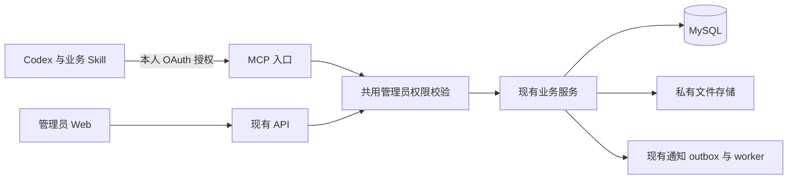

# 二期 Codex 管理员接入技术设计

日期：2026-09-21。状态：**技术设计评审稿，待确认**。用户已确认全部管理员、Web 业务能力同等、对话授权与异常处理规则、仅上传 `.xlsx`、本次支持 Codex，并授权本技术设计及独立开发计划编写。本地分析基线为 `3f6cf2d`，未核验生产版本。

依据：[能力对照与验收草案](Codex管理员能力对照与验收草案.md)、[一期现行需求及增量](../../一期/requirements/一期需求文档.md)、[API 使用说明](../../一期/project/一期API使用说明.md)。本文定义接入方式；二期其他业务线仍按自己的需求与设计执行。[开发计划](Codex管理员接入开发计划.md)列出实施依赖与验收。

本轮授权规则增量已确认：Web 与 Plugin 使用账号级共同授权，任一端使用共同续期，过期、停用或统一退出时一起失效。以下流程与模型已覆盖此前“两端独立续期、独立退出”的设计；整份技术设计仍为评审稿。

## 1. 目标与架构决定

同一管理员通过 Codex 和 Web 访问同一业务服务；对象、字段、权限、状态、数量、文件与业务副作用一致。对话可串联现有动作，最终结果仍由后端校验和持久化。

- MCP 放在现有 `order_tracking/server/`，挂载到现有 FastAPI 进程，对外统一 `/mcp`，使用 Streamable HTTP。API 与 worker 继续使用现有 server 镜像，MCP 随 API 发布。
- 使用官方 Python `mcp` SDK 的稳定 2.x 系列，实施时锁定经过测试的具体版本到 `uv.lock`；协议、序列化和 OAuth 协议组件使用成熟实现。当前 Python 3.13 满足 SDK 的 Python 版本要求。[官方 SDK](https://py.sdk.modelcontextprotocol.io/)
- 独立 `order-tracking-plugin` 项目分发连接配置与 Skill；本地文件夹由 Agent 建立，远程仓库由用户在公司 GitHub 创建，按私有分发准备。本轮仅建票和本地目录。
- MySQL 8 继续保存全部正式业务数据；只增加授权元数据。文件复用私有对象存储，通知复用现有 outbox/worker。
- Codex 负责对话编排；服务器不接入大模型，不增加聊天记录库、通用工作流引擎或 Agent 直接 SQL 执行工具。

## 2. 目录与职责

| 位置 | 改动职责 |
|---|---|
| `server/app/mcp/` | MCP 工具注册、参数与结果映射、请求身份、工具错误映射；按订单、发货、返修、资料和人员等业务分文件 |
| `server/app/modules/identity_access/` | 共用管理员权限判断，复用飞书身份与现有 `users`；新增 Web/Plugin 共同授权、共同活动时间与统一撤销服务 |
| `server/app/api/` | OAuth 元数据、网页登录授权衔接、令牌与撤销 HTTP 路由；已有网页文件下载入口的安全重定向 |
| `server/app/modules/` | 继续承载业务校验、事务、版本、幂等、文件和通知；仅补接入缺失的共享能力 |
| `server/app/main.py` | 注入既有 service 实例、挂载 MCP、管理其 lifespan；保留现有关闭数据库流程 |
| `server/app/db/` 与 `server/migrations/` | 授权表与必要幂等约束；迁移号从开工时 Alembic head 分配 |
| `admin-web/nginx.conf` | 转发 `/mcp`、OAuth 与元数据入口，保留既有 `/api/` 和 SPA 路由 |
| `admin-web/src/` | 复用现有飞书登录和退出入口，调整登录衔接及退出文案；不新增授权确认页和客户端管理页 |
| Plugin 仓库 | manifest、远程 MCP 配置、Skill、安装与验收说明；不存业务代码或凭据 |

接入只抽取确实由 Web 与 MCP 共用的校验。禁止简单调用底层 service 后跳过原先仅存在于 HTTP 路由的角色检查；每个工具都要追踪原入口的完整权限路径。

## 3. 本人授权与权限

### 3.1 授权流程

1. Codex 连接 `/mcp`，服务器通过标准 401 挑战告知资源元数据和授权服务器。
2. Codex 使用 Authorization Code + PKCE S256 发起授权。授权服务器校验客户端与回调后，将完整请求保存在服务器短期事务记录中。
3. 浏览器复用现有飞书登录取得当前内部管理员身份；已有效登录时无需重复飞书登录。网页登录会话绑定该账号当前有效的共同授权。已有账号启停、最高管理员识别继续执行现行规则；工厂账号不可授权此接入。
4. 对明确登记的公司受信任 Codex 客户端采用预授权策略，校验当前网页登录身份后自动绑定，无额外“允许/取消”页。预授权不扩展到任意客户端；公开 client ID 不证明身份。登录衔接绑定浏览器、短期授权事务与 PKCE，验证回调、来源及 CSRF 等请求保护，不接受模型提交的 `user_id`。
5. 校验完成后签发一次性授权码，Codex 用 verifier 换取专供本系统 MCP 使用的访问令牌及刷新令牌，grant 绑定同一个共同授权 ID。飞书令牌保留在服务器，网页 Cookie 不交给 Codex。
6. Web 请求、MCP 调用及两端刷新均校验共同授权和当前账号状态。有效业务使用更新共同活动时间；短期访问令牌到期后按共同授权自动续期，无需用户重新飞书登录。最高管理员专属动作再次核验最高管理员标记。
7. 共同授权失效或统一退出后，两端旧凭据均拒绝。重新登录创建新的共同授权，Plugin 重新执行连接绑定，旧 grant 不自动复活。

OAuth 标准要求包括资源发现、客户端注册、PKCE、令牌受众验证等；实现按当前协议及 SDK 的兼容能力联调。[MCP 授权规范](https://modelcontextprotocol.io/specification/2026-07-28/basic/authorization)

### 3.2 协议与存储约定

| 项目 | 设计 |
|---|---|
| 资源与 issuer | 从服务端受控公开 HTTPS origin 配置生成；resource 固定为该环境 `/mcp`，不信任任意 Host 头 |
| 客户端识别 | 首次只验收 Codex，优先采用预注册公共客户端并随插件分发公开 client ID；不分发 client secret。Codex 实际客户端配置支持是 A01 的必验项 |
| 回调 | 精确匹配本次授权请求；当前 Codex 使用 `http://127.0.0.1:<动态端口>/callback/<随机串>`，服务端限制回环地址、路径格式与端口；禁止任意回调、开放重定向 |
| scope | `order_tracking.admin` 表示使用本人当前管理员能力；不据此授予最高管理员角色 |
| 时效 | 授权事务和一次性码 5 分钟；两端访问凭据采用短期有效期，MCP 为 15 分钟。Web/Plugin 刷新资格统一取共同授权 `last_activity_at + 30 天`，不再分别按各端闲置时间失效 |
| 令牌 | 随机不透明值、数据库仅存摘要；MCP 绑定 client、user、resource、grant，Web 与 MCP 分别保管凭据。两端刷新令牌轮换但共用授权期限；检测刷新重放时撤销共同授权 |
| 撤销 | 标准撤销端点、`logout_shared_session` 工具及现有网页登录退出均撤销该账号共同授权；所有关联 Web 会话及 Plugin grant 一起失效。退出文案与工具说明明确两端影响；账号停用继续使全部终端失效 |
| 元数据路径 | `/.well-known/oauth-protected-resource/mcp`、`/.well-known/oauth-authorization-server` |
| 授权路径 | `/oauth/authorize`、`/oauth/token`、`/oauth/revoke`；网页授权确认处理在受 CSRF 保护的 API 路由中 |

预注册不需要建设面向任意客户端的动态注册服务。Codex 版本若不能使用该配置，应在 A01 中给出真实兼容证据并修订设计，不能在运行时降级为共享密钥。

新增四张授权元数据表，全部放现有 MySQL；预注册公共客户端 ID 与 MCP 资源 URL 由服务端配置提供，不建客户端表。现有 `user_sessions` 增加可空 `shared_auth_id` 外键，关联管理员网页会话：

| 表 | 核心内容与约束 |
|---|---|
| `admin_shared_authorizations` | 共同授权 ID、user 外键、创建、最近有效活动与撤销时间；到期由最近活动时间加 30 天计算。每账号至多一个有效共同授权，创建/重建在用户行锁下串行化 |
| `agent_oauth_requests` | 授权请求、client、redirect、resource、scope、PKCE、登录事务关联、已验证 user、一次性 code 摘要、到期/使用状态；code 摘要唯一，交换在行锁内一次消费 |
| `agent_oauth_grants` | grant ID、client、user 外键、共同授权外键、resource、scope、首次允许时间；其用户必须与共同授权用户一致，每次使用验证父授权 |
| `agent_oauth_tokens` | token 摘要、access/refresh 类型、grant、到期、消费/撤销时间；摘要唯一。access 按短期到期时间校验，refresh 按共同授权期限与消费/撤销状态校验；消费记录保留到父授权失效以检测重放 |

授权事务只在数据库保存必要字段；访问令牌、刷新令牌、授权码、verifier、临时文件 URL 和 Cookie 不进入日志、审计正文、业务响应或 Skill。授权拒绝和无效 code 直接失败，错误不泄露账号存在性。当前工单不增加后台清理任务；到期记录无法再用于授权，后续维护任务须保留重放检测所需记录和业务审计。

### 3.3 共同续期、迁移与失效

- 联动范围为同账号的管理员 Web 会话和 Plugin grant；已启用多个浏览器或 Plugin 连接时均关联同一个有效共同授权。小程序继续沿用现有会话规则；账号停用仍影响全部终端。
- 两端共同校验顺序为：凭据真实性与所属账号 → 共同授权未撤销且未过期 → 当前账号启用及权限 → 允许访问或刷新。到期判断必须先于更新活动时间，已到期记录不能由旧请求重新激活。
- 用户发起的有效业务访问更新共同 `last_activity_at`，两端后续刷新均取这一时间。单纯刷新请求、心跳、后台轮询和失败认证不延长共同活动期限，防止无人使用时无限保活；网页与 MCP 的调用层必须区分这些请求。
- 网页刷新资格不能继续仅检查旧的独立 `refresh_expires_at`。浏览器刷新 Cookie 的保留策略也需同步调整，避免服务器共同授权有效而 Cookie 因原来的单端 30 天期限被清除。浏览器或 Codex 清理凭据、存储期限到达等客户端行为仍可能要求重新证明身份/连接；服务器不能凭账号名称恢复丢失凭据。已有活动记录不足以免除凭据校验。
- 统一退出与活动更新都锁定共同授权记录；撤销优先且不可被迟到的续期覆盖。撤销共同授权后新请求与刷新立即拒绝；已提交业务事务保持实际结果，不承诺撤回已经发生的操作。
- 标准撤销操作按可信令牌定位本人共同授权，不能凭任意 `user_id` 撤销其他账号。仅在客户端本地卸载插件且未通知服务器时，不视为已完成服务端统一退出；安装说明提供明确退出入口。
- 兼容迁移只为当前仍有效且未撤销的管理员网页会话建立关联，初始活动时间取这些会话已有的最新有效活动，不以迁移时刻重置闲置期限。过期或已撤销会话不参与。迁移完成后新 Web 登录必须建立/加入共同授权，MCP grant 必须关联共同授权。
- 共同授权结束后重新登录创建新 ID；旧 Web 会话、旧 grant、旧刷新令牌始终关联旧 ID，禁止因同账号新登录被自动重绑。通过原网页/小程序回归和并发测试验证迁移。

### 3.4 复用现有登录界面

已登录自动衔接，未登录进入现有飞书登录后返回 Codex；不增加授权确认页或客户端管理页。现有网页登录退出文案说明 Web 与 Plugin 一起失效，具体可见改动实施前按项目页面规则确认。浏览器没有当前账号有效会话时，不能仅凭账号在其他设备登录过而省略身份认证。

## 4. 工具契约与完整能力覆盖

工具用业务名称，参数使用既有 DTO/Pydantic 字段与校验。列表带既有筛选、排序、分页，响应保留 `total` 与分页信息；候选名称只负责发现，写入只接受查询返回的稳定 ID。整单查询不能用第一页代替全量。

以下是拟定工具目录；细节字段从既有模型导出，实施时形成机器可核对的“Web 动作—工具—测试”映射。一个通配组表示表内列明的独立动作，不开放任意路径请求工具。

| 工具组 | 必须覆盖的动作 |
|---|---|
| `get_me`、`logout_shared_session` | 当前账号与权限、工具契约版本、共同有效期；统一退出本人 Web 与 Plugin |
| `get_dashboard`、`list_orders`、`get_order`、`get_order_audit` | 看板、全部订单筛选分页、明细、操作记录与关联发货 |
| `start_import_run`、`get_import_run`、`list_import_candidates`、`get_import_candidate`、`get_candidate_audit` | 获取飞书订单、最新/指定任务状态、候选及来源校验 |
| `update_candidate_lines`、`import_candidates`、`exclude_candidate` | 候选未派工字段和日期保存、单/批量导入、排除；支持既有人工覆盖语义 |
| `create_order_draft`、`update_order_draft`、`publish_order_draft`、`delete_order` | 手工草稿全流程；来源明细订单继续走明细派工路径 |
| `update_order_details`、`preview_source_refresh`、`confirm_source_refresh`、`preview_dispatch`、`confirm_dispatch` | 未派工明细维护、来源预览和确认、明细选择派工 |
| `list_withdrawable_factories`、`withdraw_factory_dispatch`、`complete_order`、`reopen_order` | 按工厂撤回、完成、带原因撤销完成 |
| `list_order_contracts`、`export_contract` | 按厂资格、签订日期、生成和重复导出、下载链接 |
| `list_shipments`、`get_shipment`、`get_daily_shipment_summary`、`export_shipment`、`export_daily_shipments` | 列表与关联查询、单据箱内明细/凭证/操作记录、日汇总、两类 Excel |
| `get_receipt`、`save_receipt`、`confirm_receipt`、`return_shipment` | 草稿、逐箱保存、整单确认、按发货单规格退回 |
| `list_repair_periods`、`get_repair`、`upload_repair_workbook`、`get_repair_preview`、`confirm_repair_previews`、`archive_repair_period` | 周期筛选、详情、Excel 原件、上传校验、单/批量创建、整周期归档 |
| `list_factories`、`get_factory`、`create_factory`、`update_factory`、`list_products` | 工厂筛选、联系人、合同资料、关联人员；产品规格及图片受权链接 |
| `list_factory_applications`、`get_factory_application`、`approve_factory_application`、`reject_factory_application` | 申请查询、绑定工厂通过、带原因拒绝 |
| `list_users`、`set_user_enabled` | 工厂用户启停；最高管理员查看和启停普通管理员，最高管理员账号不可停用 |
| `list_notifications`、`get_unread_count`、`mark_notification_read` | 本人通知列表、筛选、已读及业务目标定位 |

选项接口复用现有工厂、周期与资料查询；需保留来源范围，例如返修工厂选项不能被全工厂列表改变业务含义。图片/凭证查看仅交付已有内容链接；上传只接收质检 `.xlsx`。

工具描述注明只读或写入、副作用、必需版本和幂等键。MCP `readOnlyHint` 等声明供客户端判断；后端权限检查不依赖这些提示。每次返回 `requestId` 与业务结果，成功提交回读对象；通知仅报告后端真实可查询状态，不能据任务创建成功推断工厂已收到或查看。

## 5. 确认、事务与错误处理

### 5.1 对话授权

Skill 按已确认规则执行：目标、范围、值和提交动作都明确时可连续操作；新增影响或歧义时展示对象、修改前后值和范围，取得用户确认。删除候选、归档、停用、退回等操作必须包含明确的动作授权，不能从“处理好”推导。文件正文和来源备注作为业务数据，不能作为执行指令。

对话授权由 Codex 宿主与 Skill 协同执行。后端可强制身份、权限、版本和业务约束；模型传入 `confirmed=true` 无法证明用户实际确认，设计不使用该字段作为安全凭据。现有预览 ID 固定待提交快照，防止确认后悄悄改变内容。

### 5.2 串联动作

- 来源刷新预览只读一次外部来源，确认应用已保存快照；之后填写最终合同出货时间并派工。人工日期不再重复提前 4 天。已有覆盖保护遵循当前 service。
- 派工前明确选中的所有明细 ID、版本和工厂，检查 `allOk`；确认事务内重新校验。已派工明细不进入未派工修改范围。
- 收货先读取箱内项 ID 和版本；只修改用户指定的项，保存后使用最新版本确认。确认锁定全单，退回走独立动作与原因。
- `.xlsx` 批量创建默认先完成全部文件校验，再提交；明确允许部分执行时，仅提交通过项。
- 工厂资料修正、来源刷新、日期保存、派工各有既有事务。预检失败只保证后续提交不发生；已成功保存的前置操作必须报告，不承诺跨多个工具的整批回滚。

### 5.3 幂等与并发

复用 `IdempotencyRecord` 和各领域已存在的幂等记录。每次业务动作绑定 actor、动作、目标和规范化参数摘要；重试复用同一键，同键不同内容拒绝。补齐有重复副作用但缺保护的入口时，在业务事务内实现并同时供 Web/MCP 使用；不在 MCP 外层另开事务后假装覆盖 service 内部提交。

有版本的写操作必须带版本；当前无版本且受对象状态约束的动作，要在同一业务事务内锁定对象并复核用户看到的关键状态。不能单靠“提交前再查一次”规避竞争。来源预览过期、409、账号停用、附件校验失败均在原位置返回明确失败。

跨订单批量先检查整批并固定目标清单，再顺序执行各订单现有原子操作。并发变化仍可能造成中途失败；默认停止剩余项，返回每项的 ID、成功/失败/未执行及原因。只有用户明确授权部分执行时才继续其他独立项。单订单派工继续保持原有事务原子性。

401 时先按共同授权尝试受控自动刷新；共同授权已失效、已撤销或本地凭据不可用时再要求恢复登录并重新连接。403 直接报告无权限；422 报字段或业务问题；409 重读差异并按授权规则重新确认。超时或 5xx 标记结果待核实，以原幂等键查询或重试，禁止更换键造成重复业务事实。未知异常保留脱敏 request ID 并失败，不做默认成功或自动改值重试。

## 6. 文件通路

上传采用客户端原生文件引用方案：工具声明 `_meta["openai/fileParams"]`，文件对象含 `download_url`、`file_id`，可带 `mime_type`、`file_name`；服务器取字节后调用现有 `RepairWorkflowService.create_preview`。这一定义来自官方插件文件参数文档，具体 Codex 私有 MCP 的可用性必须实测。[文件参数参考](https://developers.openai.com/plugins/reference)

实施 A02 先在目标 Codex 版本完成“本地附件→远程测试服务→预览→原件下载”闭环。文档未证明目标客户端已支持；不满足时应停止该方案的发布、修订文件通路设计，不能把上传能力从完整范围中删除或默认为已经成功。

- 维持每批最多 20 份、每份最多 20 MiB、一文件一工厂。客户端上限、服务器读取上限和 Excel 解析上限须共同满足；按真实文件内容校验格式，不能仅凭扩展名。文件名或类型缺失时读取可验证元数据，无法确认 `.xlsx` 则拒绝。
- 文件 URL 作为不可信输入：只接受已联调确认的客户端文件服务 HTTPS origin，禁止任意 URL、内网/回环/元数据地址与跳转到非白名单地址；连接目标解析和出站限制共同防止 DNS 重绑定。流式读取限制大小、超时，不将管理员凭据发送给文件主机。
- 文件字节不放进模型上下文；客户端临时链接不写日志，原件按既有私有存储规则保留。下载链接过期则要求客户端重新提供文件引用，不能绕过权限访问。
- 下载沿用本人 Web 登录鉴权的业务文件直达链接，点链接直接得到 `.xlsx`；无会话时登录后仅跳回允许的本系统下载路径。MCP 返回文件名、类型、大小（可得时）、业务 ID 与链接，不返回长期公开 OSS URL。该交付允许用户在对话中点击附件链接，不需要打开业务列表查找。
- 需要 Codex 在本机继续读取下载文件时，须在 A02 验证宿主支持的文件交付；无法通过时列为兼容阻塞，不能要求用户粘贴 Cookie。当前设计不依赖读取 Codex 私有凭据库或额外的本地常驻服务。

## 7. 查询口径与二期依赖

“与 Web 一致”按具体业务视图判断：订单已发含现有历史基线和有效数量账本；发货列表已收项显示确认数量，历史撤回项可展示；日汇总 Excel 使用有效原始发货事实；质检返修独立于普通订单。

`get_daily_shipment_summary` 显式标记 `basis=original_reported`、`businessDate`、`timezone=Asia/Shanghai`，复用日汇总导出的同一查询并按厂聚合，保持单据/箱内项稳定 ID。若需查询当前确认量，使用发货查询与收货数据并标明口径。语句含糊且口径影响结果时按已确认规则询问，不替用户确定新的默认值。撤回、重新提交、跨日确认、退回均加入对照样例；只读报表不从聚水潭历史入库数推断系统当日发货。

本业务线不依赖来货出入 #123–#128 才能开发。开工和总验收都从当时 Web 基线重新核对：若来货出入查询/数量调整已进入网页，其 MCP 对应能力随同补齐，复用已批准服务；仅飞书或工厂小程序专属动作不因本次接入扩大为管理员 Web 操作。并行迁移采用独立数据库，遇多 Alembic head 必须按实际基线解决后再验证。

## 8. 部署与运行

- FastAPI 宿主 lifespan 显式启动/关闭 MCP session manager，使用无状态请求模式；业务状态、授权、幂等在 MySQL。认证按每次请求执行，不能用 MCP 会话 ID 替代访问令牌。SDK 支持 ASGI 挂载，父应用须管理挂载应用生命周期。[ASGI 官方说明](https://py.sdk.modelcontextprotocol.io/run/asgi/)
- `/mcp` 保持唯一规范路径，避免 POST 被无意重定向到 `/mcp/` 或出现 `/mcp/mcp`。集成测试覆盖 `initialize`、`tools/list`、`tools/call` 和重启后请求。
- 同步数据库与 Excel 服务在线程池执行，不阻塞 ASGI 事件循环；复用现有后台导入任务并返回 run ID，不增加长时间占住连接的轮询工具。
- Nginx 对 `/mcp` 及准确元数据、OAuth 路径转发到现有 `api:8000`，保持 Authorization、Accept 和 MCP 协议头，关闭该路径代理缓存和响应缓冲，允许协议所需方法；请求大小有限制。文件通过客户端服务拉取，不提高普通 API 全局上传限额。
- 宿主校验实际服务域名与允许 Origin；浏览器授权继续 CSRF 校验，桌面原生请求不靠放开全站 CORS 解决。HTTPS origin 从受控配置取得，避免 TLS 终止后的 scheme 错误。
- `.env.production`/共享测试配置分别提供公开 origin、客户端登记配置和授权开启开关。开关默认关闭，在完整验收后的发布中启用；关闭入口同时拒绝新授权，已发令牌不可继续访问工具。
- 保持现有两镜像发布链。部署仍要求用户明确版本标签授权；新增授权表先做兼容迁移，关闭 MCP 可恢复既有网页入口，不删除授权或业务记录。
- 日志记录 request ID、user ID、tool、目标 ID、耗时、结果和关联审计 ID，不记录原始参数全文。MCP 错误不能绕过既有脱敏规则；健康检查同时验证挂载初始化状态。

## 9. Plugin 与 Skill

Plugin 使用官方支持的根目录 `plugin.json`、`mcp.json`、`skills/` 布局，仅配置本系统远程 MCP；以团队私有仓库/分发源安装。正式包只配置生产连接，测试包使用独立名称和测试域名。具体安装渠道和目标 Codex 版本在验收记录中固定。[Plugin 打包说明](https://developers.openai.com/plugins/build/plugins)

一个入口 Skill 配少量业务参考文件：订单导入与派工、发货与收货、质检返修、资料与人员、异常与权限。说明中不复制全部 API schema；以工具返回字段为准，记录业务顺序、编号消歧、当前日期解释、分页完整性、确认规则、读后核验和结果措辞。服务端提供工具契约版本；插件要求的版本不满足时清楚报错，不猜测旧工具名称。

业务验收流程：安装→复用登录或飞书登录→查询→执行已授权操作→回读→统一退出。另用干净客户端环境验证安装无需系统源码和服务器权限；验证同事获取与更新 Plugin 的路径，不能只凭作者本机安装成功认定可分发。

## 10. 验证与批准边界

五项 MCP 和一项 Plugin 工单及本设计同步后由用户验收；当前仅授权调整工单和文档。客户端授权与文件通路在内部 A01/A02 阶段实测，已确认业务规则无需重复询问。技术方案与工单验收后进入正式实施，发布按既有确认门执行。

测试复用项目 pytest、现有隔离 MySQL 与前端测试体系，按共享业务与工具入口两层验证；不另建通用评测平台。每个能力对照项有正向用例，身份越权、版本、重放、批量部分失败、文件大小和外部地址校验重点覆盖。最终在隔离环境由真实 Codex 与网页对同一数据验收，再走完整 CI 和授权发布。

参考规范核对日期为 2026-09-21。#151 在隔离 MySQL 与 `local_demo` 环境使用 `codex-cli 0.149.1`、预注册 client ID 和资源 URL 完成两次实际 OAuth 登录：首次经本地模拟飞书页，第二次复用浏览器 Web 登录直达授权码交换。CLI 实际使用 `/callback/<随机串>`，授权请求重复携带同值 `resource`；服务端已按此收窄兼容。订单查询已通过 MCP 协议集成测试；真实飞书、HTTPS/Nginx 端到端、Codex 对话调用订单工具及生产环境尚未联调。
